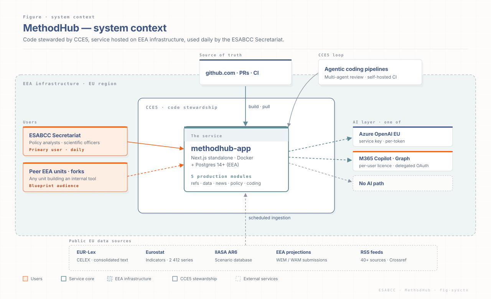

# MethodHub

Internal research workspace for the Secretariat of the European
Scientific Advisory Board on Climate Change (ESABCC). Built and
maintained by CCE5. Packaged to run on EEA infrastructure — not on
Vercel in production.

This README is a quick overview. Every section links into the
[documentation site](https://methodhub.vercel.app/docs/) hosted
under the app on Vercel, which is the single source of truth.

## At a glance

<p align="center">
  
</p>

## What is MethodHub?

A Next.js 14 application that bundles the Secretariat's day-to-day
research tooling — reference management, scenario data, news
monitoring, EU policy tracking, content analysis, anonymous
voting, per-project workspaces and recommendation tracking — behind a
single sign-in. Eight production modules ship in
`src/`; thirty-five experimental
modules (numbered M·09–M·43) sit unrouted in `beta/` and are pulled
into production once the science team signs off (Project Workspace and
Recommendations were the two most recent promotions). The beta list
grows roughly weekly — [`beta/README.md`](beta/README.md) is the
canonical registry.

Read more:
[What is MethodHub?](https://methodhub.vercel.app/docs/overview/what-is-methodhub/) ·
[The eight modules](https://methodhub.vercel.app/docs/overview/the-eight-modules/) ·
[Beta parking lot](https://methodhub.vercel.app/docs/overview/beta/) ·
[FAQ (non-technical)](https://methodhub.vercel.app/docs/FAQ-NON-TECHNICAL/).

## The eight production modules

| # | Module | What it does | Docs |
| --- | --- | --- | --- |
| M·01 | Reference Manager | Shared bibliography with PDF ingestion and tagging. | [reference manager](https://methodhub.vercel.app/docs/modules/references/) |
| M·02 | Data & Scenarios | Climate scenario datasets and chart builders. | [data & scenarios](https://methodhub.vercel.app/docs/modules/scenarios/) |
| M·03 | Secretariat News | Curated daily climate-policy news feed. | [news feed](https://methodhub.vercel.app/docs/modules/news-feed/) |
| M·04 | EU Policy Navigator | Search and timeline over EU climate legislation. | [policy navigator](https://methodhub.vercel.app/docs/modules/policy-navigator/) |
| M·05 | Content Analysis | LLM-assisted analysis of long documents. | [content analysis](https://methodhub.vercel.app/docs/modules/content-analysis/) |
| M·06 | Voting Tool | Anonymous Advisory-Board ballots with seven voting systems and live analysis. | [voting tool](https://methodhub.vercel.app/docs/modules/voting-tool/) |
| M·07 | Project Workspace | Per-project binder: indicator DB, member-state matrix, recommendation tracker, meetings. | [project workspace](https://methodhub.vercel.app/docs/modules/project-workspace/) |
| M·08 | Recommendations | Advisory-Board recommendation tracker — status and dated uptake events vs. EU law. | [recommendations](https://methodhub.vercel.app/docs/modules/recommendations/) |

Module index: [modules overview](https://methodhub.vercel.app/docs/modules/).

## Repository layout

| Path | Contents |
| --- | --- |
| `src/` | Next.js 14 application — eight production modules. |
| `beta/` | Thirty-five experimental modules (M·09–M·43), intentionally unrouted. |
| `docs/` | MkDocs source for the `/docs/` documentation subpage. |
| `scripts/` | Data pipelines, migration tooling, IT handoff kit. |
| `supabase/` | Postgres migrations. |
| `Dockerfile`, `docker-compose.yml` | Single-host demo and production build target. |
| `.github/workflows/` | CI, daily pipelines, docs deployment. |
| `project-documents/` | Source and governance documents (Project Manual, PIRs) — reference only, not used by the runtime. |

## Infrastructure

MethodHub is packaged for self-hosted deployment on EEA infrastructure.
The Vercel deployment exists only to host this documentation site and a
public demo; the production target is a single Docker host inside the
EEA estate, with Postgres on Supabase-compatible storage and an LLM
layer that can be pointed at three different back-ends depending on the
unit's procurement situation.

* [Infrastructure overview](https://methodhub.vercel.app/docs/infrastructure/) — the picture in one page.
* [Stewardship model](https://methodhub.vercel.app/docs/infrastructure/stewardship/) — who owns what after handoff.
* [Deployment on EEA](https://methodhub.vercel.app/docs/infrastructure/deployment/) — Docker, env, secrets, CI.
* [AI layer — three paths](https://methodhub.vercel.app/docs/infrastructure/ai-layer/) — hosted, EEA-internal, on-prem.
* [Copilot — technical deep-dive](https://methodhub.vercel.app/docs/infrastructure/copilot/).
* [Tech stack](https://methodhub.vercel.app/docs/infrastructure/tech-stack/) — Next.js, Postgres, MkDocs, the lot.
* [Data & GDPR](https://methodhub.vercel.app/docs/infrastructure/data-gdpr/) — what's stored, what isn't, retention.

## Vision and roadmap

MethodHub is positioned as a blueprint for other EEA units, not just a
tool for the ESABCC Secretariat. The vision pages capture the longer
arc: where the modules are heading, what the user-space layer adds on
top, and the open brainstorms that haven't yet hardened into roadmap
items.

* [Blueprint for EEA units](https://methodhub.vercel.app/docs/vision/blueprint/).
* [Roadmap](https://methodhub.vercel.app/docs/vision/roadmap/).
* [User Space](https://methodhub.vercel.app/docs/vision/user-space/).
* [Brainstorm — 20 module improvements](https://methodhub.vercel.app/docs/vision/brainstorm-modules-ux-userspace/).
* [Brainstorm — professional UX for the five modules](https://methodhub.vercel.app/docs/vision/brainstorm-pro-ux-five-modules/).
* [Brainstorm rollout TODO](https://methodhub.vercel.app/docs/vision/brainstorm-rollout-todo/).

## Reference

* [API reference](https://methodhub.vercel.app/docs/reference/api/) — every route under `src/app/api/`.
* [Scripts reference](https://methodhub.vercel.app/docs/reference/scripts/) — the pipelines and IT handoff kit under `scripts/`.
* [Design system](https://methodhub.vercel.app/docs/reference/design-system/) — tokens, components, ESABCC palette.

## Documentation

The full documentation — six-module deep-dives, infrastructure,
vision, deployment, GDPR and tech stack — ships as a subpage of the
MethodHub itself, hosted on Vercel at:

**<https://methodhub.vercel.app/docs/>**

The MkDocs source lives under `docs/` and is built into `public/docs/`
during the Vercel build (see `scripts/build-docs.sh` and the
`vercel-build` script in `package.json`). To preview locally:

```bash
bash scripts/build-docs.sh   # writes to public/docs/
mkdocs serve                 # http://127.0.0.1:8000
```

Not a developer? The non-technical FAQ is shipped as a PDF at the repo
root: [`ESABCC-MethodHub-FAQ-non-technical.pdf`](ESABCC-MethodHub-FAQ-non-technical.pdf).

## Contact

* **Code stewardship (CCE5) — Sebastian Franz.**
  <sebastian.franz@esabcc.europa.eu>
* **About the Board.**
  <https://climate-advisory-board.europa.eu>

Please ask CCE5 before pulling design details from this repository
directly — the docs site is the single source of truth for the current
architecture.
