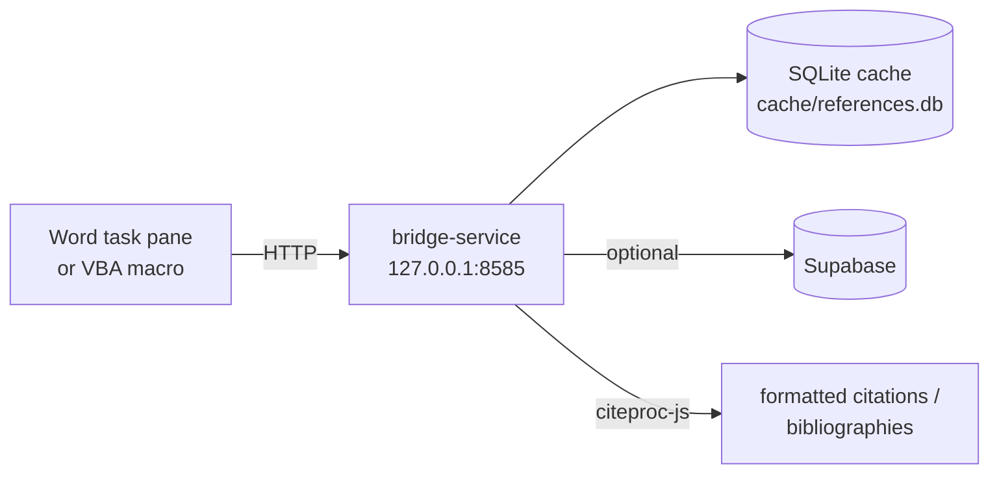

# bridge-service

Small local HTTP server that sits between the **Word add-in** (Office.js or
VBA) and **Supabase**. It runs on the user's own machine, on loopback port
`8585`, and its job is to:

- keep the Supabase credentials **off** the Word client,
- cache references in **SQLite** for offline use,
- format citations via **citeproc-js**,
- and provide a stable URL (`http://127.0.0.1:8585`) that the Word add-in can
  reach from any Office version.



## Endpoints

Defined in [`src/server.ts`](src/server.ts).

| Method | Path                                  | Purpose                                          |
|--------|---------------------------------------|--------------------------------------------------|
| GET    | `/api/status`                         | Health + version + cache info                    |
| GET    | `/api/libraries`                      | List reference libraries                         |
| GET    | `/api/references/search?q=&library_id=` | Full-text search (cache first, Supabase fallback) |
| POST   | `/api/references/batch`               | Batch fetch by ID                                |
| POST   | `/api/cite/format`                    | Format one or more citations (CSL-JSON + style)  |
| POST   | `/api/cite/bibliography`              | Build a bibliography                             |
| POST   | `/api/sync`                           | Pull new refs from Supabase by `updated_at`      |
| GET    | `/api/report-plan/:id`                | Resolve a plan + its references via MethodHub; returns funding summary |

CORS allows the Office WebView (null origin) and `localhost`.

## Run

Windows one-click:

```bat
start.bat
```

Cross-platform:

```bash
npm install
npm run build   # tsc
npm start       # node dist/server.js
# or
npm run dev     # ts-node src/server.ts
```

### Environment

| Var                 | Default | Purpose                               |
|---------------------|---------|---------------------------------------|
| `BRIDGE_PORT`       | `8585`  | Listen port                           |
| `SUPABASE_URL`      | —       | Remote sync; cache-only mode if unset |
| `SUPABASE_ANON_KEY` | —       | Supabase anon key                     |
| `METHODHUB_URL`     | `https://methodhub.eu` | Origin used to resolve report plans for `/api/report-plan/:id` |

Health check: `curl http://127.0.0.1:8585/api/status`.

## Cache

- File: `cache/references.db` (better-sqlite3, WAL mode).
- Indices on `library_id`, `citation_key`, `title`, `updated_at`.
- Sync is incremental by timestamp; the last-sync value is stored per library.
- If `/api/references/search` returns an empty cache hit, the service falls
  through to Supabase and back-fills.

## Dependencies

- `express` — HTTP framework.
- `@supabase/supabase-js` — remote store.
- `better-sqlite3` — embedded DB.
- `citeproc` (citeproc-js) — CSL citation processor. A simple author-date
  fallback is used if the engine fails to load.

## Who calls this

- **word-addin/** — every reference/search/cite call.
- **word-vba/ESABCC_RefManager.bas** — same protocol, hardcoded to
  `http://127.0.0.1:8585`.

If the bridge is not running, both clients fall back to Supabase directly for
reads (no citation formatting is available in that mode).

## Troubleshooting

| Symptom                                    | Fix                                                    |
|--------------------------------------------|--------------------------------------------------------|
| Word shows "Bridge unreachable"            | Start `bridge-service` (`start.bat` or `npm start`).   |
| Port already in use                        | Set `BRIDGE_PORT=8586` and update the Word client URL. |
| Cache is stale                             | `POST /api/sync` from the Word client or `curl -X POST http://127.0.0.1:8585/api/sync`. |
| CORS error from Office                     | Restart the bridge; CORS is configured in `src/server.ts`. |
