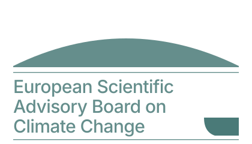

v1.0 · pre-handoff pilot
CCE5 stewardship
EEA-ready target
Internal use only

# MethodHub documentation

The ESABCC Secretariat's internal research workspace — five integrated
modules for references, data, news, policy and content analysis, shipped
as one Next.js service stewarded by CCE5 and designed for handoff to
EEA-managed infrastructure.

[Start with the FAQ →](FAQ-NON-TECHNICAL.md){ .md-button .md-button--primary }
[What is MethodHub?](overview/what-is-methodhub.md){ .md-button }

Production modules

5

refs · data · news · policy · coding

Beta parking lot

8

intentionally unrouted

Runtime

1

Next.js · Postgres 14+

Hosting region

EU

today: Vercel (fra1) · target: EEA-managed container

Built and maintained by **CCE5** for the Secretariat of the
**European Scientific Advisory Board on Climate Change**.
Packaged for self-hosted deployment on **EEA infrastructure**.

!!! tip "Not a developer? Start with the FAQ"
    The **[FAQ for non-technical staff](FAQ-NON-TECHNICAL.md)** is a
    plain-language guide to what MethodHub is, how it is built, and what
    is asked of the EEA — every term of jargon unpacked. A PDF copy is
    also [available at the repo root](https://github.com/SebastianFra/MethodHub/blob/main/ESABCC-MethodHub-FAQ-non-technical.pdf).

## The five modules

Each module reads and writes the same Postgres corpus — a reference
created in M·01 shows up in M·05, a policy annotated in M·04 is reachable
from M·05. No module is master; all five are peers.

<ul class="mh-modules" markdown>

<li markdown>
<a class="mh-module" href="modules/references/" markdown>

M · 0101

Reference Manager

Literature library with DOI lookup, PDF annotation and a Word add-in.

Open module →

</a>
</li>

<li markdown>
<a class="mh-module" href="modules/scenarios/" markdown>

M · 0202

Data &amp; Scenario Explorer

Eurostat, IPCC AR6 and IIASA scenarios in one queryable explorer.

Open module →

</a>
</li>

<li markdown>
<a class="mh-module" href="modules/news-feed/" markdown>

M · 0303

Secretariat News

Curated climate-policy news feed and the daily 24 h EU briefing.

Open module →

</a>
</li>

<li markdown>
<a class="mh-module" href="modules/policy-navigator/" markdown>

M · 0404

EU Policy Navigator

Network map of EU climate laws with article-level annotation.

Open module →

</a>
</li>

<li markdown>
<a class="mh-module" href="modules/content-analysis/" markdown>

M · 0505

Content Analysis

Hierarchical qualitative coding of policy texts and references.

Open module →

</a>
</li>

<li markdown>
<a class="mh-module mh-module--beta" href="overview/beta/" markdown>

BETA · ×8β

Beta parking lot

Eight experimental modules, intentionally unrouted. Promotion is a single <code>git mv</code>.

Browse beta →

</a>
</li>

</ul>

## Infrastructure &amp; vision

Two non-negotiables

1. **EU sovereignty.** Every runtime touches only EU regions. Today's
   pilot runs on Vercel Frankfurt (`fra1`) + Supabase (EU); the
   **EEA-ready target** moves state into EEA-operated Postgres,
   PDFs into EEA object storage, and AI calls into an EU Azure
   region *or* (once the Copilot path is built) the user's own
   M365 Copilot entitlement.
2. **CCE5 stewardship.** The code keeps evolving after handoff. EEA IT
   hosts; CCE5 ships — mirroring how `github.com/eea` already operates.

- [Deployment on EEA](infrastructure/deployment.md) — what EEA IT hosts,
  why not Vercel in production.
- [AI layer — three paths](infrastructure/ai-layer.md) — Azure OpenAI,
  M365 Copilot, or no AI at all.
- [Copilot technical deep-dive](infrastructure/copilot.md)
- [Tech stack](infrastructure/tech-stack.md)
- [Data &amp; GDPR](infrastructure/data-gdpr.md)

Vision · blueprint

The same stack becomes a template for any EEA unit's internal tooling.
One Next.js service, one Postgres schema, one handoff script.

- [Blueprint for EEA units](vision/blueprint.md)
- [Roadmap](vision/roadmap.md)

## Contact

- **CCE5 code stewardship — Sebastian Franz.**
  [sebastian.franz@esabcc.europa.eu](mailto:sebastian.franz@esabcc.europa.eu)
- **Issues and PRs.**
  [github.com/SebastianFra/MethodHub](https://github.com/SebastianFra/MethodHub)
- **About the Board.**
  [climate-advisory-board.europa.eu](https://climate-advisory-board.europa.eu)
