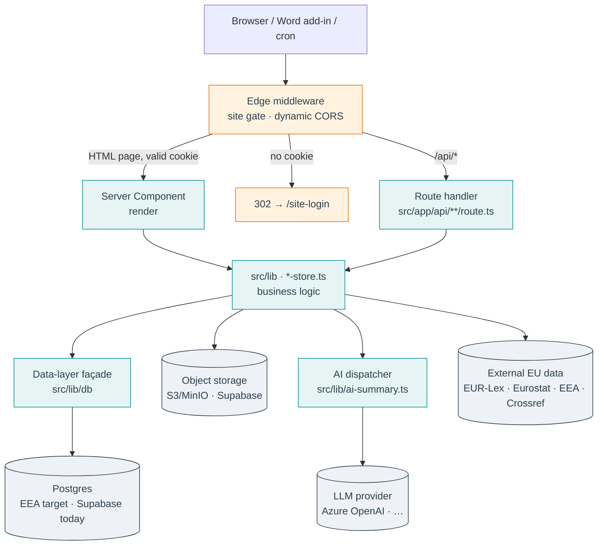

# Architecture overview

This page is for a reviewer who has **not** read the codebase yet and
needs to understand how the application is put together before judging
scope, effort or operational fit. It answers four questions:

1. What is the deployable unit, and what runs outside it?
2. Where does each piece of functionality live in the repository?
3. How does a single request flow through the system?
4. Where does data live, and how is access controlled?

Status is marked throughout the same way as the rest of these docs:
**live** (in the code today) versus **target** (scoped and named, not
yet implemented). Nothing here is aspirational unless it says so.

## System context

<figure class="mh-figure mh-figure--wide" markdown>

<figcaption><span class="mh-figure__num">Figure 1.</span> System context. The web application is the single deployable unit; everything around it is either a service EEA IT operates, an external data source, or an optional client.</figcaption>
</figure>

MethodHub is **one Next.js 14 application** plus a small set of optional
satellite clients. The application is the only thing that has to be
deployed on EEA infrastructure; the satellites are either client-side,
run on a user's own machine, or are only needed by a beta module.

| Component | What it is | Runs where | Scope |
|-----------|-----------|-----------|-------|
| **`methodhub-app`** | The Next.js app — SSR pages + API routes. | One container on EEA infra. | **v1 — the deployable unit.** |
| **Postgres** | System of record for all user state. | EEA Postgres (target) · Supabase EU (today). | v1 — provided by IT. |
| **Object storage** | Reference PDFs, ingested files. | S3/MinIO (target) · Supabase Storage (today). | v1 — provided by IT. |
| **`pypsa-service`** | Python/FastAPI energy-system solver. | Separate container (own `Dockerfile`). | Beta only — not in v1. |
| **`bridge-service`** | Local HTTP shim for the Word add-in. | The user's own machine, loopback `:8585`. | Optional client. |
| **`word-addin`** | Office.js task-pane add-in. | Served by `methodhub-app` from `/public`. | Optional client. |
| **`word-addin-app`** | Electron desktop reference manager. | The user's own machine. | Optional client. |
| **`browser-extension`** | Edge/Chrome LinkedIn capture. | The user's browser. | Optional client. |

The rest of this page is about `methodhub-app` — the part EEA IT hosts.

## The deployable unit

`next build` runs with `output: 'standalone'` (`next.config.js`), which
produces a self-contained bundle: a minimal `server.js` plus only the
production dependencies the runtime actually imports. The three-stage
`Dockerfile` copies that bundle into a `node:20-alpine` image running as
a non-root user (~180 MB). The container's entrypoint is literally
`node server.js` — no shell wrapper, no init system, no sidecar.

That means the unit of deployment is **a single OCI image**. It runs on
anything that runs containers (Podman, OpenShift, Nomad, plain VM); it
holds no state itself, so it scales horizontally behind a reverse proxy.
All state is externalised to Postgres and object storage. See
[Deployment on EEA](deployment.md) for the runtime contract and
[Tech stack](tech-stack.md) for the full dependency inventory.

## Repository layout — where code lives

<figure class="mh-figure mh-figure--wide" markdown>

<figcaption><span class="mh-figure__num">Figure 2.</span> Repository layout. The shipped scope is readable from the folder names: production routes under <code>src/app/</code>, prototypes under <code>beta/modules/</code>.</figcaption>
</figure>

| Path | Contents | Notes |
|------|----------|-------|
| `src/app/` | Next.js App Router — pages **and** API routes (`src/app/api/`). | The production surface. Each folder is a route. |
| `src/components/` | React components, grouped by module + a shared `ui/` set. | Radix primitives + bespoke components. |
| `src/lib/` | Business logic: data access, auth, the AI dispatcher, per-module `*-store.ts` modules, React hooks. | Where the non-trivial logic lives. |
| `src/lib/db/` | The data-layer **façade** — provider selection + the lazy Postgres pool. | The cutover seam (see below). |
| `src/data/` | Large static datasets (e.g. the curated reference corpus). | Compiled into the bundle; not user state. |
| `beta/modules/` | Eleven experimental modules, **unrouted**. | Outside the `app/` tree, so the build ignores them. Promotion = move a folder back into `src/app/` (this is how M·07 and M·08 graduated). |
| `supabase/migrations/` | 60-plus numbered SQL migrations — the schema, RLS, GDPR functions. | Applied in filename order; the source of truth for the DB. |
| `scripts/` | Ingestion pipelines, the Postgres migration kit, the IT-handoff kit. | See [Scripts reference](../reference/scripts.md). |
| `Dockerfile`, `docker-compose.yml` | Production image + one-command local stack. | |
| `.github/workflows/` | CI, scheduled pipelines, the self-hosted EEA deploy. | |

!!! note "The `beta/` separation is deliberate"
    A reviewer can read the shipped scope off the file system: the
    production modules are routed under `src/app/`; anything under
    `beta/modules/` is a prototype the live app never serves. This is
    the project's feature-flag mechanism — there is no LaunchDarkly-style
    runtime flagging to audit.

## Request lifecycle

Every HTTP request enters through **Edge middleware** (`src/middleware.ts`)
before any page renders. The middleware has exactly two jobs, then it
hands off to either a server-rendered page or an API route handler.



1. **Site-wide access gate.** HTML page requests must carry a valid
   HMAC-signed `HttpOnly` cookie (`src/lib/site-auth.ts`), checked at the
   edge using a server-only `SITE_PASSWORD`. Requests without it are
   302'd to `/site-login`. `/api/*`, the Word add-in paths, and the
   public voting-ballot pages are intentionally exempt — each has its own
   auth mechanism. **(live)**
2. **Dynamic CORS for `/api/*`.** The Office host set (Word/Outlook on
   the web) can't be expressed as one static `Access-Control-Allow-Origin`,
   so origins are matched against an allowlist and reflected back
   per-request with `Vary: Origin`. **(live)**

API routes are not site-gated; each enforces its own auth — a Bearer
cron secret for scheduled jobs, a Supabase JWT for user calls, or RLS at
the database. Security headers (HSTS, CSP, `X-Frame-Options`, etc.) are
set globally in `next.config.js`.

## The production modules and their code

The eight core modules make up the shipped surface. Each maps cleanly onto a
route folder, an API namespace, a `src/lib` area, and a set of migrations.

| Module | Page routes | API namespace | Logic |
|--------|------------|---------------|-------|
| M·01 Reference Manager | `app/references/` | `api/references/*` | `lib/references/`, `lib/references.ts` |
| M·02 Data & Scenarios | `app/scenarios/` | `api/scenarios/*` | `lib/scenarios/` |
| M·03 Secretariat News | `app/news-feed/` | `api/news-feed/*`, `api/inbound-email/*`, `api/daily-summary/*` | `lib/rss-feeds.ts`, `lib/ai-summary.ts` |
| M·04 EU Policy Navigator | `app/policy-navigator/` | `api/policy-clock/*`, `api/policy-text`, `api/eu-calendar` | `lib/policy-*.ts` |
| M·05 Content Analysis | `app/content-analysis/` | `api/content-analysis/*` | `lib/content-analysis/` |
| M·06 Voting Tool | `app/voting/`, `app/vote/[token]/` | `api/voting/*` | `lib/voting/` |
| M·07 Project Workspace | `app/project-workspace/`, `app/member-states/` | `api/project-workspace/*`, `api/member-states/*` | `lib/project-workspace/`, `lib/country-profiles/` |
| M·08 Recommendations | `app/recommendations/` | `api/project-workspace/recommendations*` | `lib/project-workspace/db.ts` |

Module deep-dives live under [Modules](../modules/index.md); every API
route is catalogued in the [API reference](../reference/api.md).

## Data layer

```
DB_PROVIDER = supabase (default) | postgres
```

All persistent state lives in Postgres. Today call sites talk to
Supabase directly; `src/lib/db/` exists as the **cutover seam** — a thin
façade that centralises provider selection and a lazily-constructed
self-hosted Postgres pool (the `pg` import is deferred so the dependency
stays optional until `DB_PROVIDER=postgres`).

- **Schema & migrations.** 38 forward-only SQL migrations under
  `supabase/migrations/`, applied in filename order. The IT-handoff kit
  (`scripts/it-handoff/`) applies them to a fresh Postgres; a one-shot
  `combined_migrations.sql` exists for pasting into a SQL editor. **(live)**
- **Row-Level Security.** Every table holding user state has RLS,
  keyed to `auth.uid() = added_by` or to explicit library/workspace
  membership. **(live)**
- **Migration to EEA Postgres.** The dump → restore → flip-flag →
  parity-check sequence is scripted in `scripts/migrate-to-postgres/`
  and verified by a per-table row-count diff. The façade is in place;
  porting each `*-store.ts` call site behind it is **in progress**.
- **Storage & realtime** are independent switches (`STORAGE_PROVIDER`,
  `REALTIME_PROVIDER`) so each can move on its own schedule.

The provider switches are deliberately decoupled so that, e.g., the DB
and storage can move to EEA infrastructure while authentication stays on
Supabase until an OIDC replacement is ready. See
[Data & GDPR](data-gdpr.md) for the personal-data inventory, retention
windows, and the Art. 17 erasure flow.

## Authentication — two layers

MethodHub has two independent auth layers; it helps to keep them separate
when reasoning about identity.

| Layer | What it protects | Mechanism | Status |
|-------|------------------|-----------|--------|
| **Site gate** | Whether you can reach the app at all. | Server-checked `SITE_PASSWORD` + HMAC `HttpOnly` cookie, enforced in Edge middleware. | **live** |
| **Per-user identity** | Who you are; powers `profiles`, RLS, ownership. | Supabase Auth today. | **live (Supabase)** |
| **Per-user identity (target)** | Same, on EEA infra. | `AUTH_PROVIDER=oidc` — EU Login / Entra ID via standard OIDC + PKCE. | **target — flag declared (`src/lib/db/config.ts`); the OIDC branch is not yet wired into the sign-in routes, and `openid-client`/MSAL are not yet dependencies.** |

!!! warning "SSO is genuine, unfinished work"
    The `oidc` value is recognised by the config layer and the auth
    routes carry comments describing their behaviour under it, but the
    Entra ID / EU Login sign-in flow itself is **not implemented**. Treat
    "wire OIDC SSO" as scoped-but-unbuilt, not as a configuration toggle.

## AI layer

LLM use is funnelled through one dispatcher, `src/lib/ai-summary.ts`,
selected by `LLM_PROVIDER` (auto-detected from whichever API key is
present: Azure OpenAI > Gemini > Anthropic > OpenAI). It is called from a
handful of news/summary routes (`/api/inbound-email/summarize`,
`/api/brussels-bulletin`, …). For production the intended path is the
**Azure OpenAI EU** endpoint so calls terminate in-region. A per-user
M365 Copilot path (`LLM_PROVIDER=copilot-graph`) is **target**, not
implemented. See [AI layer](ai-layer.md) and the
[Copilot deep-dive](copilot.md).

## Satellite components

None of these are part of the v1 deployable unit; they are listed so the
architecture is complete and a reviewer isn't surprised by the extra
top-level folders.

- **`pypsa-service/`** — Python/FastAPI energy-system solver with its own
  `Dockerfile` (sized for a separate container). Only the **beta**
  energy-system module calls it; out of scope for v1.
- **`bridge-service/`** — a small HTTP server that runs on a user's own
  machine (loopback `:8585`) so the Word add-in never holds Supabase
  credentials; caches references in SQLite.
- **`word-addin/`** — the Office.js task-pane add-in, built into
  `/public/word-addin-dist` and served by the main app to Word.
- **`word-addin-app/`** — a standalone Electron desktop reference manager.
- **`browser-extension/`** — an Edge/Chrome extension for one-click
  LinkedIn capture into the (beta) media-monitoring module.

More detail in [Clients & extensions](../reference/clients.md).

## Scheduled & ingestion jobs

Data pipelines are plain scripts under `scripts/`, driven on a schedule.
Today the schedule is GitHub Actions workflows under `.github/workflows/`
(EUR-Lex daily, RSS hourly, daily LLM summary, GDPR retention weekly).
**Target state for EEA:** the same scripts and SQL functions run from a
scheduler the hosting partner operates (`pg_cron`, a systemd timer, or an
OpenShift CronJob), so no GitHub-side scheduling is required once the
service is in-network. The full pipeline cadence table is in
[Tech stack](tech-stack.md#ingestion-pipelines).

## What this means for a reviewer

- The thing to host is **one stateless container**; everything stateful
  is a service IT already knows how to run (Postgres, object storage,
  reverse proxy).
- The shipped scope is **legible from the file system** — `src/app/`
  is production, `beta/modules/` is not.
- The two pieces that are **scoped but unbuilt** and would extend a v1
  estimate are clearly bounded: the per-user **OIDC/Entra ID** sign-in
  flow, and the operational endpoints called out in
  [Deployment](deployment.md) (a `GET /api/health` probe, `SIGTERM`
  draining, request-ID correlation). Everything else described above is
  in the code today.
</content>
</invoke>
