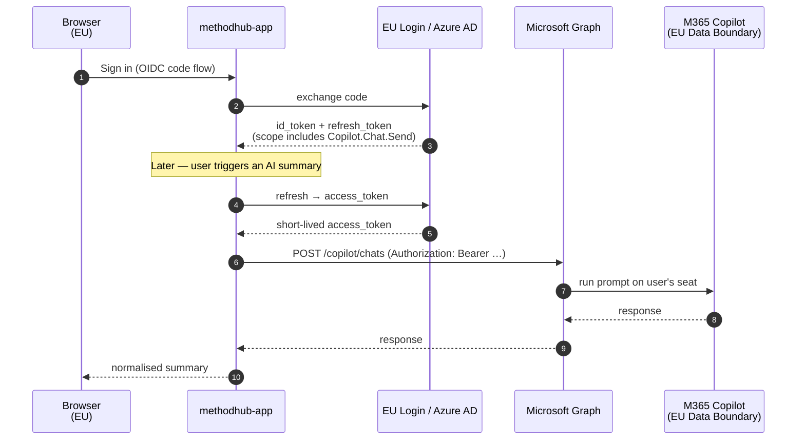

# Copilot — technical deep-dive

!!! abstract "Scope"
    The technical design for **Path B** of the [AI layer](ai-layer.md) —
    reusing each user's existing Microsoft 365 Copilot licence via
    Microsoft Graph, instead of provisioning an Azure OpenAI
    subscription.

!!! danger "Design document, not current implementation"
    **Everything on this page describes the target state for the
    Copilot / Graph path, not what runs today.** The current
    codebase dispatches AI calls through `src/lib/ai-summary.ts`
    to Azure OpenAI, Anthropic, OpenAI, or Gemini only. There is
    no Microsoft Graph SDK in `package.json`, no
    `src/lib/ai/copilot-graph.ts` file, no `@azure/msal-node`
    dependency, no `copilot-graph` value for `LLM_PROVIDER`, and
    no per-user token bucket or circuit breaker. Landing this
    path requires the code described below to be written.

!!! warning "Maturity disclaimer"
    Microsoft stabilised the Graph-based Copilot APIs through 2025/2026.
    Some endpoints referenced below moved from preview to GA; others
    may still be in preview when EEA evaluates this path. This page is
    a design note, not a shipping manual — before implementing the
    flag, CCE5 re-verifies endpoint names, scope names and licence
    gates against current Microsoft documentation.

## Why this is attractive for EEA

- **No service subscription, no per-token billing.** AI cost stays
  where EEA already spends it — the per-user M365 Copilot seat.
- **No API keys to rotate.** Tokens come from EU Login / Azure AD and
  refresh with the standard OIDC flow we already support.
- **EU Data Boundary by construction.** For EU tenants, Microsoft
  keeps Copilot processing inside the EU Data Boundary.
- **Auditable per user.** Tenant-level Purview / DLP / sensitivity
  labels apply automatically. If EEA admins disable Copilot for a
  user, MethodHub stops calling it for that user the same minute.
- **Fallback is trivial.** Users without a Copilot licence fall back
  to Path A (Azure OpenAI EU) or to a "no AI" response.

<figure class="mh-figure mh-figure--wide" markdown>

<figcaption><span class="mh-figure__num">Figure 7.</span> Delegated OAuth sequence. One-time OIDC sign-in populates a server-side refresh-token cache; every subsequent AI call trades it for a short-lived access token and hits Graph on the user's behalf. No service API key is used at any point.</figcaption>
</figure>

## High-level call path



## App registration & OAuth scopes

A single Entra ID app registration in the EEA tenant covers it.

=== "App registration"

    ```
    App type:             Web (confidential client)
    Redirect URI:         https://methodhub.eea/auth/callback
    Supported accounts:   Accounts in this organizational directory only
                          (EEA tenant)
    Client secret:        stored in IT's secret store as AZURE_CLIENT_SECRET
    ```

=== "Delegated scopes"

    | Scope                                     | Purpose                                             |
    |-------------------------------------------|-----------------------------------------------------|
    | `openid` / `profile` / `email`            | Base OIDC — already used by `AUTH_PROVIDER=oidc`.   |
    | `offline_access`                          | Issue refresh tokens for server-side calls.         |
    | `User.Read`                               | Resolve the signed-in user's UPN and licence set.   |
    | `Copilot.Chat.Send` *(or current name)*   | Submit a prompt to Copilot on the user's behalf.    |
    | `Copilot.Retrieve.Chat` *(or current name)* | Retrieve grounded / searched content.             |

    The exact scope names track Microsoft's current "Microsoft 365
    Copilot" catalogue under Graph permissions. CCE5 pins them in
    code once the flag ships.

Admin consent is usually the right choice in EEA's context because it
eliminates the per-user consent dialog the first time a Secretariat
member uses AI in MethodHub.

## Environment variables

Added to `.env.local.example` when `LLM_PROVIDER=copilot-graph`:

```bash
LLM_PROVIDER=copilot-graph

# Entra ID app registration
AZURE_TENANT_ID=<eea-tenant-guid>
AZURE_CLIENT_ID=<app-registration-client-id>
AZURE_CLIENT_SECRET=<in IT secret store, not in repo>

# Graph endpoints — override only to track API version changes
GRAPH_BASE_URL=https://graph.microsoft.com/v1.0
COPILOT_CHAT_PATH=/copilot/chats           # pinned to current GA name
COPILOT_RETRIEVE_PATH=/copilot/retrieval   # pinned to current GA name

# Scopes requested at sign-in (space-separated)
COPILOT_GRAPH_SCOPES="openid profile email offline_access User.Read Copilot.Chat.Send"

# Optional fallback when the user lacks a Copilot licence
LLM_FALLBACK_PROVIDER=azure     # or =none to return a graceful error
```

Nothing in the list is a per-token API key; every secret is tenant-level
Entra ID app configuration.

## Code shape

```
src/lib/ai/
├── anthropic.ts      # current default
├── azure-openai.ts   # Path A
└── copilot-graph.ts  # Path B ── NEW
```

`copilot-graph.ts`, trimmed:

```ts
/**
 * Submit a prompt to Microsoft 365 Copilot on behalf of the signed-in
 * user, using the user's own Copilot entitlement. No service API key
 * is used; the call is authorised by a delegated OAuth token.
 */
export async function summarize(prompt: string, opts: { userId: string }) {
  const session = await getServerSession();
  if (!session?.user) throw new Error('Copilot path requires signed-in user');

  const token = await getDelegatedAccessToken({
    userId: session.user.id,
    scopes: process.env.COPILOT_GRAPH_SCOPES!.split(' '),
  });

  const url = `${process.env.GRAPH_BASE_URL}${process.env.COPILOT_CHAT_PATH}`;
  const res = await fetch(url, {
    method:  'POST',
    headers: { Authorization: `Bearer ${token}`, 'Content-Type': 'application/json' },
    body: JSON.stringify({
      message: { body: { contentType: 'text', content: prompt } },
      groundingSources: buildGroundingFor(opts.userId),
    }),
  });

  if (res.status === 402 || res.status === 403) return summarizeViaFallback(prompt);
  if (!res.ok) throw new Error(`Copilot Graph ${res.status}`);
  return normaliseCopilotResponse(await res.json());
}
```

Key points:

- **Delegated auth.** Cached refresh token per user; each call trades it
  for a short-lived access token.
- **Licence handling.** 402/403 routes to `LLM_FALLBACK_PROVIDER`. No
  silent failure.
- **Response shim.** Copilot responses are mapped into the same
  envelope Anthropic and Azure return.

## Scheduled jobs — the unsigned-in case

Several pipelines run without a user:

- `scripts/fetch-news.js` — hourly RSS sweep.
- `scripts/generate-daily-summary.js` — daily 24 h LLM summary.
- Content-analysis batch pre-tagging if enabled.

M365 Copilot is a **per-user** entitlement; these jobs cannot use it.
They keep running on `LLM_PROVIDER_BATCH=azure` (Path A) via a small
service-side budget. This is how the mixed landing in
[AI layer — Path C](ai-layer.md#path-c-mixed-recommended-landing)
actually works.

## Rate limits, observability, DLP

- **Rate limits** are per-user-per-minute and enforced by Microsoft.
  The existing retry/backoff layer handles 429s; the headers to
  inspect are `Retry-After` on the Graph response.
- **Observability.** Every call logs
  `{ userId, latencyMs, statusCode, fallbackTriggered }` into the
  existing `ai_call_audit` table. **Prompt content is not logged.**
- **DLP / sensitivity labels.** Because the call is delegated,
  tenant-level Purview / DLP policies apply automatically — this is
  the biggest operational argument for Path B.

## What we do *not* do

- ❌ Embed Microsoft 365 Chat as an iframe. The UX stays native to
  MethodHub; Copilot is an inference backend, not a surface.
- ❌ Register MethodHub as a declarative agent inside Microsoft 365
  Copilot. That is a separate integration and can coexist later.
- ❌ Require every module to use Copilot. The flag is global but
  modules can opt back to Path A per-call (e.g. batch pre-tagging).

## Deep dive

??? abstract "Token cache — where refresh tokens live"
    `getDelegatedAccessToken({ userId, scopes })` is backed by a
    server-side MSAL node token cache, persisted in the
    `auth_tokens` Postgres table (not localStorage, not a file).
    Columns:

    ```
    user_id        uuid   — references users.id
    home_account   text   — MSAL home account identifier
    encrypted_blob bytea  — MSAL cache serialised and encrypted
                            with TOKEN_CACHE_KEY (env)
    refreshed_at   timestamptz
    ```

    Encryption uses AES-256-GCM with a per-environment key. If
    `TOKEN_CACHE_KEY` rotates, existing rows are invalidated and
    users re-consent on next call (same UX as a refresh-token
    expiry).

??? abstract "Graph response shape — what we normalise"
    Graph's Copilot Chat response is not 1:1 with OpenAI-format
    completions. The shim in `src/lib/ai/copilot-graph.ts`
    normalises:

    ```ts
    function normaliseCopilotResponse(raw: any): AiResponse {
      const msg = raw?.message ?? raw?.attributedText;
      return {
        text:          msg?.body?.content ?? msg?.text ?? '',
        citations:     (msg?.attributions ?? []).map(mapCitation),
        tokens:        undefined,      // Graph does not return a token count
        finishReason:  raw?.finishReason ?? 'stop',
        providerMeta: {
          rateLimitRemaining: raw?.headers?.['x-rate-limit-remaining'],
          retryAfter:         raw?.headers?.['retry-after'],
        },
      };
    }
    ```

    Callers care about `text` and `citations`; `tokens` is
    intentionally `undefined` on this path because there is no
    per-token billing to attribute.

??? abstract "Fallback routing — order of resolution"
    The `summarize()` facade resolves the provider in this order:

    1. Explicit `opts.provider` argument (wins, for tests).
    2. If `LLM_PROVIDER === 'copilot-graph'` **and** a session
       exists **and** `COPILOT_GRAPH_SCOPES` are granted → Copilot.
    3. Otherwise → `LLM_FALLBACK_PROVIDER` if set.
    4. Otherwise → `LLM_PROVIDER` as a last resort (i.e. same path
       without the per-user element, e.g. a service-subscription
       Azure call).
    5. Otherwise → throw a `NoLLMAvailable` error.

    The resolution is logged to `ai_call_audit` as
    `chose_provider`, so you can audit fallback frequency after
    enabling Path B.

??? abstract "Rate-limit behaviour — retries and circuit breaker"
    - On a 429 from Graph, the call retries up to **2 times** with
      exponential backoff honouring `Retry-After`.
    - A per-user token-bucket in the app (`ai_call_budget` table)
      additionally caps calls at **12 per minute per user** to
      stay well below Graph's limits under bursts.
    - After 5 consecutive 5xx responses on the Copilot path, a
      60-second circuit breaker opens and the code falls through to
      `LLM_FALLBACK_PROVIDER`. The breaker state is visible via
      `/api/health?detail=ai`.

## Decision checklist for EEA IT

Before flipping `LLM_PROVIDER=copilot-graph` in production:

- [ ] Confirm the current GA status of the Graph Copilot Chat endpoints.
- [ ] Create the Entra ID app registration in the EEA tenant and grant
      admin consent for the scopes listed above.
- [ ] Confirm every user expected to use AI has an M365 Copilot licence.
- [ ] Decide the fallback provider (`LLM_FALLBACK_PROVIDER`) for users
      without a licence.
- [ ] Confirm with the DPO that Copilot's EU Data Boundary behaviour
      is acceptable for the data types MethodHub handles (it almost
      always is, but documenting it closes a loop).
- [ ] Roll out to one module first — [Content Analysis](../modules/content-analysis.md)
      is the recommended pilot.

Once those are done, the production flip is a single env-var change.
CCE5 does the code (response shim, fallback, observability); EEA IT
does the tenant configuration.
