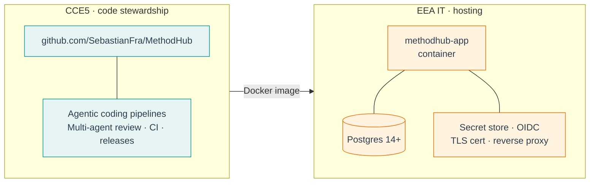

# Stewardship model

> **CCE5 owns the code. EEA IT operates the service.** That split
> mirrors how [`github.com/eea`](https://github.com/eea) already
> operates — code in the open, services in the EU region.

<figure class="mh-figure mh-figure--wide" markdown>

<figcaption>Figure 5. The stewardship split. CCE5 ships release artefacts (Docker images) across the boundary; EEA IT sends operational signal back. Neither side takes on work that naturally belongs to the other.</figcaption>
</figure>

## Responsibilities

=== "CCE5 (code)"
    - Repository ownership on `github.com/SebastianFra/MethodHub`.
    - Feature development, migrations, data pipelines, UI, docs.
    - PR review loop, agentic coding pipelines, multi-agent review passes.
    - Decides when a beta module graduates out of `beta/modules/`.
    - Publishes releases and Docker images.

=== "EEA IT (hosting)"
    - Runs the container on EEA infrastructure in the EU region.
    - Provides a Postgres 14+ URL; owns backups, patching, restore.
    - Reverse proxy + TLS cert on an EEA-owned domain.
    - Wires OIDC (EU Login / Azure AD), optionally S3, optionally an
      Azure OpenAI EU endpoint or the M365 Copilot path.
    - Manages operational secrets via their secret store.

## Why this split is cheap

- **The artefact is a plain OCI image.** EEA IT runs it on whatever
  they already operate.
- **The source of truth stays on GitHub.** PR review, issue tracking,
  code search — the habits do not change.
- **Nothing leaks.** User-entered state lives in EEA Postgres; PDFs in
  EEA object storage; AI calls terminate in-EU.

## CCE5 contact

For anything code-related — bugs, proposed modules, review requests,
handoff questions — the primary contact at CCE5 is:

- **Sebastian Franz** — [sebastian.franz@esabcc.europa.eu](mailto:sebastian.franz@esabcc.europa.eu)

Anything operational (production incidents, DB restores, TLS cert
rotation) goes to EEA IT through their usual channels; code fixes
come back to CCE5 via the GitHub repository's issues and PRs.

## Repository ownership — today and tomorrow

The codebase currently lives under a personal GitHub account:

github.com/<strong>SebastianFra</strong>/MethodHub

That is a starting-point arrangement, not a long-term one. The intent is
to move the repository under a **GitHub organisation** that reflects its
institutional home:

=== "Today"
    - **Owner:** `github.com/SebastianFra` (personal account, CCE5 engineer).
    - **Access:** normal repo collaborator model; CCE5 contributors invited
      directly by the owner.
    - **CI / self-hosted runner:** attached at the repo level.
    - **Why this is fine for now:** the repository is young, moving fast,
      and the institutional GitHub org story needs EEA IT's input to
      land correctly. A personal account keeps the blast radius small.

=== "Tomorrow (option A · ESABCC org)"
    - **Owner:** a `github.com/ESABCC` (or similar) organisation, once
      created.
    - **Rationale:** reflects the primary user (the Secretariat) in the
      URL. Matches the pattern some other EU scientific bodies use.
    - **Move:** GitHub's built-in *Transfer ownership* flow preserves
      issues, PRs, releases and Pages.

=== "Tomorrow (option B · EEA org)"
    - **Owner:** under the existing `github.com/eea` organisation.
    - **Rationale:** puts it in the same place as every other
      EEA-maintained repository, including the Plone stack. No policy
      conflict — code in the open, services in the EU region is exactly
      the pattern EEA already runs.
    - **Move:** same GitHub *Transfer ownership* flow.

**Whichever move happens, one requirement is non-negotiable:**

!!! warning "CCE5 keeps maintainer access"
    CCE5 must retain **maintainer-level (edit) access** on the
    transferred repository. The stewardship model — CCE5 ships features,
    EEA IT hosts — only works if CCE5 can keep pushing branches,
    merging PRs, cutting releases and running the self-hosted runner.
    Read-only access for CCE5 after a transfer would quietly break the
    model.

Practically, that means the destination org's admins grant CCE5
engineers a **team** with `Maintain` (or `Admin`) permissions on this
repository. A `Write` role is enough day-to-day but doesn't cover
release/tag protection changes, so `Maintain` is the recommended floor.

### What does *not* change across a transfer

- Git history, CI configuration, self-hosted runner tokens after
  re-registration, Pages URL (redirect is automatic on GitHub).
- The agentic coding and review pipelines — those are defined in the
  repo's `.github/` and `docs/`, so they travel with the code.
- The Docker image + the Postgres schema. The service on EEA
  infrastructure is unaffected by who owns the GitHub repo.

### What does change

- The repo URL, and therefore any hardcoded link. These are already
  minimised; the canonical source-of-truth is `package.json`'s
  `repository` field and the `repo_url` in
  [`mkdocs.yml`](https://github.com/SebastianFra/MethodHub/blob/main/mkdocs.yml).
  A one-line PR updates both, nothing else.

## Access today — the practical picture

While the repository still lives at `github.com/SebastianFra/MethodHub`
(a personal GitHub account), **CCE5 colleagues and trusted reviewers
are added as repository collaborators**, not as org members. On a
personal account, GitHub allows an unlimited number of collaborators
on both public and private repositories — there is no per-user fee
for access to the source while we stay on this arrangement.

Two operating modes are feasible today without any plan upgrade:

=== "Public repo · collaborators for edit access"
    - Anyone on the internet can read the code (supports the blueprint
      argument).
    - Named collaborators (CCE5 engineers, trusted reviewers) get
      write / maintain access and can push PRs and merge.
    - Docs site is served from GitHub Pages with the StaticCrypt
      password gate in front.
    - **This is the current state.**

=== "Private repo · collaborators only"
    - Only invited collaborators see the code at all.
    - Still supports CCE5 maintainership — invited people get the
      same push/merge rights as under the public mode.
    - ⚠️ **Free-plan caveat.** GitHub Pages only serves from private
      repositories on the **Pro / Team / Enterprise** plans. On a free
      personal account, turning the repo private will take the docs
      site offline until either the repo is public again or the plan
      is upgraded. For internal-only docs, GitHub **Team** with
      "Private Pages" is the clean answer — readers sign in with
      GitHub and must have repo read access.

??? abstract "Quick cost ladder for the private-and-shared case"
    | Plan                     | Rough price                   | What it unlocks                                             |
    |--------------------------|-------------------------------|-------------------------------------------------------------|
    | **Free** (today)         | €0                            | Public repo · unlimited collaborators · public Pages only.  |
    | **GitHub Pro**           | ~€4 / month                   | Private repo + Pages works — but URL is still public; keep StaticCrypt as the gate. |
    | **GitHub Team (org)**    | ~€4 / user / month            | Private Pages — requires GitHub sign-in and read access. Clean for an internal-only doc site. |
    | **Enterprise Cloud**     | ~€21 / user / month           | SAML SSO — the eventual answer once EEA's Azure AD is in the picture. |

??? abstract "Inviting a collaborator — step-by-step"
    From `github.com/SebastianFra/MethodHub/settings/access` (desktop
    mode on mobile):

    1. **Add people** → type the person's GitHub username or email.
    2. Pick a role: **Write** is enough to push branches and merge
       their own PRs; **Maintain** additionally grants permission to
       manage releases and issues without full admin powers;
       **Admin** covers settings / secrets / Pages.
    3. Confirm. GitHub emails them an invitation; once they accept,
       they have full access at the chosen level.

    No plan change needed for this path — collaborator invites are
    free on both public and private repos.

## What CCE5 does *not* take on

- Day-to-day operational monitoring.
- Backups, disaster recovery, patching of the host OS.
- Tenant-level identity / DLP / Purview policies — those stay with EEA.

## What EEA IT does *not* take on

- Shipping features.
- Schema design (they run migrations, they don't author them).
- Choosing libraries, auth providers, LLM providers — those are flags
  exposed by CCE5, not decisions IT has to make.
