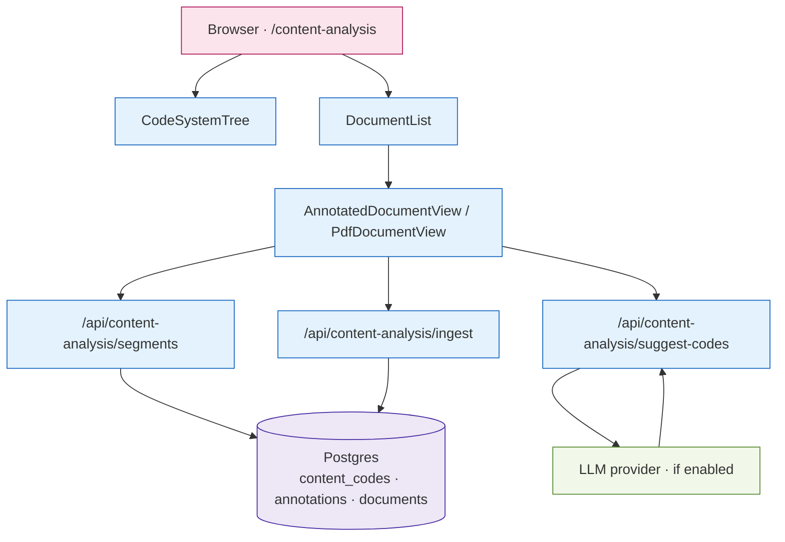

# M · 05 — Content Analysis

!!! tip "Status"
    Stable · shipped in v1.0 · route [`/content-analysis`](https://github.com/EUClimateAdvisoryBoard/ESABCCMethodHub/tree/main/src/app/content-analysis)

MAXQDA-style qualitative coding, but in the browser and keyed to the
same corpus the rest of MethodHub works on — policy texts via M·04,
reference PDFs via M·01.

## User story

> An analyst is coding six policy texts for "just transition" framing.
> They open `/content-analysis`, select the texts in the corpus
> browser, drag their code tree onto highlighted passages, and — once
> coverage looks reasonable — toggle LLM pre-tagging on a seventh text
> to bootstrap the same scheme.

## Surfaces

| Surface                       | Role                                                    |
|-------------------------------|---------------------------------------------------------|
| `CodeSystemTree`              | Hierarchical code taxonomy with drag/drop, collapse/expand-all, color-square activate toggle, "create from selection" and "move to root" affordances. |
| `DocumentList`                | Corpus browser with filter/search.                      |
| `AnnotatedDocumentView`       | Plain-text viewer with inline codings, in-document Ctrl+F find bar, right-click context menu on segment brackets. |
| `PdfDocumentView`             | Lazy-loaded `react-pdf` viewer for PDF sources.         |
| `FloatingCodeToolbar`         | Selection toolbar — apply tag, create new tag from selection, **# Extract number** for the mixed-methods layer. |
| `TagDistributionPanel`        | Right-rail panel: tag frequency for the *current* document. |
| `NumericExtractionsPanel`     | Right-rail panel: structured numeric segments (value · unit · year · label) with sort, inline edit, jump-to-source, Word/CSV export. |
| `SnapshotsPanel`              | Manual + auto (every 5 min) snapshots of the code tree and segments, restore-from-snapshot with safety snapshot first. |
| `NewProjectWizard`            | Two-step wizard: (1) corpus scope by master tag or explicit documents; (2) project details + analysis mode. |
| `SectorFlowBoard`             | Analyse-view lens: per-sector flow chart wiring ① progress reporting → ② policy analysis → ③ ESABCC recommendations, with a co-benefits lane (health, air, water, biodiversity…) and live indicator chips. |
| `ProjectLockPill`             | Header pill — "You are editing" / "Read-only — Alice is editing" with Request / Hand-off actions. |

## Data flow



## Code surface

| Path                                                                                                                                     | Role                                               |
|------------------------------------------------------------------------------------------------------------------------------------------|----------------------------------------------------|
| [`src/app/content-analysis/page.tsx`](https://github.com/EUClimateAdvisoryBoard/ESABCCMethodHub/blob/main/src/app/content-analysis/page.tsx)              | Route entry; composes the three surfaces.          |
| [`src/components/content-analysis/`](https://github.com/EUClimateAdvisoryBoard/ESABCCMethodHub/tree/main/src/components/content-analysis)                 | All sub-components (tree, list, text/PDF viewers). |
| [`src/lib/content-analysis/`](https://github.com/EUClimateAdvisoryBoard/ESABCCMethodHub/tree/main/src/lib/content-analysis)                               | Store + server-side ingestion helpers.             |

## API surface

| Method        | Path                                          | Purpose                                                 |
|---------------|-----------------------------------------------|---------------------------------------------------------|
| GET           | `/api/content-analysis/segments`              | List coding segments for a document.                    |
| POST          | `/api/content-analysis/ingest`                | Ingest a URL / DOI / file into the corpus.              |
| POST          | `/api/content-analysis/ingest-upload`         | Direct file upload (PDF, DOCX, MD).                     |
| POST          | `/api/content-analysis/resegment`             | Re-segment a document (granularity change).             |
| POST          | `/api/content-analysis/classify`              | LLM classification against an existing code tree.       |
| POST          | `/api/content-analysis/suggest-codes`         | LLM-suggest missing codes.                              |
| GET           | `/api/content-analysis/suggestions`           | List pending LLM-suggested codings.                     |
| GET           | `/api/content-analysis/pdf`                   | Serve PDF bytes for the viewer.                         |
| GET           | `/api/content-analysis/locks`                 | List held project locks (or fetch one by `?projectId=`).|
| POST          | `/api/content-analysis/locks`                 | Acquire a project lock (steals if heartbeat older than 90 s; otherwise stamps the requester as a hand-off candidate). |
| PATCH         | `/api/content-analysis/locks`                 | Heartbeat the held lock — returns any pending hand-off request. |
| DELETE        | `/api/content-analysis/locks`                 | Release the lock (also fired via `navigator.sendBeacon` on tab close). |

## Schema

```
ca_documents                       (id, kind, title, source_ref, text,
                                    ingested_by, ingested_at)
ca_segments                        (id, document_id, para_idx, start, end, text)
ca_code_system                     (id, parent_id, label, color, order_idx)
ca_annotations                     (id, segment_id, code_id, note,
                                    created_by, created_at, confidence)

-- migration 027 (project locks)
content_analysis_project_locks     (project_id PK, holder_id, holder_name,
                                    acquired_at, heartbeat_at,
                                    request_pending, requested_at)
```

The lock table has at most one row per project. `holder_id` is the
stable per-browser id sent by the workbench in the `X-MH-Client-Id`
header; once OIDC lands, the same column carries the OIDC `sub` with
no schema change. `request_pending` carries the hand-off requester's
display name so the holder's next heartbeat can surface a "Bob is
asking for the lock — hand off?" toast.

## LLM integration

Optional LLM-assisted pre-tagging is gated behind
`AUTO_LLM_SUMMARIZATION_ENABLED` (default **off**; see
[GDPR](../infrastructure/data-gdpr.md)). When enabled, the module calls
`LLM_PROVIDER` — Anthropic today, Azure OpenAI EU in production, or the
user's own **Microsoft 365 Copilot** licence via Graph as a new
per-user option (see [Copilot deep-dive](../infrastructure/copilot.md)).

!!! info "Recommended pilot for the Copilot path (target)"
    When the Copilot path (`LLM_PROVIDER=copilot-graph`) is eventually
    implemented, Content Analysis is the recommended first module to
    try it in: prompts are short, the user is always signed in, and
    the value of LLM assistance here is clear. Today that path
    doesn't exist in the dispatcher yet; Content Analysis uses
    whichever provider is configured via the current `LLM_PROVIDER`
    values (`azure-openai | anthropic | openai | gemini`).

## Deep dive

??? abstract "Segmentation — how we slice a document into coding units"
    `POST /api/content-analysis/ingest` runs a two-pass segmenter:

    1. **Structural pass** — split on `\n\n+`, headers (`#`, `##`, …),
       and EUR-Lex article markers (`Article \d+`, `Section \d+`).
    2. **Length pass** — any segment longer than ~600 words is
       subdivided at sentence boundaries so annotators can attach a
       code to a manageable chunk.

    The segmenter records `para_idx` (structural order) and
    `start`/`end` character offsets relative to the original text.
    Re-segmentation (`/api/content-analysis/resegment`) preserves
    existing annotations by mapping their `(start, end)` range to the
    new segment that contains most of the range.

??? abstract "LLM pre-tagging — prompt and output envelope"
    When `AUTO_LLM_SUMMARIZATION_ENABLED=true`, `POST /api/content-analysis/classify`
    sends each segment with the full code tree to the LLM. The prompt:

    ```
    System:
      You are an assistant that tags policy-text segments with codes
      from a hierarchical coding scheme. Output only valid JSON.

    User:
      CODE TREE:
      <YAML-serialised hierarchy with label, description, id>

      SEGMENT:
      <the text>

      Return { "codes": [<id>, ...], "confidence": <0..1>, "rationale": "<<=240 chars>" }
    ```

    The output is validated against a strict JSON schema. Low-confidence
    results (<0.5) are stored in `ca_suggestions` and only become
    `ca_annotations` once a human confirms them via the UI.

??? abstract "PDF coordinates — why the current system is page-relative"
    `PdfDocumentView.tsx` (react-pdf) exposes the character ranges on
    each page through its `TextLayer`. We store PDF highlights as
    `(page, rect)` in PDF user-space, not `(offset_start, offset_end)`,
    because text-layer offsets are unstable across pdf.js versions
    and text extraction quality varies dramatically between PDFs
    produced by different tools.

    The roadmap is to swap to OCR-backed coordinates via
    [pdf-text-extract](https://github.com/nisaacson/pdf-text-extract)
    or similar, which would let us persist text-relative offsets that
    survive re-renders on different pdf.js versions.

??? abstract "Inter-coder agreement — export path"
    We do **not** compute inter-coder reliability (κ, α) in-app.
    Instead, `/api/content-analysis/segments?format=dta` returns a
    Stata-compatible DTA export with one row per (segment × coder ×
    code) that plugs into standard reliability tooling (Stata's
    `kappa`, R's `irr` package). This is a deliberate
    build-vs-buy call: reliability computation has many well-validated
    implementations and no real UX value for a web app.

## Workbench tooling

The coding workbench is more than the tree + viewer. The features
below are all wired into `src/app/content-analysis/page.tsx`:

### Tag system tooling

- **Activate / deactivate codes via the colour-square toggle** —
  inactive codes drop out of the floating toolbar and visualisations
  but stay in the tree.
- **Sub-tags inherit parent colour** — even unrecognised tag families
  get a per-family palette derived from the parent so the tree stays
  readable on first sight.
- **Collapse / expand-all** control above the tree.
- **Right-click context menu on segment brackets** — re-tag, untag,
  jump to source, copy segment text.
- **Create new tag from highlighted selection** — direct path from
  reading to coding without leaving the document.
- **"Move tag to root"** affordance on every nested code, surfaced
  in the right-click menu.
- **Tag distribution panel** — frequency for every tag in the
  *current document only* (the corpus-wide view lives in the
  analytics route).

### Chapter (sector) tags

A second, parallel tagging dimension that runs alongside the thematic
code tree: a **`chapter:` namespace** of *overall tags* seeded with the
report chapters / sectors — **Energy, Industry, Transport, Buildings,
Agriculture, LULUCF, Cross-cutting, Adaptation**. It lets the lead line
up *which papers belong to which sector chapter*, independently of the
thematic coding.

- **No schema change.** Chapter tags are encoded self-describingly
  (`chapter:<id>`) so they ride the **existing shared, durable
  overall-tags store** — localStorage-first, with an outbox that syncs
  to Supabase — exactly like custom overall tags. They are permanently
  stored and synced, with no new table or migration.
- **"Set chapter" picker** on each document in the Analysing section,
  with an *add a new chapter* option. Chapter tags render as their own
  **filled chips** — kept visually separate from thematic overall tags —
  both on the document and on the corpus document cards.
- **Chapter filters** in both the *In this workspace* corpus list and
  the *Add documents* library browser, so the lead can narrow to the
  papers lined up for a given sector chapter. The filter pool includes
  any hand-coined chapter.
- **Generalised `OverallTagPicker`** — a `formatCreateId` hook mints the
  right id (`chapter:` vs `custom:`) and the picker resolves
  already-selected tags that are absent from the current pool (chapters
  or custom tags coined on other documents).

The helpers live in
[`src/lib/content-analysis/chapter-tags.ts`](https://github.com/EUClimateAdvisoryBoard/ESABCCMethodHub/blob/main/src/lib/content-analysis/chapter-tags.ts)
(`CHAPTER_TAGS`, `isChapterTagId`, `formatChapterTagId`,
`chapterTagColor`, `splitTagIds`). This is the **coding-side** counterpart
to [M·33 Sector Background](sector-background.md), which reads a sector's
framework, policies and literature together.

!!! info "Where it surfaces"
    Chapter tags are wired through the **Project Workspace** embed of
    Content Analysis (`ContentAnalysisModule`), which reaches the module
    through the public `lib/content-analysis/service` and
    `components/content-analysis` barrels rather than deep-importing
    internals — the same stable entry points a future module reuses.

### In-document Ctrl+F search

`AnnotatedDocumentView` ships its own find bar — toggled with **⌘F /
Ctrl+F** or the *Find in document* link in the viewer header. Matches
are highlighted in yellow on top of any segment colouring; the
active match gets a brighter outline and scrolls into view; **Enter /
Shift+Enter** step through prev/next. The corpus-wide
`FullTextSearch` panel keeps doing the cross-document job.

### Mixed-methods numeric extraction

Highlight a number → **# Extract number** in the floating toolbar →
the parser produces a structured payload `{ value, unit, year, label }`:

- European decimals (`1,5`), magnitude suffixes (`bn`, `mn`),
  unit families (`EUR`, `%`, `GW`, `TWh`, `Mt CO₂eq`, …),
  and year ranges.
- The segment is created under the active tag with the numeric
  payload attached, so qualitative codings and quantitative
  evidence land in the same store
  (`src/lib/content-analysis/numeric.ts`).
- The right-rail **Numeric extractions** panel is a sortable
  mini-table with inline edit, jump-to-source, and **Word / CSV
  export** (CSV is BOM-prefixed so Excel opens it as UTF-8).

### Sector flow lens

The Analyse view's **Sector flow** tab draws the reasoning chain the
Secretariat works along when drafting, one flow chart per report
sector (Energy supply, Industry, Transport, Buildings, Agriculture,
LULUCF):

- **① Progress reporting** — live indicator cards from the shared
  indicator database (sparkline, latest value, % change, and an
  on-track / too-slow / off-track signal computed against the legal
  target's required pace).
- **② Policy analysis** — the EU instruments responding to each
  signal, from the Policy Navigator's sectoral library. When the
  active workspace corpus contains the act (CELEX or acronym match),
  the card shows how many coded passages the workspace holds on it.
- **③ Recommendations** — the ESABCC 2024 advice that closes the
  remaining gap, with the tracker's uptake status; advice with no
  instrument to flow through renders as a dashed **identified gap**
  card (e.g. agricultural emissions pricing, the ETD revision).
- **Co-benefits lane** — health, air quality, water, biodiversity,
  equity, jobs, energy security and resilience nodes hang off the
  indicator / policy / recommendation they spring from, with a data
  series of their own where one exists (e.g. nitrogen-use efficiency
  for water quality).

Edges are measured SVG beziers between the real cards; hovering any
node highlights its chain and fades the rest. Only the *wiring* is
curated (`src/lib/content-analysis/sector-flow.ts`) — values,
statuses and policy metadata resolve from the shared databases at
render time, so the chart never drifts from the tracker modules.

### Snapshots

The **Snapshots** panel captures the current code tree + segments:

- **Manual** — *Capture* button, optional label.
- **Automatic** — every five minutes while the workbench is open.
- Snapshots live in their own `localStorage` key, so resetting the
  corpus does not wipe them
  (`src/lib/content-analysis/snapshots.ts`).
- **Restore** replaces codes + segments only — documents and
  projects are preserved — and a safety snapshot is captured first
  so a restore can itself be undone.

### Policy clustering

A lens in the Analyse view (`PolicyClusteringBoard`) that runs the first
step of the policy coherence analysis: for each system (Energy supply,
Buildings, Agri-food, and others to follow), every relevant EU policy or
measure is sorted into one of four categories describing the type of
governing resource it uses — information, law, money, or institutional
capacity — and tagged for whether it serves mitigation, adaptation, or
both. This produces the structured inventory the coherence board
(`PolicyCoherenceBoard`) needs before it can look for gaps, overlaps and
conflicts across and within the clusters.

The four-category framework (originally "NATO": Nodality, Authority,
Treasure, Organization) is Daniel Henstra's policy-instruments typology
(Henstra, D. (2015). *The tools of climate adaptation policy: analysing
instruments and instrument selection*. Climate Policy.
doi:10.1080/14693062.2015.1015946). The dataset and category metadata
live in
[`src/lib/content-analysis/policy-clustering.ts`](https://github.com/EUClimateAdvisoryBoard/ESABCCMethodHub/blob/main/src/lib/content-analysis/policy-clustering.ts);
it is a draft working tool — instrument lists are a first pass and should
be checked against current legislation before use in the final coherence
analysis.

### Two-step New Project Wizard

The **New Project** flow is a two-step stepper:

1. **Define corpus scope.** Pick by master tag (left column) and/or
   add specific documents ad hoc (right column with search). The
   footer summarises the resolved scope in real time
   (*"3 tags → ~12 docs"*, *"5 documents explicit"*, *"Whole library"*).
2. **Project details.** Name, description, analysis mode.

The wizard finally honours `documentAllowList`, which had been
wired in the data model but unreachable from the previous all-in-one
screen.

## Soft locking — one editor at a time per project

Multi-user coding does not need full real-time CRDTs at this scale;
the workbench uses **soft locks** instead.

### Lifecycle

1. **Acquire.** When the editor opens a project, the workbench
   `POST`s to `/api/content-analysis/locks`. If no row exists, the
   caller becomes the holder. If the existing holder's `heartbeat_at`
   is older than 90 s, the lock is **stolen**. Otherwise the request
   stamps the caller's display name as a hand-off candidate.
2. **Heartbeat.** Every ~30 s the holder's tab `PATCH`es the row.
   The response surfaces any pending hand-off request so the holder
   gets a 30 s sticky toast — *"Bob is asking for the lock — hand
   off?"* — with a one-click action.
3. **Idle gestures.** Global `mousedown` / `keydown` listeners bump
   the idle timer naturally, so an active editor isn't auto-released
   after 10 min just because they aren't switching tabs.
4. **Release.** Explicit *Release* button, or `navigator.sendBeacon`
   on tab close, or implicit when heartbeats stop and the watcher's
   acquire request steals it.

### Identity carrier

`X-MH-Client-Id` is a uuid the client persists in `localStorage`. When
OIDC lands the route reads the session `sub` instead — same string-id
semantics, no schema change. The watcher's display name comes from
the user profile (or "Anonymous tablet" in unauthenticated dev).

### Hand-off vs. steal

- **Hand-off** is co-operative: holder still alive, watcher waits for
  the toast, holder clicks *Hand off*.
- **Steal** is non-co-operative: the watcher's acquire call sees a
  stale heartbeat (>90 s) and replaces the holder row outright. This
  is the recovery path for crashed tabs.

The watcher loop intentionally backs off after a hand-off so it does
not immediately re-acquire the lock it just released
(see commit `8a1cdf8` — *stop watcher loop from grabbing the lock
right back after hand-off*).

### Mutating-handler gate

Every mutating handler in `page.tsx` is wrapped in a `requireLock()`
guard via the `useProjectLock` hook. Read-only viewers never call it.
The gate makes the lock the single source of truth for whether the
session can write — even keyboard shortcuts respect it.

## Known limits

- **No inter-coder reliability metrics yet.** Export to DTA for SPSS
  analysis is the current workaround.
- **PDF highlights are page-relative, not text-relative.** This is a
  react-pdf constraint; a switch to OCR-backed coordinates is on the
  roadmap.
- **Soft-locking is per project, not per document.** Two analysts
  cannot edit different documents within the same project at the
  same time. This is by design — the code tree itself is shared
  state, and concurrent edits to it are the failure mode locks
  exist to prevent.
