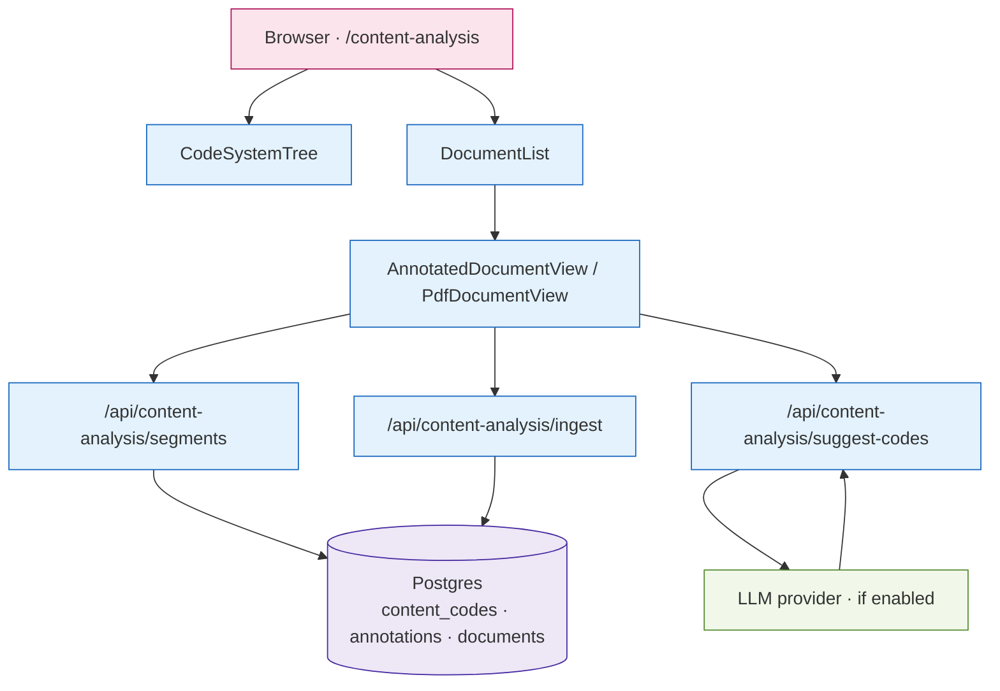

# M · 05 — Content Analysis

!!! tip "Status"
    Stable · shipped in v1.0 · route [`/content-analysis`](https://github.com/SebastianFra/MethodHub/tree/main/src/app/content-analysis)

MAXQDA-style qualitative coding, but in the browser and keyed to the
same corpus the rest of MethodHub works on — policy texts via M·04,
reference PDFs via M·01.

## User story

> An analyst is coding six policy texts for "just transition" framing.
> They open `/content-analysis`, select the texts in the corpus
> browser, drag their code tree onto highlighted passages, and — once
> coverage looks reasonable — toggle LLM pre-tagging on a seventh text
> to bootstrap the same scheme.

## Surfaces

| Surface                 | Role                                                    |
|-------------------------|---------------------------------------------------------|
| `CodeSystemTree`        | Hierarchical code taxonomy with drag/drop.              |
| `DocumentList`          | Corpus browser with filter/search.                      |
| `AnnotatedDocumentView` | Plain-text viewer with inline codings.                  |
| `PdfDocumentView`       | Lazy-loaded `react-pdf` viewer for PDF sources.          |

## Data flow



## Code surface

| Path                                                                                                                                     | Role                                               |
|------------------------------------------------------------------------------------------------------------------------------------------|----------------------------------------------------|
| [`src/app/content-analysis/page.tsx`](https://github.com/SebastianFra/MethodHub/blob/main/src/app/content-analysis/page.tsx)              | Route entry; composes the three surfaces.          |
| [`src/components/content-analysis/`](https://github.com/SebastianFra/MethodHub/tree/main/src/components/content-analysis)                 | All sub-components (tree, list, text/PDF viewers). |
| [`src/lib/content-analysis/`](https://github.com/SebastianFra/MethodHub/tree/main/src/lib/content-analysis)                               | Store + server-side ingestion helpers.             |

## API surface

| Method | Path                                             | Purpose                                                 |
|--------|--------------------------------------------------|---------------------------------------------------------|
| GET    | `/api/content-analysis/segments`                 | List coding segments for a document.                    |
| POST   | `/api/content-analysis/ingest`                   | Ingest a URL / DOI / file into the corpus.              |
| POST   | `/api/content-analysis/ingest-upload`            | Direct file upload (PDF, DOCX, MD).                     |
| POST   | `/api/content-analysis/resegment`                | Re-segment a document (granularity change).             |
| POST   | `/api/content-analysis/classify`                 | LLM classification against an existing code tree.       |
| POST   | `/api/content-analysis/suggest-codes`            | LLM-suggest missing codes.                              |
| GET    | `/api/content-analysis/suggestions`              | List pending LLM-suggested codings.                     |
| GET    | `/api/content-analysis/pdf`                      | Serve PDF bytes for the viewer.                         |

## Schema

```
ca_documents       (id, kind, title, source_ref, text,
                    ingested_by, ingested_at)
ca_segments        (id, document_id, para_idx, start, end, text)
ca_code_system     (id, parent_id, label, color, order_idx)
ca_annotations     (id, segment_id, code_id, note,
                    created_by, created_at, confidence)
```

## LLM integration

Optional LLM-assisted pre-tagging is gated behind
`AUTO_LLM_SUMMARIZATION_ENABLED` (default **off**; see
[GDPR](../infrastructure/data-gdpr.md)). When enabled, the module calls
`LLM_PROVIDER` — Anthropic today, Azure OpenAI EU in production, or the
user's own **Microsoft 365 Copilot** licence via Graph as a new
per-user option (see [Copilot deep-dive](../infrastructure/copilot.md)).

!!! info "Recommended pilot for the Copilot path (target)"
    When the Copilot path (`LLM_PROVIDER=copilot-graph`) is eventually
    implemented, Content Analysis is the recommended first module to
    try it in: prompts are short, the user is always signed in, and
    the value of LLM assistance here is clear. Today that path
    doesn't exist in the dispatcher yet; Content Analysis uses
    whichever provider is configured via the current `LLM_PROVIDER`
    values (`azure-openai | anthropic | openai | gemini`).

## Deep dive

??? abstract "Segmentation — how we slice a document into coding units"
    `POST /api/content-analysis/ingest` runs a two-pass segmenter:

    1. **Structural pass** — split on `\n\n+`, headers (`#`, `##`, …),
       and EUR-Lex article markers (`Article \d+`, `Section \d+`).
    2. **Length pass** — any segment longer than ~600 words is
       subdivided at sentence boundaries so annotators can attach a
       code to a manageable chunk.

    The segmenter records `para_idx` (structural order) and
    `start`/`end` character offsets relative to the original text.
    Re-segmentation (`/api/content-analysis/resegment`) preserves
    existing annotations by mapping their `(start, end)` range to the
    new segment that contains most of the range.

??? abstract "LLM pre-tagging — prompt and output envelope"
    When `AUTO_LLM_SUMMARIZATION_ENABLED=true`, `POST /api/content-analysis/classify`
    sends each segment with the full code tree to the LLM. The prompt:

    ```
    System:
      You are an assistant that tags policy-text segments with codes
      from a hierarchical coding scheme. Output only valid JSON.

    User:
      CODE TREE:
      <YAML-serialised hierarchy with label, description, id>

      SEGMENT:
      <the text>

      Return { "codes": [<id>, ...], "confidence": <0..1>, "rationale": "<<=240 chars>" }
    ```

    The output is validated against a strict JSON schema. Low-confidence
    results (<0.5) are stored in `ca_suggestions` and only become
    `ca_annotations` once a human confirms them via the UI.

??? abstract "PDF coordinates — why the current system is page-relative"
    `PdfDocumentView.tsx` (react-pdf) exposes the character ranges on
    each page through its `TextLayer`. We store PDF highlights as
    `(page, rect)` in PDF user-space, not `(offset_start, offset_end)`,
    because text-layer offsets are unstable across pdf.js versions
    and text extraction quality varies dramatically between PDFs
    produced by different tools.

    The roadmap is to swap to OCR-backed coordinates via
    [pdf-text-extract](https://github.com/nisaacson/pdf-text-extract)
    or similar, which would let us persist text-relative offsets that
    survive re-renders on different pdf.js versions.

??? abstract "Inter-coder agreement — export path"
    We do **not** compute inter-coder reliability (κ, α) in-app.
    Instead, `/api/content-analysis/segments?format=dta` returns a
    Stata-compatible DTA export with one row per (segment × coder ×
    code) that plugs into standard reliability tooling (Stata's
    `kappa`, R's `irr` package). This is a deliberate
    build-vs-buy call: reliability computation has many well-validated
    implementations and no real UX value for a web app.

## Known limits

- **No inter-coder reliability metrics yet.** Export to DTA for SPSS
  analysis is the current workaround.
- **PDF highlights are page-relative, not text-relative.** This is a
  react-pdf constraint; a switch to OCR-backed coordinates is on the
  roadmap.
