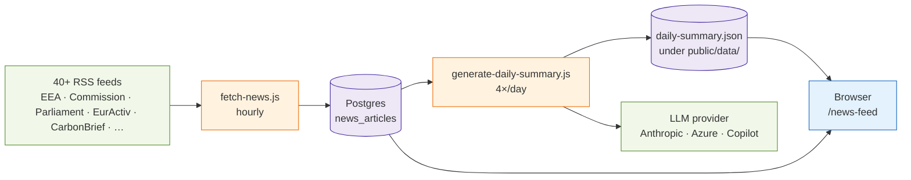

# M · 03 — Secretariat News

!!! tip "Status"
    Stable · shipped in v1.0 · route [`/news-feed`](https://github.com/SebastianFra/MethodHub/tree/main/src/app/news-feed)

A curated climate-policy news feed with a daily 24-hour EU briefing and
an AI-summarised briefing layered on top.

## User story

> An officer starts the day on `/news-feed`. The "Daily summary" tab
> shows the last 24 hours of EU climate news, deduplicated across 40+
> RSS feeds and summarised per topic. A second tab shows the 24 h EU
> institutional briefing (Commission, Parliament, EEA). A third tab
> offers the AI-generated narrative briefing for the same window.

## Three views

=== "1 · Daily summary"
    Hourly RSS sweep → dedup → topical grouping. Cached at
    `public/data/daily-summary.json`, regenerated by
    [`scripts/generate-daily-summary.js`](https://github.com/SebastianFra/MethodHub/blob/main/scripts/generate-daily-summary.js).

=== "2 · 24 h EU briefing"
    Chronological digest of EU-institutional sources only. Route:
    [`/news-feed/24h-news-update`](https://github.com/SebastianFra/MethodHub/tree/main/src/app/news-feed/24h-news-update).

=== "3 · AI daily briefing"
    LLM-summarised narrative for the last 24 h, routed through
    `LLM_PROVIDER` — today Anthropic / Azure OpenAI, tomorrow optionally
    the signed-in user's Microsoft 365 Copilot licence via Graph.
    Route: [`/news-feed/daily-briefing`](https://github.com/SebastianFra/MethodHub/tree/main/src/app/news-feed/daily-briefing).

## Data flow



## Code surface

| Path                                                                                                                        | Role                                                           |
|-----------------------------------------------------------------------------------------------------------------------------|----------------------------------------------------------------|
| [`src/app/news-feed/page.tsx`](https://github.com/SebastianFra/MethodHub/blob/main/src/app/news-feed/page.tsx)                | Tab bar, Daily Summary / 24h / AI briefing views.              |
| [`src/app/news-feed/24h-news-update/page.tsx`](https://github.com/SebastianFra/MethodHub/blob/main/src/app/news-feed/24h-news-update/page.tsx) | 24 h EU briefing view.                                         |
| [`src/app/news-feed/daily-briefing/page.tsx`](https://github.com/SebastianFra/MethodHub/blob/main/src/app/news-feed/daily-briefing/page.tsx)   | AI-summarised briefing view.                                   |
| [`src/data/newsfeed.ts`](https://github.com/SebastianFra/MethodHub/blob/main/src/data/newsfeed.ts)                                              | Bundled seed feed items.                                       |
| [`src/lib/ai-summary.ts`](https://github.com/SebastianFra/MethodHub/blob/main/src/lib/ai-summary.ts)                                            | Provider-agnostic LLM summariser.                              |

## API surface

| Method | Path                             | Purpose                                             |
|--------|----------------------------------|-----------------------------------------------------|
| GET    | `/api/live-news`                 | Current RSS sweep with filters.                     |
| GET    | `/api/daily-summary`             | Cached daily summary JSON.                          |
| GET    | `/api/policy-news`               | News tagged to a specific policy act.               |
| GET    | `/api/rss-feeds`                 | List of configured feeds.                           |
| POST   | `/api/ai/summarize`              | Summarise arbitrary text via `LLM_PROVIDER`.        |

## Ingestion

| Script                                                                                                                        | Cadence | What it does                                                   |
|-------------------------------------------------------------------------------------------------------------------------------|---------|----------------------------------------------------------------|
| [`scripts/fetch-news.js`](https://github.com/SebastianFra/MethodHub/blob/main/scripts/fetch-news.js)                           | hourly  | Sweep every configured RSS feed, write to `news_articles`.     |
| [`scripts/generate-daily-summary.js`](https://github.com/SebastianFra/MethodHub/blob/main/scripts/generate-daily-summary.js)   | 4×/day  | Deduplicate + topically cluster, then LLM-summarise per section. |

## Schema

```
news_articles    (id, feed_id, url, title, published_at, source,
                  topics[], deduped_group, retrieved_at)
rss_feeds        (id, name, url, active, category, last_fetch_at)
```

## Deep dive

??? abstract "Deduplication — how 40 feeds become one narrative"
    `scripts/generate-daily-summary.js` runs four times a day. It:

    1. Pulls every `news_articles` row published in the last 24 h.
    2. Normalises titles (lower-case, strip punctuation, fold EU
       variants of common words — "EU Commission" ↔ "European
       Commission").
    3. Computes a MinHash signature on the normalised title + the
       first 600 characters of the article body.
    4. Clusters by Jaccard similarity ≥ 0.72 (tuned empirically on
       EURActiv vs. Commission vs. Carbon Brief coverage of the same
       event).
    5. Picks a cluster representative: the earliest article from the
       highest-authority source in a small hand-curated ladder
       (institutional > specialist press > general press).
    6. Runs the chosen representatives through the LLM with a
       topical-grouping prompt to produce the final sections.

    Tuning the similarity threshold downward produces more collapsing
    (risk: merging unrelated stories); upward produces more noise.
    0.72 has held up for a year.

??? abstract "LLM summarisation prompt — shape and guardrails"
    The daily-summary prompt has three parts:

    1. **System.** Sets the role ("neutral EU-policy news
       summariser"), the audience (ESABCC Secretariat), and the
       absolute rule: "quote article titles and URLs verbatim; do not
       invent sources".
    2. **User.** The list of deduplicated articles as JSON with
       `{title, source, url, published_at, excerpt}`.
    3. **Assistant — prefilled.** A two-character prefix of the
       expected output format to anchor the model's first token.

    Max tokens is capped at ~2 k for the output. If the model emits a
    URL that is not in the input list, the post-processor strips it
    and logs a `hallucinated_url` counter.

??? abstract "Scheduled-job AI fallback (target)"
    *Target state — not yet implemented.* Once Path B (`LLM_PROVIDER=copilot-graph`)
    is built it will require a signed-in user, so cron-run pipelines
    cannot use it. The design calls for a `LLM_PROVIDER_BATCH`
    resolution in preference order:

    ```
    LLM_PROVIDER_BATCH ??
      (LLM_PROVIDER === "copilot-graph" ? "azure-openai" : LLM_PROVIDER)
    ```

    That would let EEA safely set `LLM_PROVIDER=copilot-graph` in
    production while the news-summary cron keeps working against
    Azure OpenAI with no extra configuration. Today the dispatcher
    only recognises `azure-openai | anthropic | openai | gemini`, and
    `LLM_PROVIDER_BATCH` is not yet read.

## Known limits

- **Source list is hand-curated.** Adding a feed is a PR. This is
  intentional — the Secretariat cares about signal, not reach.
- **The AI briefing depends on LLM availability.** In the target
  state, once Path B (`LLM_PROVIDER=copilot-graph`) is implemented,
  the scheduled job falls back to `LLM_PROVIDER_BATCH` (usually
  `azure-openai`) because Copilot is per-user and the cron has no
  signed-in user. Today the scheduled job runs against whichever
  provider is auto-detected from the configured API key. See
  [AI layer — three paths](../infrastructure/ai-layer.md).
