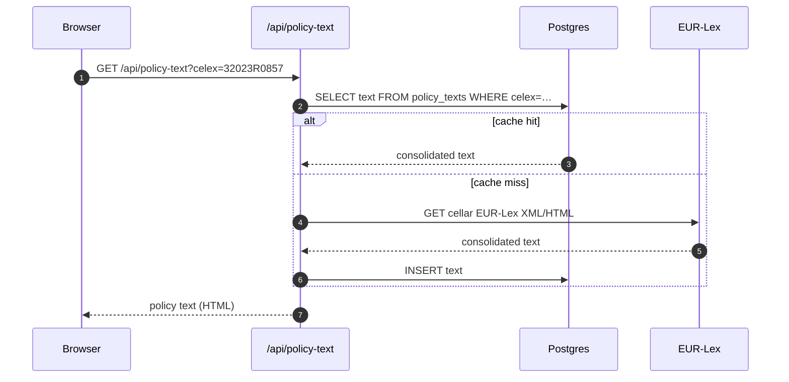

# M · 04 — EU Policy Navigator

!!! tip "Status"
    Stable · shipped in v1.0 · route [`/policy-navigator`](https://github.com/EUClimateAdvisoryBoard/ESABCCMethodHub/tree/main/src/app/policy-navigator)

A network map of EU climate laws. Each node is a policy (regulation,
directive, decision) and each edge is a structural relationship
(amends, repeals, cites, implements). The Secretariat uses this to
trace why a given provision exists, which acts depend on it, and which
2030 / 2040 / 2050 milestones it ties into.

## User story

> An officer is drafting the climate-neutrality chapter of the annual
> advice. They open `/policy-navigator`, filter by "Industry", click
> through to EU ETS, read article 10a inline, leave a comment on the
> free-allowance provision, and jump straight to the AR6 chapter
> referenced there.

## Data flow



## Code surface

| Path                                                                                                                                   | Role                                                          |
|----------------------------------------------------------------------------------------------------------------------------------------|---------------------------------------------------------------|
| [`src/app/policy-navigator/page.tsx`](https://github.com/EUClimateAdvisoryBoard/ESABCCMethodHub/blob/main/src/app/policy-navigator/page.tsx)             | Route entry — filter panel + network view.                    |
| [`src/components/PolicyNetworkGraph.tsx`](https://github.com/EUClimateAdvisoryBoard/ESABCCMethodHub/blob/main/src/components/PolicyNetworkGraph.tsx)     | D3-powered network visualisation.                             |
| [`src/components/FullTextViewer.tsx`](https://github.com/EUClimateAdvisoryBoard/ESABCCMethodHub/blob/main/src/components/FullTextViewer.tsx)             | Article-level viewer with inline annotation.                  |
| [`src/components/PolicyGapExplorer.tsx`](https://github.com/EUClimateAdvisoryBoard/ESABCCMethodHub/blob/main/src/components/PolicyGapExplorer.tsx)       | Gap charts by sector and milestone.                           |
| [`src/data/policies.ts`](https://github.com/EUClimateAdvisoryBoard/ESABCCMethodHub/blob/main/src/data/policies.ts)                                        | Master list of tracked acts.                                  |
| [`src/data/sectoral-policies.ts`](https://github.com/EUClimateAdvisoryBoard/ESABCCMethodHub/blob/main/src/data/sectoral-policies.ts)                      | Sector groupings + milestone map.                             |

## Subroutes

- `/policy-navigator/policy` — single-policy view with full text.
- `/policy-navigator/policy-text` — stand-alone full-text reader.
- `/policy-navigator/analytics` — gap / coverage charts.
- `/policy-navigator/search` — full-text search across tracked acts.
- `/policy-navigator/guide` — methodology notes for the Secretariat.

## API surface

| Method | Path                             | Purpose                                                 |
|--------|----------------------------------|---------------------------------------------------------|
| GET    | `/api/policy-text`               | Consolidated EUR-Lex text for a CELEX.                  |
| GET    | `/api/policy-news`               | News articles linked to a given act.                    |
| GET    | `/api/policy-clock`              | Timeline events (deadlines, reviews, sunsets).          |

## Ingestion

| Script                                                                                                                                 | Cadence | What it does                                                 |
|----------------------------------------------------------------------------------------------------------------------------------------|---------|--------------------------------------------------------------|
| [`scripts/fetch-eurlex-texts.js`](https://github.com/EUClimateAdvisoryBoard/ESABCCMethodHub/blob/main/scripts/fetch-eurlex-texts.js)                     | daily   | Consolidates CELEX texts from EUR-Lex cellar.                |
| [`scripts/prefetch-eurlex-bodies.mjs`](https://github.com/EUClimateAdvisoryBoard/ESABCCMethodHub/blob/main/scripts/prefetch-eurlex-bodies.mjs)           | on demand | Warms the full-text cache for a list of CELEXes.             |

## Schema

```
policies       (id, celex, title, type, adopted_at, in_force_at,
                domain, sectors[], eur_lex_url)
policy_texts   (celex, language, text_html, fetched_at, version)
policy_edges   (from_celex, to_celex, kind)   -- amends / repeals / cites
policy_annots  (id, celex, article, rect, note, created_by)
policy_clock   (id, celex, event_kind, due_at, completed_at)
```

## Related modules

- **M·01 References** — annotations can cite references from the library.
- **M·03 News** — news articles are tagged to policies via `policy_news`.
- **M·05 Content Analysis** — the policy text viewer is reused as the
  corpus source for M·05's coding surface.

### Policy Clock — universal `policyId` deep-linking

Every tracked policy already carries a stable string id
(`Policy.id`, e.g. `eu-climate-law`, `cbam-regulation`). That id
flows through every module that shares the policy corpus, so a
single click on a Policy Clock event can open the matching artefact
in any of them.

The contract lives in
[`src/lib/cross-module-links.ts`](https://github.com/EUClimateAdvisoryBoard/ESABCCMethodHub/blob/main/src/lib/cross-module-links.ts) —
the **single source of truth** for the four deep-link shapes:

| Target              | URL                                                                                  |
|---------------------|--------------------------------------------------------------------------------------|
| Policy Navigator    | `/policy-navigator/policy?policy=<policyId>`                                         |
| Content Analysis    | `/content-analysis?policy=<policyId>` (selects the matching corpus document).        |
| Reference Manager   | `/references?policy=<policyId>` (resolves to the synthesised *Policy Citation*).     |
| Policy Clock        | `/news-feed/policy-clock?policy=<policyId>` (filters timeline to a single act).      |

Supporting pieces:

- [`src/lib/policy-citations.ts`](https://github.com/EUClimateAdvisoryBoard/ESABCCMethodHub/blob/main/src/lib/policy-citations.ts)
  synthesises a free-floating **Policy Citation** Reference Manager
  entry per policy, using `Policy.id` as the reference id, so
  `?policy=<id>` deep links always resolve.
- [`src/lib/policy-clock-reviews.ts`](https://github.com/EUClimateAdvisoryBoard/ESABCCMethodHub/blob/main/src/lib/policy-clock-reviews.ts)
  synthesises 5-year review-due events for the whole corpus so the
  clock surfaces all upcoming reviews automatically.
- Migration
  [`026_policy_clock_events_policy_id.sql`](https://github.com/EUClimateAdvisoryBoard/ESABCCMethodHub/blob/main/supabase/migrations/026_policy_clock_events_policy_id.sql)
  adds the `policy_id` column + index to `policy_clock_events`;
  `PolicyClockUserEvent` and the events `POST` route now accept
  the field.
- `PolicyClock.tsx` adds a **Reviews due** strip in the header and
  a cross-module nav block in the expanded event panel — *Policy
  Navigator* / *Content Analysis* / *Official Citation* chips,
  rendered only when the event has a `policyId`.
- `ReferenceList.tsx` shows a **Policy Citation** badge plus
  jump-to-Navigator and jump-to-Content-Analysis chips on each
  policy-citation row.

## Deep dive

??? abstract "EUR-Lex cellar — how we resolve a CELEX"
    A CELEX identifier (e.g. `32023R0857`) is resolved through the
    EUR-Lex **Cellar** repository, not the classic EUR-Lex website.
    `scripts/fetch-eurlex-texts.js`:

    1. Hits `http://publications.europa.eu/resource/celex/{celex}` with
       `Accept: application/rdf+xml` to discover the consolidated-text
       manifestation URI.
    2. Follows the manifestation URI with
       `Accept: application/xhtml+xml;notice=branch` — the `branch`
       notice gives us the body we render.
    3. Strips the Cellar chrome (article-navigation sidebar, inline
       footnote tooltips) and rewrites internal CELEX links so they
       stay inside MethodHub.
    4. Stores the result in `policy_texts (celex, language, text_html,
       fetched_at, version)`.

    Re-runs are cheap: the `version` column lets us compare against
    the previous manifestation and skip the write if nothing changed.

??? abstract "Network layout — D3 force simulation"
    `PolicyNetworkGraph.tsx` renders the constellation with D3's
    `forceSimulation`:

    - **forceLink** — strength scaled by edge kind (amends / repeals
      stronger than cites).
    - **forceManyBody** — charge -220 per node, capped at -400 for
      high-degree nodes so the Emissions Trading cluster doesn't
      explode.
    - **forceCollide** — radius = node-label width + 8 px, so labels
      never overlap.
    - **forceX / forceY** — anchored to sector lanes when the
      "group by sector" toggle is on.

    The simulation runs 300 ticks on mount then freezes; subsequent
    filter changes mutate node `visible` flags without re-running the
    simulation, keeping interactions crisp on lower-powered laptops.

??? abstract "Cross-link edge types and their foreign keys"
    `policy_edges (from_celex, to_celex, kind, confidence)` where
    `kind` is one of:

    | kind           | populated by                                                  |
    |----------------|---------------------------------------------------------------|
    | `amends`       | EUR-Lex structural metadata                                   |
    | `repeals`      | EUR-Lex structural metadata                                   |
    | `cites`        | NLP pass over the consolidated text (spaCy + EUR-Lex regex)   |
    | `implements`   | Manual tag by the Secretariat (`policy_annots`)               |
    | `derives_from` | Manual tag                                                    |

    The `confidence` column is `1.0` for EUR-Lex-sourced edges,
    `0.5–0.9` for NLP-derived ones. The UI renders confidence-<0.9
    edges as thinner lines.

## Legacy routes

`/policy` and `/policy-text` redirect to `/policy-navigator/*` — see
[`next.config.js`](https://github.com/EUClimateAdvisoryBoard/ESABCCMethodHub/blob/main/next.config.js).
