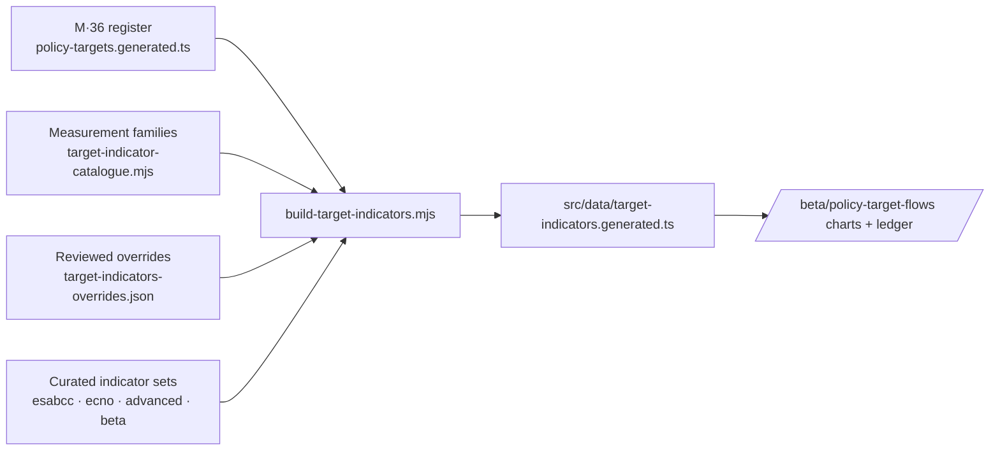

# M · 53 — Policy Targets → Indicators

!!! tip "Status"
    Beta · route [`/beta/policy-target-flows`](https://github.com/EUClimateAdvisoryBoard/ESABCCMethodHub/tree/main/beta/modules/policy-target-flows)

The **measurement layer** of the Policy Gap report. The
[Policy Targets Register (M·36)](policy-targets.md) established what EU climate
law actually requires — 819 verbatim targets from 61 acts, 544 of them relevant
to the transition, of which **356** survive the August 2026 review pass's
"revise target" flags (rows the reviewers judged likely not targets at all,
under the NT-7..NT-15 rules). This module runs on that reduced set and answers
the question that follows: for every one of those targets, **how do we measure
whether it is being met, and where can we not?**

It exists so the report can say "we assessed every relevant EU climate policy
target systematically" and have a checkable artefact behind the sentence — not
a claim of comprehensiveness, but a ledger in which no relevant, unflagged
target is missing a stated way of being measured.

## What it produces

### 1. The overview figure

The flow view opens on a single figure carrying **all nine sector columns on
one shared scale**. It leads with the ledger-wide share of column entries a
curated series already measures, then draws each sector as one row of a spine
chart: measured targets grow leftward from the spine, the measurement gap
(the specified and milestone routes) grows rightward, and rows are sorted
biggest gap first — so the right-hand side reads as a ranked list of the gaps
the Policy Gap report needs to name. The measured side is split in two: a
darker segment for targets whose matched series is one of the Policy Gap
report's own progress indicators (or its declared ECNO duplicate) — targets
the report could track today with its existing indicator framework — and a
lighter one for targets measured only by other curated MethodHub series. Each
row carries its "% measured" and "% in report set" figures (both shares of
the column's targets, so the second is always contained in the first) and its
count of weak matches. Clicking a row expands it into that sector's full flow
chart and scrolls there.

Every bar shares the same targets scale and carries its number, so colour
never carries the meaning alone. The first-order / second-order / procedural
split is deliberately not drawn here — it answers a different question and
lives in the rung bands of the expanded charts. The figure is filter-aware:
narrowing to weak matches or to one act redraws the whole figure, hero number
included, so the map and the chart below it can never disagree.

### 2. Sector flow charts

One chart per sector column, drawn in the visual language of the **Policy Gap
2.0** boards in the Project Workspace and of the report's own sector
assessment-framework figures:

```
[ sector goal ]                     dark band, with the act and article it comes from
      ↑
[ first-order targets ]             one group per act
      ↑
[ second-order targets ]            one group per act

[ procedural obligations ]          enabling band — no causal arrow
```

Each box is an **act**, on the row its targets belong to, and the bar under its
name is the mix of assessment routes it carries. Acts start **collapsed**, so a
whole sector — up to 100 targets across two dozen acts — is one figure that fits
a screen; opening a box turns it into **target** cards, and the white boxes
beneath each card are the **indicators** that measure it, exactly as the white
progress boxes work in the report figures. A collapsed box still shows how many
weak matches it holds, because those are the rows a reviewer is looking for.
"Open every act" expands the lot at once.

An indicator chip marked **↗** is a link: it opens that series in the Policy Gap
2.0 indicator database — the Project Workspace's Indicator Database module, at
`/project-workspace/policy-gap-2-0?module=indicators&indicator=<id>` — in a new
tab, so the chart keeps its filters and selection. Chips are linked only where
the series is in the seed catalogue that populates that database *and* carries
at least one data point; everything else stays a plain chip rather than a link
that would open on an empty chart. The membership test is `isSeededIndicator()`
in `src/data/workspace-indicator-seed.ts`, which holds the same catalogue the
workspace seeder writes, so the two cannot drift apart. What it proves is that
the series is in the seeded set and is not empty — not that a given deployment's
Supabase has finished seeding it; an id the workspace does not know falls back
to the module's default landing.

Grouping by act is what keeps the chart readable at 356 targets, and connectors
therefore run between act groups: an act's second-order targets feed its
first-order targets, which feed the sector goal.

Columns are the eight sectors/systems M·36 classifies targets against (Energy ·
Buildings · Agri-food · Transport · Industry · Land & marine ecosystems · Water
· Health) plus a **cross-cutting** column for governance, finance and external
action. A target that bears on several sectors is drawn in each column; the
ledger counts it once.

### 3. The assessment ledger

Every relevant, unflagged target as a row — verbatim requirement, timeline, flow-chart
position, assessment route, measurement family, indicator ids, source dataset,
matched terms and match confidence — filterable and downloadable as CSV. This
is the artefact the report cites.

### 4. Measurement gaps

The families no curated series covers yet, ranked by how many targets each one
would measure, each with the **named public dataset** that would close it — so
a gap is a data pull with a known source, not an open research question. Plus
the mirror image: families in the catalogue that match **no** target in the
register at all, which is itself a finding (either EU law sets no target on
them, or the register is missing the act that does).

## The three assessment routes

| Route | Meaning |
|-------|---------|
| **Series** | A time series MethodHub already curates measures this target. Progress can be read off today. |
| **Specified** | No curated series yet, but the indicator is specified against a named public dataset — provider, dataset code, URL. This is the measurement gap the report should name. |
| **Milestone** | The target names no measurable state of the world (adopt a plan, submit a report). It is assessed as done / not done against the act's own deadline, not with a statistical series. |

There is deliberately **no fourth "not assessed" route**. The build script exits
non-zero if any in-scope target ends without one — which is what makes the
systematic-coverage claim checkable rather than rhetorical.

## How the data is built



1. **The catalogue** defines one entry per measurable concept: what is measured
   (label, unit, sector, direction), the curated series that measure it, and the
   public dataset those series are — or would be — built from. Matching is by
   **word-boundary vocabularies with veto phrases**, in the same style as the
   M·36 classifier: no agent judgement runs at build time.
2. **Scoring** weighs terms found in the target's own wording above terms that
   only appear in the provision heading or the act's title, and records the
   result as a `confidence` flag (strong / moderate / weak). Weak rows are the
   ones a reviewer should challenge first.
3. **Routing** falls to a compliance milestone when a target carries no quantity
   and only matched a topical family through the act's title — so procedural
   duties are not dressed up as measured.
4. **Integrity checks fail loudly**: an indicator id that does not resolve in the
   four curated sets, a family without dataset provenance, a stale override id,
   or any in-scope target left unassessed all stop the build.
5. **Reviewed corrections** live in `scripts/target-indicators-overrides.json`,
   one entry per target id with a prose reason tagged with the pass. A
   correction is reversible by deleting one entry and rebuilding — never by
   editing the generated file.

Regenerate and verify with:

```bash
npm run build:target-indicators   # rewrite src/data/target-indicators.generated.ts
npm run check:target-indicators   # verify the committed dataset reproduces
```

## What it does and does not claim

- **Claimed.** Every target M·36 marks relevant and leaves unflagged has an
  assessment route, and the route names either a curated series, a public
  dataset, or the act's own deadline.
- **Not claimed.** That any target is met, missed or on track. No numeric value
  is asserted anywhere in the module — reading progress off the indicators is
  the indicator database's job.
- **Not claimed.** That a linked series is the *best* measure of a target. The
  mapping is AI-compiled and deterministic, not verified; a family can be right
  in subject and still be the wrong measure of a particular target.
- **Out of scope.** The 275 targets M·36 classifies as peripheral to the
  transition, and the 188 relevant rows the August 2026 review pass flagged
  "revise target". Both calls are inherited from the register, not re-made
  here; lifting a flag in the register re-admits the row on the next rebuild.

## Relationship to the other modules

- [**M·36 Policy Targets Register**](policy-targets.md) — the source of every
  target text, sector classification and first/second-order call. M·53 adds no
  legal content of its own beyond the sector goal statements in the dark band.
- **M·07 Project Workspace** — the Policy Gap 2.0 flow-chart versions this
  module's charts are modelled on; the indicator chips resolve against the same
  four curated indicator sets the workspace boards use, and link into the
  workspace's indicator database wherever the series is seeded there.
- **Policy Gap Tracker** (`/beta/policy-gaps`) — the gap register from the 2024
  report; M·53 is the measurement counterpart to it.
