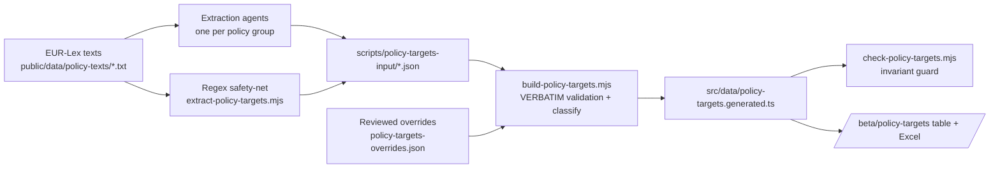

# M · 36 — Policy Targets Register

!!! tip "Status"
    Beta · route [`/beta/policy-targets`](https://github.com/EUClimateAdvisoryBoard/ESABCCMethodHub/tree/main/beta/modules/policy-targets)

A reviewable, exportable table of **every target, goal, objective and
commitment** in the EU climate acquis — each one extracted **verbatim**
from the enacting terms of the source act, and classified along the
dimensions the Secretariat screens on. It is the structured companion to
the M·04 Policy Navigator: the Navigator maps how acts relate, this
register pulls the concrete commitments out of them.

## What it produces

**1 004 targets across 62 acts** — one row per target (a policy can have many),
with twelve brief columns plus the relevance lens:

| # | Column | Notes |
|---|--------|-------|
| 1 | Name of policy | Official title of the act. |
| 2 | Type of policy | regulation · directive · decision · communication · strategy. |
| 3 | Policy area | Headline sector (Climate, Energy, Transport, Finance …). |
| 4 | Target text | **Verbatim** quote, numbered per policy. |
| 5 | Target label | target · goal · objective · commitment · other. |
| 6 | Obligation | mandatory vs voluntary. |
| 7 | Type of target | quantitative · qualitative · unspecified. |
| 8 | Timeline | time phrase from the quote (e.g. "by 2030") — or, for reviewed rows, from the surrounding provision — or unspecified. |
| 9 | Indicators | metrics linked to the target, if any. |
| 10 | Climate-relevance | mitigation · adaptation · both · none. |
| 11 | Source | link to the act on EUR-Lex. |
| 12 | **Human confirmed** | reviewer checkbox — grey until ticked, then green. |
| — | Relevant (transition lens) | relevant · peripheral — see [below](#the-relevance-lens). Also a column in the export. |

The provision reference (e.g. "Art. 4(1) — Union 2030 climate target") sits with
the target text in the table and is its own column in the export.

The full table (including confirmation status) downloads as **`.xlsx`**
(styled, auto-filtered, confirmed rows shaded green) or **`.csv`**.

## How the data is built

The pipeline is **recall-first** by design — it is better to surface a
borderline candidate for a human to reject than to miss a real target.



1. **Agents** read each act and pull every target-like statement from the
   **articles/annexes only** — never the preamble/recitals.
2. A **regex safety-net** sweeps the same enacting terms for unambiguous
   quantified/dated targets, so nothing obvious slips through.
3. `build-policy-targets.mjs` is the **trust boundary**: a candidate is
   kept only if its quote is an exact substring of the source act's
   enacting terms, and the exact source characters are re-sliced so the
   stored text is guaranteed real EUR-Lex text — not an agent paraphrase.
   Obligation, type, timeline and climate-relevance are then derived
   deterministically for consistency.
4. **Reviewed overrides** (`scripts/policy-targets-overrides.json`) carry the
   verified corrections from the July 2026 per-act fact-check passes (one
   reviewer agent per act, every row checked against the source, then a second
   agent adversarially re-checking each proposed change): precise provision
   references (including amendment text an act inserts into *other*
   legislation), context-supported timelines, substance-based
   climate-relevance calls the keyword rules miss (e.g. SAF mandates,
   EV-charging infrastructure), relevance-lens flips, and drops for
   heading-only, scope-clause or duplicate rows. Each entry records its reason
   and is applied after deterministic classification.
5. **One row per target.** A provision quoted by both an agent and the regex
   net collapses to a single row even when only the source's paragraph
   enumerator differs ("1. Member States shall …" vs "Member States shall …").
   On a collision the richer agent entry wins.
6. **Invariant check.** `scripts/check-policy-targets.mjs` re-derives every
   guarantee on this page from the shipped dataset — independently of the build
   script, so a self-consistent bug in the builder cannot pass — and fails the
   build if one no longer holds.

Row ids are **stable content hashes** of (policy, quote) — regenerating the
dataset does not shift them, so human confirmations (column 12) keep
pointing at the same target.

Regenerate with:

```bash
npm run build:policy-targets   # regex sweep → merge/validate → generated TS → invariant check
npm run check:policy-targets   # invariants only, against the committed dataset
```

The build is **deterministic and idempotent**: with the corpus and inputs
unchanged, two consecutive runs produce byte-identical output. If a run moves
the row count, a source text under `public/data/policy-texts/` changed and the
new candidates need reviewing.

## The relevance lens

The register spans the climate acquis plus the resilience, health,
civil-protection and cohesion-funding acts added for their transition-relevant
slices — which also carry many generic institutional, procedural or non-climate
commitments. Every row therefore carries a boolean `relevant` flag:

- **Default rule** (`relevantDefault` in the build script): relevant when
  climate-relevance is not `none`, **or** the row is a quantified, time-bound
  target/goal; peripheral otherwise.
- **Refined per row** by the fact-check pass, which set the flag explicitly
  where it disagreed with the default (26 rows).
- **In the UI** the *Relevance* filter defaults to *relevant*, so the register
  opens on the transition-material targets. Current split: **660 relevant /
  344 peripheral**.

Relevance is a screening lens, not a legal classification: every row stays in
the dataset and is visible under the *all* filter.

## Nomenclature

The register keeps the ESABCC distinction explicit in column 5:

- **Goal** — a long-term direction (e.g. the Paris "global adaptation goal").
- **Objective** — a stated purpose of the act, broader than a single figure.
- **Target** — a quantified, usually dated milestone.
- **Commitment** — an undertaking a party is bound to deliver.

## Obligation depends on the instrument

Column 6 combines the **instrument type** (regulations, directives and
decisions bind; communications and strategies are soft law) with the
**modal language** of the provision ("shall" → mandatory, "should" /
"may" / "aim to" → voluntary). It reports the obligation created by **the act
the row belongs to**, which has two consequences:

- Soft-law rows are **always voluntary** — even when the quoted passage
  contains "shall" or "must", it is quoting, restating or proposing binding
  text that lives in another act, and that act carries its own rows here. The
  build enforces this *after* overrides, so a reviewer reading a communication's
  passage as binding cannot reintroduce the confusion.
- **Best-efforts constructions count as voluntary** in binding acts too:
  "shall endeavour / aim / strive / seek" anywhere in the quote, and a
  governing "shall make (all appropriate) efforts" — e.g. TEN-T Art. 19(1),
  whose 75 %-punctuality figures hang off "shall make all possible efforts to
  ensure". A secondary best-efforts duty later in a provision does not
  downgrade a binding headline target (EED Art. 4(1) stays mandatory).

## Code surface

| Path | Role |
|------|------|
| `beta/modules/policy-targets/page.tsx` | Table UI, filters, Excel/CSV export, confirm workflow. |
| `src/app/beta/policy-targets/page.tsx` | Route re-export. |
| `src/data/policy-targets.ts` | Types, display metadata, shared column config, stats. |
| `src/data/policy-targets.generated.ts` | Generated dataset (verbatim rows). |
| `src/lib/useTargetConfirmations.ts` | Per-user human-confirm state (localStorage). |
| `scripts/extract-policy-targets.mjs` | Regex safety-net. |
| `scripts/build-policy-targets.mjs` | Merge, verbatim validation, classification, overrides. |
| `scripts/policy-targets-input/*.json` | Committed extraction input (agents + regex). |
| `scripts/policy-targets-overrides.json` | Verified corrections from the fact-check pass (with reasons). |
| `scripts/check-policy-targets.mjs` | Invariant guard (`npm run check:policy-targets`). |

## Caveats

- The register mirrors **whatever version of each act is in the corpus**.
  A few source texts are pre-consolidation (e.g. the EU ETS file is the
  original 2003/87/EC, RED is the 2018 version), so their figures are the
  ones in force in that text, not necessarily the latest amendment.
- Extraction favours recall — **always confirm a row against the source**
  before citing it. That is exactly what column 12 is for.
- The invariant guard proves the rows are faithful to the *source text* and
  internally consistent. It cannot prove a classification is the right *reading*
  — that is what the per-act fact-check passes and column 12 are for.
- Adding a source text to the corpus without rerunning the build leaves the
  register silently behind its inputs. The idempotency check above is what
  surfaces that (it is how the 7 TEN-T rows added in the July 2026 conformance
  pass were found); see `docs-internal/policy-targets-factcheck-2026-07.md`.
