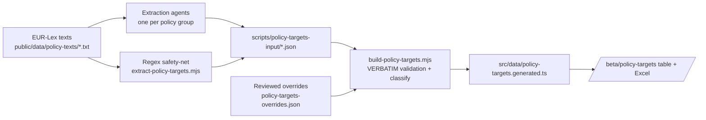

# M · 36 — Policy Targets Register

!!! tip "Status"
    Beta · route [`/beta/policy-targets`](https://github.com/EUClimateAdvisoryBoard/ESABCCMethodHub/tree/main/beta/modules/policy-targets)

A reviewable, exportable table of **every target, goal, objective and
commitment** in the EU climate acquis — each one extracted **verbatim**
from the enacting terms of the source act, and classified along the
dimensions the Secretariat screens on. It is the structured companion to
the M·04 Policy Navigator: the Navigator maps how acts relate, this
register pulls the concrete commitments out of them.

## What it produces

One row per target (a policy can have many), with twelve columns:

| # | Column | Notes |
|---|--------|-------|
| 1 | Name of policy | Official title of the act. |
| 2 | Type of policy | regulation · directive · decision · communication · strategy. |
| 3 | Policy area | Headline sector (Climate, Energy, Transport, Finance …). |
| 4 | Target text | **Verbatim** quote, numbered per policy. |
| 5 | Target label | target · goal · objective · commitment · other. |
| 6 | Obligation | mandatory vs voluntary. |
| 7 | Type of target | quantitative · qualitative · unspecified. |
| 8 | Timeline | time phrase from the quote (e.g. "by 2030") — or, for a few reviewed rows, from the surrounding provision — or unspecified. |
| 9 | Indicators | metrics linked to the target, if any. |
| 10 | Climate-relevance | mitigation · adaptation · both · none. |
| 11 | Source | link to the act on EUR-Lex. |
| 12 | **Human confirmed** | reviewer checkbox — grey until ticked, then green. |

Plus the review dimensions added by the later passes, which travel with the
table and every export:

| Column | Notes |
|--------|-------|
| 13–20 · Sectors/systems | Energy · Buildings · Agri-food · Transport · Industry · Land & marine ecosystems · Water · Health. A target can carry several. |
| 21 · Mitigation / adaptation argument | The mechanism behind the climate-relevance call. |
| 22 · Duplicate / similar target | The closest target text in another act. |
| Relevant (transition lens) | Whether the row materially bears on the transition; the default view. |
| **First order (1) / Second order (2)** | First order = the overall change the act exists to achieve; second order = dependent, complementary or niche. Reviewer-assigned where available, else classifier-assigned on the reviewers' calibration. |
| **Revise target / Revise reason** | Flags a row that matches a not-a-target pattern (NT-1…NT-15) — flagged for the next round, not deleted. |
| **Document updated (consolidated version)** | Set when the act's source text was refreshed to a newer consolidated EUR-Lex version. |

The full table (including confirmation status) downloads as **`.xlsx`**
(styled, auto-filtered, confirmed rows shaded green) or **`.csv`**. The in-app
download and the shipped reviewer workbook
(`public/data/eu-policy-targets-corrected.xlsx`) carry the **same columns in the
same order**, so the two can be diffed row for row.

## How the data is built

The pipeline is **recall-first** by design — it is better to surface a
borderline candidate for a human to reject than to miss a real target.



1. **Agents** read each act and pull every target-like statement from the
   **articles/annexes only** — never the preamble/recitals.
2. A **regex safety-net** sweeps the same enacting terms for unambiguous
   quantified/dated targets, so nothing obvious slips through.
3. `build-policy-targets.mjs` is the **trust boundary**: a candidate is
   kept only if its quote is an exact substring of the source act's
   enacting terms, and the exact source characters are re-sliced so the
   stored text is guaranteed real EUR-Lex text — not an agent paraphrase.
   Obligation, type, timeline and climate-relevance are then derived
   deterministically for consistency.
4. **Reviewed overrides** (`scripts/policy-targets-overrides.json`) carry the
   verified corrections from the July 2026 per-act fact-check pass (one
   reviewer per act, every row checked against the source, adversarially
   verified): precise provision references (including amendment text an act
   inserts into *other* legislation), context-supported timelines,
   substance-based climate-relevance calls the keyword rules miss (e.g. SAF
   mandates, EV-charging infrastructure), and drops for heading-only or
   duplicate rows. Each entry records its reason and is applied after
   deterministic classification.
5. **The August 2026 (v3) reviewer pass** sharpened the target definition —
   a target must be timebound or imply a measurable progression of effort
   (rules NT-7..NT-15) — and added three dimensions: **first/second-order**
   classification (human labels + calibrated agent assignments in
   `scripts/policy-targets-review-2026-08.json`), a **Revise target** flag
   marking likely non-targets for the next review round, and a
   **Document updated** marker for the 17 acts whose source texts were
   replaced with the current consolidated EUR-Lex version
   (`scripts/policy-targets-replaced.json`) — including the RED III-amended
   Renewable Energy Directive and the Climate Law's adopted 2040 target.
   See `docs-internal/policy-targets-human-review-2026-08.md`.

Row ids are **stable content hashes** of (policy, quote) — regenerating the
dataset does not shift them, so human confirmations (column 12) keep
pointing at the same target.

Regenerate with:

```bash
npm run build:policy-targets   # regex sweep → merge/validate → generated TS
```

## Nomenclature

The register keeps the ESABCC distinction explicit in column 5:

- **Goal** — a long-term direction (e.g. the Paris "global adaptation goal").
- **Objective** — a stated purpose of the act, broader than a single figure.
- **Target** — a quantified, usually dated milestone.
- **Commitment** — an undertaking a party is bound to deliver.

## Obligation depends on the instrument

Column 6 combines the **instrument type** (regulations, directives and
decisions bind; communications and strategies are soft law) with the
**modal language** of the provision ("shall" → mandatory, "should" /
"may" / "aim to" → voluntary). Soft-law rows are **always voluntary** —
even when the quoted passage contains "shall", it is quoting or proposing
binding text that lives elsewhere — and best-efforts constructions
("shall endeavour / aim / strive") count as voluntary in binding acts too.

## v5 Masterfile & sector summaries (August 2026)

The August 2026 iteration promoted the reviewed workbook to a **Masterfile**
(`public/data/eu-policy-targets-master.xlsx`): the *Revised* tab is the record
of all targets/commitments/objectives after the human review (rows the
reviewers marked `Revise target = 2` deleted, the two truncated target texts
restored, every change noted in *Revision note (Aug 2026 iteration)*); the
*Clean targets* tab is the analysis set — live targets beyond 2026, no
duplicates/cross-references — with a human-authored layman **Short version**
per row. `scripts/build-sector-targets.py` turns that tab into
`src/data/sector-targets.generated.ts`, which drives two further pages:

- `/beta/policy-targets/sectors` — summaries for the eight sectors plus
  cross-cutting: short-form targets grouped by act, mandatory vs indicative,
  mitigation/adaptation, linked indicators, collapsible second-order targets,
  and a 2020–2050 timeline mark per target (deadline / applies-from / window /
  stepped / periodic).
- `/beta/policy-targets/frameworks` — suggested expansions of the indicator
  assessment framework in *Towards EU climate neutrality* (pp. 33–37) per
  sectoral chapter, plus a worked Land-and-marine-ecosystems framework that
  combines adaptation targets, outcomes and levers with the mitigation ones.

## Code surface

| Path | Role |
|------|------|
| `beta/modules/policy-targets/page.tsx` | Table UI, filters, Excel/CSV export, confirm workflow. |
| `beta/modules/policy-targets/sectors/page.tsx` | Sector summaries + timelines (v5 clean set). |
| `beta/modules/policy-targets/frameworks/page.tsx` | Progress-framework suggestions + worked example. |
| `public/data/eu-policy-targets-master.xlsx` | v5 Masterfile (Revised = record, Clean targets = analysis set). |
| `scripts/build-sector-targets.py` | Clean-targets tab → `sector-targets.generated.ts`. |
| `src/data/sector-targets.ts` | Typed model for the sectoral dataset. |
| `src/app/beta/policy-targets/page.tsx` | Route re-export. |
| `src/data/policy-targets.ts` | Types, display metadata, shared column config, stats. |
| `src/data/policy-targets.generated.ts` | Generated dataset (verbatim rows). |
| `src/lib/useTargetConfirmations.ts` | Per-user human-confirm state (localStorage). |
| `scripts/extract-policy-targets.mjs` | Regex safety-net. |
| `scripts/build-policy-targets.mjs` | Merge, verbatim validation, classification, overrides. |
| `scripts/policy-targets-input/*.json` | Committed extraction input (agents + regex). |
| `scripts/policy-targets-overrides.json` | Verified corrections from the fact-check pass (with reasons). |

## Caveats

- The register mirrors **whatever version of each act is in the corpus**.
  A few source texts are pre-consolidation (e.g. the EU ETS file is the
  original 2003/87/EC, RED is the 2018 version), so their figures are the
  ones in force in that text, not necessarily the latest amendment.
- Extraction favours recall — **always confirm a row against the source**
  before citing it. That is exactly what column 12 is for.
