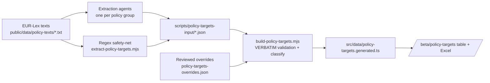

# M · 36 — Policy Targets Register

!!! tip "Status"
    Beta · route [`/beta/policy-targets`](https://github.com/EUClimateAdvisoryBoard/ESABCCMethodHub/tree/main/beta/modules/policy-targets)

A reviewable, exportable table of **every target, goal, objective and
commitment** in the EU climate acquis — each one extracted **verbatim**
from the enacting terms of the source act, and classified along the
dimensions the Secretariat screens on. It is the structured companion to
the M·04 Policy Navigator: the Navigator maps how acts relate, this
register pulls the concrete commitments out of them.

## What it produces

One row per target (a policy can have many), with twelve columns:

| # | Column | Notes |
|---|--------|-------|
| 1 | Name of policy | Official title of the act. |
| 2 | Type of policy | regulation · directive · decision · communication · strategy. |
| 3 | Policy area | Headline sector (Climate, Energy, Transport, Finance …). |
| 4 | Target text | **Verbatim** quote, numbered per policy. |
| 5 | Target label | target · goal · objective · commitment · other. |
| 6 | Obligation | mandatory vs voluntary. |
| 7 | Type of target | quantitative · qualitative · unspecified. |
| 8 | Timeline | time phrase from the quote (e.g. "by 2030") — or, for a few reviewed rows, from the surrounding provision — or unspecified. |
| 9 | Indicators | metrics linked to the target, if any. |
| 10 | Climate-relevance | mitigation · adaptation · both · none. |
| 11 | Source | link to the act on EUR-Lex. |
| 12 | **Human confirmed** | reviewer checkbox — grey until ticked, then green. |

The full table (including confirmation status) downloads as **`.xlsx`**
(styled, auto-filtered, confirmed rows shaded green) or **`.csv`**.

## Scope — which acts are in the register, and why

The register is **not** the whole EU acquis and it is **not** a "top target
per policy area" pick. Its scope is the **climate-relevant subset of the
Policy Navigator registry** (M·04, `src/data/policies.ts` — 97 acts): every
act whose enacting terms set a target, goal, objective or commitment bearing
on **climate mitigation or adaptation**. That gives **38 acts**, selected
systematically from the Navigator's own `domain` tags rather than hand-picked,
so the choice is reproducible and auditable.

Concretely, the 38 are:

- the **core climate architecture** — Climate Law, EU ETS, Effort Sharing,
  LULUCF, F-gas, Nature Restoration;
- the **Fit-for-55 / Green Deal delivery acts** across energy (RED, EED,
  EPBD, Methane), transport (CO2 cars, AFIR, FuelEU, RefuelEU, Euro 7),
  industry (IED, NZIA, CRMA), buildings, and the circular-economy files
  (Batteries, Ecodesign, Waste FD, SUP, PPWR);
- the **land / water / environment** acts with climate content (CAP Strategic
  Plans, Deforestation, Water FD, Marine Strategy FD, Zero-Pollution);
- the **sustainable-finance and cross-cutting** enablers (Taxonomy, SFDR,
  CSRD, CBAM, Social Climate Fund, CSDDD; Governance Regulation, Horizon
  Europe; the Green Deal and Fit-for-55 umbrella communications).

Everything with **no direct climate-target content** — the digital, health,
security, migration, justice, consumer-protection and education acquis, and
the purely prudential finance / trade-defence files — is **out of scope**.

### Coverage is auditable

Because the selection tracks domain tags, it can be checked mechanically. The
coverage audit prints the 38 covered acts by domain, then the not-covered acts
in three tiers — **candidate gaps** (core climate/energy acts not yet in, which
a reviewer should consciously keep out or add), **judgment calls** (mixed-domain
acts where only the climate-relevant ones were pulled in) and **out of scope**:

```bash
npm run check:policy-targets-coverage
```

At the time of writing the audit flags **6 candidate gaps** in the core
domains — Electricity Market Reform, the Hydrogen & Gas Market package,
REPowerEU, TEN-E (energy) and CO2 standards for heavy-duty vehicles, TEN-T
(transport) — for a reviewer to accept or add.

To confirm a **prior list** of policies (e.g. everything named in **PGR 1.0**)
is captured, drop the list into a text file — one policy per line, as a
Navigator id or a free-text name — and diff it:

```bash
cp scripts/data/pgr-1.0-policies.example.txt scripts/data/pgr-1.0-policies.txt
# …replace the examples with the PGR 1.0 policy list…
npm run check:policy-targets-coverage -- --ref scripts/data/pgr-1.0-policies.txt
```

The diff reports each reference entry as *captured in the register* / *in the
Navigator but not the register* / *not found in the Navigator at all*, and exits
non-zero if anything from the list is missing.

## How the data is built

The pipeline is **recall-first** by design — it is better to surface a
borderline candidate for a human to reject than to miss a real target.



1. **Agents** read each act and pull every target-like statement from the
   **articles/annexes only** — never the preamble/recitals.
2. A **regex safety-net** sweeps the same enacting terms for unambiguous
   quantified/dated targets, so nothing obvious slips through.
3. `build-policy-targets.mjs` is the **trust boundary**: a candidate is
   kept only if its quote is an exact substring of the source act's
   enacting terms, and the exact source characters are re-sliced so the
   stored text is guaranteed real EUR-Lex text — not an agent paraphrase.
   Obligation, type, timeline and climate-relevance are then derived
   deterministically for consistency.
4. **Reviewed overrides** (`scripts/policy-targets-overrides.json`) carry the
   verified corrections from the July 2026 per-act fact-check pass (one
   reviewer per act, every row checked against the source, adversarially
   verified): precise provision references (including amendment text an act
   inserts into *other* legislation), context-supported timelines,
   substance-based climate-relevance calls the keyword rules miss (e.g. SAF
   mandates, EV-charging infrastructure), and drops for heading-only or
   duplicate rows. Each entry records its reason and is applied after
   deterministic classification.

Row ids are **stable content hashes** of (policy, quote) — regenerating the
dataset does not shift them, so human confirmations (column 12) keep
pointing at the same target.

Regenerate with:

```bash
npm run build:policy-targets   # regex sweep → merge/validate → generated TS
```

## Nomenclature

The register keeps the ESABCC distinction explicit in column 5:

- **Goal** — a long-term direction (e.g. the Paris "global adaptation goal").
- **Objective** — a stated purpose of the act, broader than a single figure.
- **Target** — a quantified, usually dated milestone.
- **Commitment** — an undertaking a party is bound to deliver.

## Obligation depends on the instrument

Column 6 combines the **instrument type** (regulations, directives and
decisions bind; communications and strategies are soft law) with the
**modal language** of the provision ("shall" → mandatory, "should" /
"may" / "aim to" → voluntary). Soft-law rows are **always voluntary** —
even when the quoted passage contains "shall", it is quoting or proposing
binding text that lives elsewhere — and best-efforts constructions
("shall endeavour / aim / strive") count as voluntary in binding acts too.

## Code surface

| Path | Role |
|------|------|
| `beta/modules/policy-targets/page.tsx` | Table UI, filters, Excel/CSV export, confirm workflow. |
| `src/app/beta/policy-targets/page.tsx` | Route re-export. |
| `src/data/policy-targets.ts` | Types, display metadata, shared column config, stats. |
| `src/data/policy-targets.generated.ts` | Generated dataset (verbatim rows). |
| `src/lib/useTargetConfirmations.ts` | Per-user human-confirm state (localStorage). |
| `scripts/extract-policy-targets.mjs` | Regex safety-net. |
| `scripts/build-policy-targets.mjs` | Merge, verbatim validation, classification, overrides. |
| `scripts/check-policy-targets-coverage.mjs` | Scope/coverage audit + reference-list (PGR) diff. |
| `scripts/policy-targets-input/*.json` | Committed extraction input (agents + regex). |
| `scripts/policy-targets-overrides.json` | Verified corrections from the fact-check pass (with reasons). |

## Caveats

- The register mirrors **whatever version of each act is in the corpus**.
  A few source texts are pre-consolidation (e.g. the EU ETS file is the
  original 2003/87/EC, RED is the 2018 version), so their figures are the
  ones in force in that text, not necessarily the latest amendment.
- Extraction favours recall — **always confirm a row against the source**
  before citing it. That is exactly what column 12 is for.
