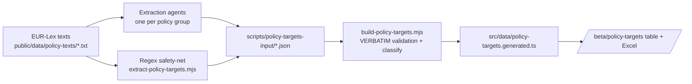

# M · 36 — Policy Targets Register

!!! tip "Status"
    Beta · route [`/beta/policy-targets`](https://github.com/EUClimateAdvisoryBoard/ESABCCMethodHub/tree/main/beta/modules/policy-targets)

A reviewable, exportable table of **every target, goal, objective and
commitment** in the EU climate acquis — each one extracted **verbatim**
from the enacting terms of the source act, and classified along the
dimensions the Secretariat screens on. It is the structured companion to
the M·04 Policy Navigator: the Navigator maps how acts relate, this
register pulls the concrete commitments out of them.

## What it produces

One row per target (a policy can have many), with twelve columns:

| # | Column | Notes |
|---|--------|-------|
| 1 | Name of policy | Official title of the act. |
| 2 | Type of policy | regulation · directive · decision · communication · strategy. |
| 3 | Policy area | Headline sector (Climate, Energy, Transport, Finance …). |
| 4 | Target text | **Verbatim** quote, numbered per policy. |
| 5 | Target label | target · goal · objective · commitment · other. |
| 6 | Obligation | mandatory vs voluntary. |
| 7 | Type of target | quantitative · qualitative · unspecified. |
| 8 | Timeline | verbatim time phrase (e.g. "by 2030"), or unspecified. |
| 9 | Indicators | metrics linked to the target, if any. |
| 10 | Climate-relevance | mitigation · adaptation · both · none. |
| 11 | Source | link to the act on EUR-Lex. |
| 12 | **Human confirmed** | reviewer checkbox — grey until ticked, then green. |

The full table (including confirmation status) downloads as **`.xlsx`**
(styled, auto-filtered, confirmed rows shaded green) or **`.csv`**.

## How the data is built

The pipeline is **recall-first** by design — it is better to surface a
borderline candidate for a human to reject than to miss a real target.



1. **Agents** read each act and pull every target-like statement from the
   **articles/annexes only** — never the preamble/recitals.
2. A **regex safety-net** sweeps the same enacting terms for unambiguous
   quantified/dated targets, so nothing obvious slips through.
3. `build-policy-targets.mjs` is the **trust boundary**: a candidate is
   kept only if its quote is an exact substring of the source act's
   enacting terms, and the exact source characters are re-sliced so the
   stored text is guaranteed real EUR-Lex text — not an agent paraphrase.
   Obligation, type, timeline and climate-relevance are then derived
   deterministically for consistency.

Regenerate with:

```bash
npm run build:policy-targets   # regex sweep → merge/validate → generated TS
```

## Nomenclature

The register keeps the ESABCC distinction explicit in column 5:

- **Goal** — a long-term direction (e.g. the Paris "global adaptation goal").
- **Objective** — a stated purpose of the act, broader than a single figure.
- **Target** — a quantified, usually dated milestone.
- **Commitment** — an undertaking a party is bound to deliver.

## Obligation depends on the instrument

Column 6 combines the **instrument type** (regulations, directives and
decisions bind; communications and strategies are soft law) with the
**modal language** of the provision ("shall" → mandatory, "should" /
"may" / "aim to" → voluntary).

## Code surface

| Path | Role |
|------|------|
| `beta/modules/policy-targets/page.tsx` | Table UI, filters, Excel/CSV export, confirm workflow. |
| `src/app/beta/policy-targets/page.tsx` | Route re-export. |
| `src/data/policy-targets.ts` | Types, display metadata, shared column config, stats. |
| `src/data/policy-targets.generated.ts` | Generated dataset (verbatim rows). |
| `src/lib/useTargetConfirmations.ts` | Per-user human-confirm state (localStorage). |
| `scripts/extract-policy-targets.mjs` | Regex safety-net. |
| `scripts/build-policy-targets.mjs` | Merge, verbatim validation, classification. |
| `scripts/policy-targets-input/*.json` | Committed extraction input (agents + regex). |

## Caveats

- The register mirrors **whatever version of each act is in the corpus**.
  A few source texts are pre-consolidation (e.g. the EU ETS file is the
  original 2003/87/EC, RED is the 2018 version), so their figures are the
  ones in force in that text, not necessarily the latest amendment.
- Extraction favours recall — **always confirm a row against the source**
  before citing it. That is exactly what column 12 is for.
