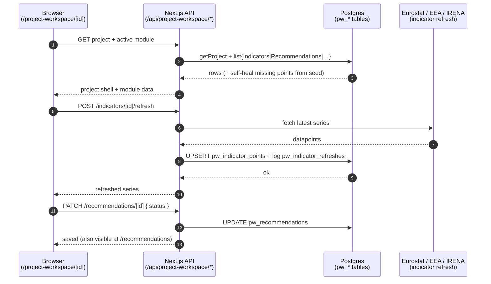

# M · 07 — Project Workspace

!!! tip "Status"
    Stable · promoted from beta · route [`/project-workspace`](https://github.com/EUClimateAdvisoryBoard/ESABCCMethodHub/tree/main/src/app/project-workspace)

The Project Workspace is the **per-project container** that the rest of the
Hub's analytical work hangs off. Where M·01–M·05 each own one kind of
artefact (references, scenarios, news, policies, codes), a *project* bundles
several of those surfaces — an indicator database, a recommendation tracker, a
member-state matrix, a content-analysis corpus, meetings — under one named
piece of work such as **Policy Gap 2.0** or the **Industry Project**.
Everything is persisted in Postgres (`pw_*` tables) so contributors share the
same state.

## For non-technical readers

Think of a project as a **digital binder for one report**. Inside the binder
are tabs: a tab of indicators (the numbers the Board tracks, year by year), a
tab of past recommendations and whether the EU acted on them, a tab with a map
of the 27 member states, a tab of tagged policy text. You open the binder for
"Policy Gap 2.0", everyone on the team sees the same tabs and the same data,
and edits save for everybody. New binders and new tabs can be added without a
developer — the workspace is **user-extensible**.

## User story

> A scientific officer opens the **Policy Gap 2.0** project. The *Indicators*
> tab shows the ESABCC headline indicators with their historical series; they
> click *Refresh* on the renewables indicator and it re-pulls the latest
> Eurostat values, logging the refresh. They switch to *Recommendations*,
> mark KR4 as *partially addressed*, and log a dated uptake event linking the
> Council conclusion that moved it. In *Member states* they recolour Germany's
> NECP cell. Every change is written straight to Postgres; a colleague viewing
> the same project sees it on reload.

## Modules a project can bundle

Each project owns a list of **modules** (`pw_modules`), each with a `kind`.
Seven kinds are defined:

| Kind                | What the tab is                                                            | Backing component                    |
|---------------------|----------------------------------------------------------------------------|--------------------------------------|
| `indicators`        | Editable indicator database with per-year series, targets and Excel layout. | `IndicatorModule`                   |
| `recommendations`   | Advisory-Board recommendation tracker (shared with [M·08](recommendations.md)). | `RecommendationsModule`          |
| `member-states`     | EU-27 × sector status matrix + map (shares the country-profile store).      | `MemberStatesModule`                |
| `content-analysis`  | MAXQDA-style qualitative coding scoped to the project (shares [M·05](content-analysis.md)). | `ContentAnalysisModule`  |
| `policy-analysis`   | Sectoral-overview annotations (approve / fact-check / edit) on policies.     | `PolicyAnalysisModule` (→ content-analysis) |
| `meetings`          | Meeting notes, phases / milestones, optional transcription + AI summary.    | `MeetingsModule`                    |
| `custom`            | A free-form Markdown scratchpad for anything that doesn't fit the above.     | `CustomNotesModule`                 |

Two projects ship seeded by the migration:

- **Policy Gap 2.0** (`policy-gap-2-0`) — bundles `indicators`,
  `content-analysis`, `member-states` and `recommendations`.
- **Industry Project** (`industry-project`) — an industry-tagged
  `content-analysis` corpus (plus a second module added in migration 044).

Anything users create lives in the same tables alongside the seeds.

## Data flow



## Code surface

| Path                                                           | Role                                                 |
|----------------------------------------------------------------|------------------------------------------------------|
| [`src/app/project-workspace/page.tsx`](https://github.com/EUClimateAdvisoryBoard/ESABCCMethodHub/blob/main/src/app/project-workspace/page.tsx) | Landing — lists every project from `pw_projects`, *New project* button. |
| [`src/app/project-workspace/[projectId]/page.tsx`](https://github.com/EUClimateAdvisoryBoard/ESABCCMethodHub/blob/main/src/app/project-workspace/%5BprojectId%5D/page.tsx) | Project detail — server-fetches the active module's data and renders the tabbed shell. |
| [`src/lib/project-workspace/db.ts`](https://github.com/EUClimateAdvisoryBoard/ESABCCMethodHub/blob/main/src/lib/project-workspace/db.ts) | Data access: `listProjects`, `getProject`, `listIndicators`, `listIndicatorSheets`, `listRecommendations`, `listMemberStateCells`, `listPolicyAnnotations`, `getPolicyOverrides`, `listPolicyCodes`, `getCustomModuleContent`, `reseedFor`. |
| [`src/lib/project-workspace/`](https://github.com/EUClimateAdvisoryBoard/ESABCCMethodHub/tree/main/src/lib/project-workspace) | Supporting: `indicator-sheet.ts`, `indicator-revisions.ts`, `indicator-excel.ts`, `phases.ts`, `collaboration.ts`, `meetings.ts`, `meeting-ai.ts`. |
| [`src/components/workspace/`](https://github.com/EUClimateAdvisoryBoard/ESABCCMethodHub/tree/main/src/components/workspace) | `ProjectShell` + per-kind modules (`IndicatorModule`, `RecommendationsModule`, `MemberStatesModule`, `ContentAnalysisModule`, `MeetingsModule`, `CustomNotesModule`) plus `IndicatorDataEditor`, `IndicatorHistory`, `DownloadMenu`, `WorkspaceComments`. |
| [`src/data/project-workspace.ts`](https://github.com/EUClimateAdvisoryBoard/ESABCCMethodHub/blob/main/src/data/project-workspace.ts) | Seed projects + module lists, used when the DB is disabled. |

When the workspace DB env is not configured, `listProjects()` falls back to
the bundled `SEED_PROJECTS` so the surface is still browsable read-only.

## API surface

Roughly two dozen routes under `/api/project-workspace/*`. Highlights:

| Method | Path                                                | Purpose                                            |
|--------|-----------------------------------------------------|----------------------------------------------------|
| GET    | `/projects`                                         | List all projects.                                 |
| GET·POST | `/projects/[projectId]/modules`                   | List / create modules on a project.                |
| POST·PATCH·DELETE | `/indicators` · `/indicators/[id]`       | CRUD an indicator (name, unit, direction, target). |
| PUT    | `/indicator-points`                                 | Replace an indicator's per-year series.            |
| POST   | `/indicators/[id]/refresh`                          | Re-pull from Eurostat / EEA / EAFO / IRENA / EHPA. |
| GET·POST | `/indicators/[id]/revisions` (+ `/restore`)       | Revision history and rollback.                     |
| GET·POST | `/indicators/[id]/sheet`                          | Read / write the Excel layout (formulas, helpers). |
| POST   | `/indicators/export` · `/indicators/import`         | Excel workbook round-trip.                         |
| GET·POST·PATCH·DELETE | `/recommendations` (+ `/[id]`)       | Recommendation CRUD (shared with M·08).            |
| POST·DELETE | `/recommendation-events` (+ `/[eventId]`)      | Log / remove dated uptake events.                  |
| PUT    | `/member-state-cells`                               | Update a country × sector matrix cell.             |
| GET·POST·PATCH | `/policy-annotations` (+ `/[id]`)           | Sectoral-overview annotations (incl. *promote*).   |
| GET·POST·PATCH | `/policy-codes` (+ `/[id]`)                 | Project-scoped code assignments (fork master).     |
| PUT    | `/custom-module-content`                            | Save a custom module's Markdown.                   |
| GET·POST | `/comments`                                       | Threaded comments on workspace artefacts.          |
| GET·POST | `/meetings` (+ `/[id]/transcribe`, `/[id]/analyze`) | Meetings, transcription, AI summary.             |
| POST   | `/admin/reseed`                                     | Admin force-reseed of a project's seeds.           |

## Schema

```
pw_projects            (id, name, description, is_seed, created_by,
                        created_at, updated_at)
pw_modules             (id, project_id, kind, name, description,
                        position, is_seed, featured, beta, created_at)
                        -- kind ∈ indicators | recommendations |
                        --        member-states | policy-analysis |
                        --        content-analysis | meetings | custom
pw_indicators          (id, project_id, name, category, unit, description,
                        source, source_url, direction, target_value,
                        target_year, is_seed, created_by, …)
pw_indicator_points    (indicator_id, year, value, updated_at)   -- PK (id, year)
pw_indicator_sheets    (indicator_id, layout jsonb, updated_by, updated_at)
pw_indicator_refreshes (id, indicator_id, source, ok, points_added,
                        message, refreshed_at, refreshed_by)
pw_recommendations     (id, project_id, area, title, summary, status,
                        report_id, report_label, report_url, tags[], …)
pw_recommendation_events (id, recommendation_id, occurred_at, note,
                        source_url, created_by, created_at)
pw_member_state_cells  (project_id, country_code, sector_id, status, note, …)
pw_policy_annotations  (id, project_id, policy_id, kind, field, value,
                        status, promoted_at, created_by, created_at)
pw_policy_codes        (id, project_id, policy_id, code_id, source,
                        parent_code_id, label, color, removed, …)
pw_custom_module_content (project_id, module_id, content, updated_by, updated_at)
```

Defined in migration
[`038_project_workspace.sql`](https://github.com/EUClimateAdvisoryBoard/ESABCCMethodHub/blob/main/supabase/migrations/038_project_workspace.sql)
and extended by `039`, `040_pw_policy_codes.sql`,
`042_pw_indicator_sheets.sql` and `044_pw_industry_modules.sql`. Every table
carries RLS; signed-in users share read/write so a project is a true shared
workspace. See [Data & GDPR](../infrastructure/data-gdpr.md) for retention.

## Deep dive

??? abstract "Self-healing indicator series"
    Indicator rows live in `pw_indicators`; their values live in
    `pw_indicator_points` keyed `(indicator_id, year)`. On read, `db.ts`
    detects a seeded indicator whose points went missing (e.g. a partial
    migration) and **repopulates them from the bundled series** in
    `src/data/*-indicators.ts` before returning. That makes the seed data the
    durable source of truth for headline indicators while still letting users
    overwrite any year in place.

??? abstract "Indicator refresh — live re-pull"
    `POST /indicators/[id]/refresh` reads the indicator's `source` /
    `source_url` and dispatches to the matching upstream client (Eurostat,
    EEA projections, EAFO, IRENA, EHPA). New datapoints are upserted into
    `pw_indicator_points` and the attempt — ok/fail, points added, message —
    is written to `pw_indicator_refreshes` so the indicator carries a visible
    provenance trail.

??? abstract "Excel layout fidelity"
    `pw_indicator_sheets.layout` stores the **shape of the source workbook**,
    not just values: header rows, helper columns, and cells that are either a
    literal or a `{ f: formula, v: value }` pair. This lets the workspace
    export an indicator back to an `.xlsx` that mirrors the analyst's original
    sheet (`indicator-excel.ts`) and re-import edited workbooks without losing
    the formula scaffolding.

## Member states — the EU-27 sub-surface

The `member-states` module renders the same data as the standalone
[`/member-states`](https://github.com/EUClimateAdvisoryBoard/ESABCCMethodHub/tree/main/src/app/member-states)
country-profile surface, plus a per-project status matrix
(`pw_member_state_cells`). It is a **dual surface**: it exists both as a
stand-alone web app and as an optional project module.

- **27 EU member-state profiles** ship as seed files under
  [`src/data/country-profiles/`](https://github.com/EUClimateAdvisoryBoard/ESABCCMethodHub/tree/main/src/data/country-profiles),
  each an EEA-style profile covering GHG emissions, renewables, energy
  efficiency, air, water, biodiversity, the circular economy, climate
  adaptation and NECP delivery — nine status indicators that drive the
  heat-map columns.
- **Editing is patch-based.** `loadEffectiveProfile(code)` merges the seed
  file with a draft override stored as JSONB in `country_profile_drafts`;
  `saveProfilePatch(code, patch)` writes the override. The seed is never
  mutated, so a profile can always be diffed against its baseline.
- **External contribution flow.** A main user can mint a **share link**
  (`country_profile_share_links`, token + optional section scope + expiry).
  An external contributor submits edits through that token, landing a
  `pending` row in `country_profile_submissions`; a reviewer approves
  (merges into drafts) or rejects (with a reason). Submissions from an
  authenticated main user auto-approve.
- **Routes:** `/member-states` (map + 27 × 9 heat-map + directory),
  `/member-states/[code]` (read-only profile), `/member-states/[code]/edit`
  (main-user editor), `/member-states/submissions` (review queue). API under
  `/api/member-states/*`. Schema in migration
  [`039_country_profiles.sql`](https://github.com/EUClimateAdvisoryBoard/ESABCCMethodHub/blob/main/supabase/migrations/039_country_profiles.sql).

The Leaflet map is loaded with `next/dynamic` (`ssr: false`) because Leaflet
touches `window` on mount.

## Known limits

- **Shared, not per-user, RLS.** Inside a project all signed-in users share
  read/write — projects are collaborative by design, not private notebooks.
- **Indicator refresh coverage is bounded** by which upstreams have a client
  wired up (Eurostat, EEA, EAFO, IRENA, EHPA). Other sources are manual.
- **Meeting transcription / AI summary** require the AI layer to be
  configured (see [AI layer](../infrastructure/ai-layer.md)); without a key
  the *Meetings* tab still works for notes, just not transcription.
- **A profile section with no data** renders as `unknown` on the heat-map
  rather than being hidden — deliberately, so gaps are visible.
