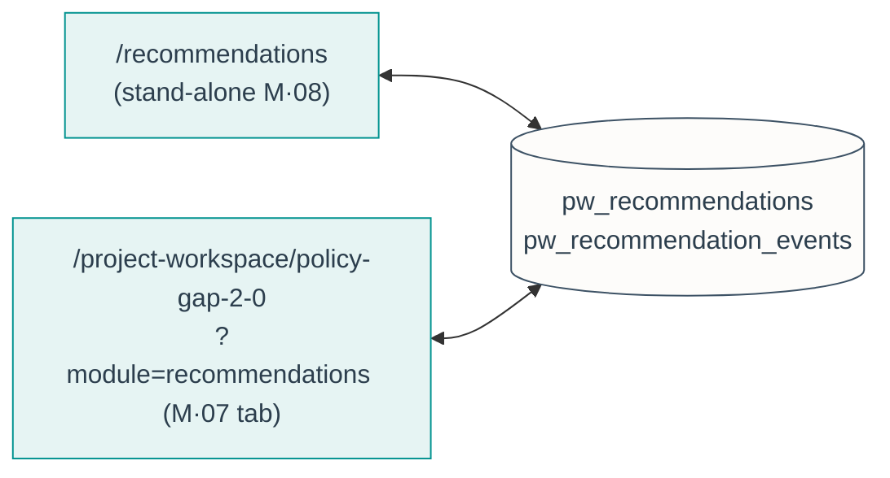
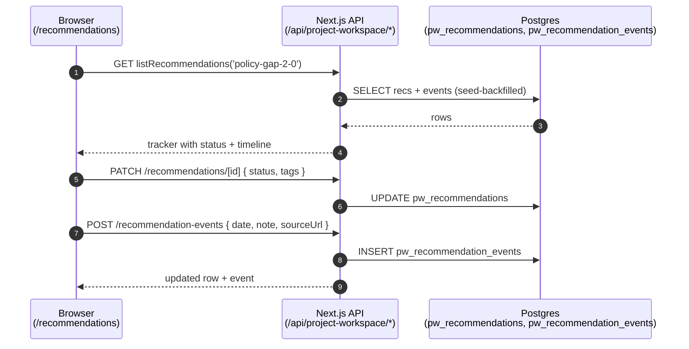

# M · 08 — Recommendations

!!! tip "Status"
    Stable · promoted from beta · route [`/recommendations`](https://github.com/EUClimateAdvisoryBoard/ESABCCMethodHub/tree/main/src/app/recommendations)

A tracker for the **Advisory Board's published recommendations** — what the
Board has advised across its reports, whether the EU has acted on each, and
the dated evidence for any uptake. It is the institutional-memory surface: the
single place to answer "did our 2023 advice on the 2040 target go anywhere?"

## For non-technical readers

Over the years the Board has published many recommendations across a dozen
reports. This module is a **scoreboard** for them. Each recommendation has a
status — *not addressed*, *in progress*, *partially*, or *addressed* — and a
short timeline of dated events showing how the EU responded (a Council
conclusion here, a Commission proposal there), each with a link to the
evidence. It lets the Secretariat show, at a glance, where the Board's advice
has landed and where it hasn't.

## Relationship to the Project Workspace

The Recommendations module is **the same data as the *Recommendations* tab of
the Policy Gap 2.0 project** ([M·07](project-workspace.md)), surfaced as a
stand-alone module so it can be reached in one click. Both read and write the
same `pw_recommendations` rows (project `policy-gap-2-0`), so an edit made on
either surface shows up on the other:



!!! note "Legacy store retired"
    An earlier stand-alone recommendations system (a `recommendations` table +
    `useRecommendations` hook + `RecommendationForm`) is no longer wired up.
    It is left in the tree for reference but unused — the Project Workspace
    tables are the live store.

## User story

> Preparing a progress note, an analyst opens **Recommendations**, filters to
> the 2024 sectoral set, and marks recommendation **I3** *partially
> addressed*. They log an uptake event dated to the relevant Council
> conclusion, paste the evidence URL, and tag it `industry`. The same change
> is immediately visible inside the Policy Gap 2.0 workspace, where the
> indicator and member-state tabs sit alongside it.

## Data flow



## Code surface

| Path                                                           | Role                                                 |
|----------------------------------------------------------------|------------------------------------------------------|
| [`src/app/recommendations/page.tsx`](https://github.com/EUClimateAdvisoryBoard/ESABCCMethodHub/blob/main/src/app/recommendations/page.tsx) | Server route — loads `listRecommendations('policy-gap-2-0')` and renders the shared module with a link back to the workspace. |
| [`src/components/workspace/RecommendationsModule.tsx`](https://github.com/EUClimateAdvisoryBoard/ESABCCMethodHub/blob/main/src/components/workspace/RecommendationsModule.tsx) | The tracker UI — status picker, sector tags, source-report dropdown, uptake-event logger. Shared with the M·07 tab. |
| [`src/data/esabcc-recommendations.ts`](https://github.com/EUClimateAdvisoryBoard/ESABCCMethodHub/blob/main/src/data/esabcc-recommendations.ts) | The seed corpus — `ALL_ESABCC_RECOMMENDATIONS` plus `RECOMMENDATION_REPORTS`. |
| [`src/lib/project-workspace/db.ts`](https://github.com/EUClimateAdvisoryBoard/ESABCCMethodHub/blob/main/src/lib/project-workspace/db.ts) | `listRecommendations(projectId)` and the event helpers behind the API. |

## API surface

Backed by the workspace API (the tracker is a workspace module under the hood):

| Method | Path                                                | Purpose                                            |
|--------|-----------------------------------------------------|----------------------------------------------------|
| GET    | `/api/project-workspace/recommendations`            | List recommendations for a project.                |
| POST   | `/api/project-workspace/recommendations`            | Create a recommendation.                           |
| PATCH  | `/api/project-workspace/recommendations/[id]`       | Update title, summary, area, **status**, tags, source report. |
| DELETE | `/api/project-workspace/recommendations/[id]`       | Delete a recommendation.                           |
| POST   | `/api/project-workspace/recommendation-events`      | Log a dated uptake event.                          |
| DELETE | `/api/project-workspace/recommendation-events/[id]` | Remove an uptake event.                            |

## The seed corpus

`ALL_ESABCC_RECOMMENDATIONS` aggregates every published Board recommendation
across the report series — key and sectoral recommendations from the 2024
*Towards EU climate neutrality* report, plus the ACER / TEN-E, climate-targets,
energy-crisis, energy-infrastructure, 2040-target, carbon-removals,
climate-law-amendment, adaptation and agri-food advice. The homepage reads the
count **live** at render time (`ALL_ESABCC_RECOMMENDATIONS.length`), so the
"tracked" stat always matches the corpus.

Each recommendation carries:

```typescript
{
  id: string;                 // stable seed id
  area: string;               // report chapter code (E, I, T, B, A, L, …, KR)
  title: string;
  summary: string;
  status: 'not-addressed' | 'in-progress' | 'partially' | 'addressed';
  uptakeEvents: { date: string; note: string; sourceUrl?: string }[];
  report?: { id: string; label: string; url: string };  // source report
  tags?: string[];            // sector tags: industry, energy-supply, …
}
```

`RECOMMENDATION_REPORTS` is the canonical list of source reports (id, chip
label, canonical publication URL) used to render the report badge and the
filter dropdown.

## Schema

```
pw_recommendations       (id, project_id, area, title, summary, status,
                          report_id, report_label, report_url, tags[],
                          is_seed, created_by, created_at, updated_at)
                          -- status ∈ not-addressed | in-progress |
                          --          partially | addressed
pw_recommendation_events (id, recommendation_id, occurred_at, note,
                          source_url, created_by, created_at)
```

Defined in
[`038_project_workspace.sql`](https://github.com/EUClimateAdvisoryBoard/ESABCCMethodHub/blob/main/supabase/migrations/038_project_workspace.sql)
(columns backfilled in `042`). RLS lets signed-in users share the tracker; the
seed rows carry `is_seed = true` so they can be told apart from user-added
recommendations. See [Data & GDPR](../infrastructure/data-gdpr.md).

## Known limits

- **Single seeded project.** The stand-alone page is hard-wired to
  `policy-gap-2-0`; tracking recommendations against a *different* project is
  done from that project's *Recommendations* tab.
- **Uptake status is editorial.** Status and uptake events are entered by the
  Secretariat — there is no automated link from EU legislative events to a
  recommendation. The `sourceUrl` on each event is the audit trail.
- **No cross-report dedup.** A recommendation reiterated across two reports
  appears once per report; consolidating is a manual editorial choice.
