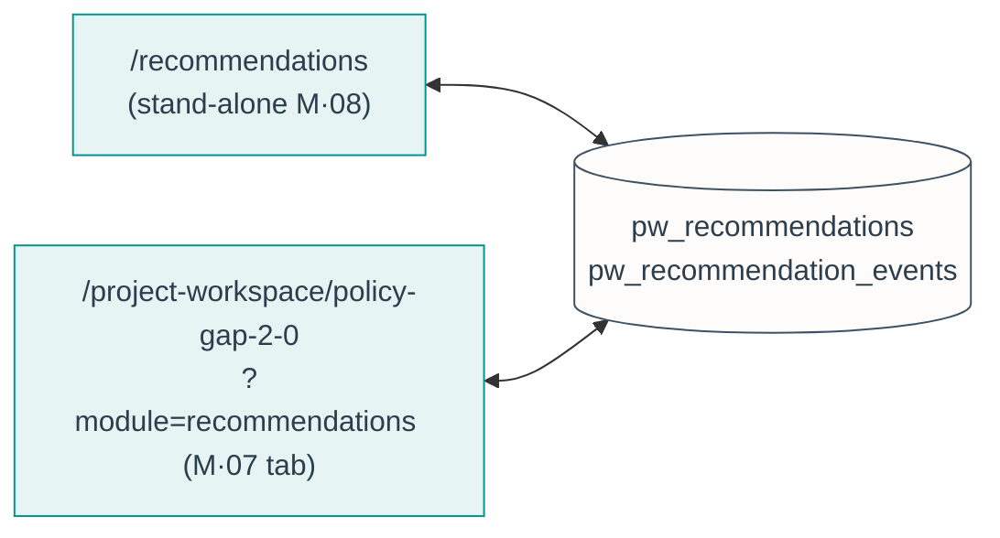
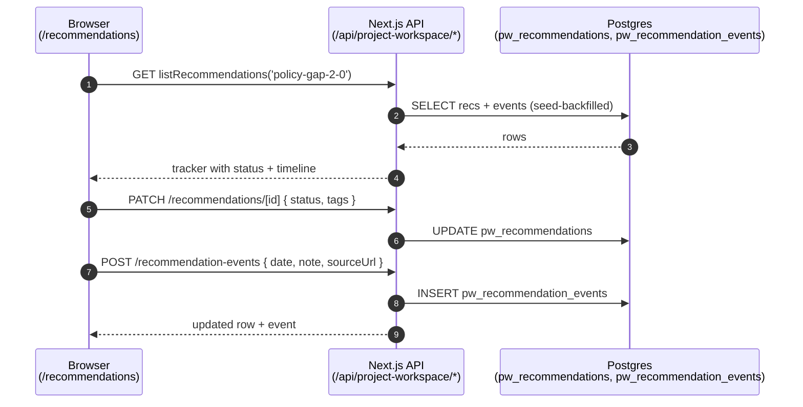

# M · 08 — Recommendations

!!! tip "Status"
    Stable · promoted from beta · route [`/recommendations`](https://github.com/EUClimateAdvisoryBoard/ESABCCMethodHub/tree/main/src/app/recommendations)

A tracker for the **Advisory Board's published recommendations** — what the
Board has advised across its reports, whether the EU has acted on each, and
the dated evidence for any uptake. It is the institutional-memory surface: the
single place to answer "did our 2023 advice on the 2040 target go anywhere?"

## For non-technical readers

Over the years the Board has published many recommendations across a dozen
reports. This module is a **scoreboard** for them. Each recommendation has a
status — *not addressed*, *in progress*, *partially*, or *addressed* — and a
short timeline of dated events showing how the EU responded (a Council
conclusion here, a Commission proposal there), each with a link to the
evidence. It lets the Secretariat show, at a glance, where the Board's advice
has landed and where it hasn't.

## Relationship to the Project Workspace

The Recommendations module is **the same data as the *Recommendations* tab of
the Policy Gap 2.0 project** ([M·07](project-workspace.md)), surfaced as a
stand-alone module so it can be reached in one click. Both read and write the
same `pw_recommendations` rows (project `policy-gap-2-0`), so an edit made on
either surface shows up on the other:


```mermaid
flowchart LR
  classDef ui fill:#E6F4F3,stroke:#00928F,color:#2C3E4D
  classDef data fill:#FDFCFA,stroke:#3D5265,color:#2C3E4D

  A["/recommendations<br/>(stand-alone M·08)"]:::ui
  B["/project-workspace/policy-gap-2-0<br/>?module=recommendations (M·07 tab)"]:::ui
  DB[("pw_recommendations<br/>pw_recommendation_events")]:::data
  A <--> DB
  B <--> DB
```

!!! note "Legacy store retired"
    An earlier stand-alone recommendations system (a `recommendations` table +
    `useRecommendations` hook + `RecommendationForm`) is no longer wired up.
    It is left in the tree for reference but unused — the Project Workspace
    tables are the live store.

## User story

> Preparing a progress note, an analyst opens **Recommendations**, filters to
> the 2024 sectoral set, and marks recommendation **I3** *partially
> addressed*. They log an uptake event dated to the relevant Council
> conclusion, paste the evidence URL, and tag it `industry`. The same change
> is immediately visible inside the Policy Gap 2.0 workspace, where the
> indicator and member-state tabs sit alongside it.

## Data flow


```mermaid
sequenceDiagram
    autonumber
    participant UI  as Browser<br/>(/recommendations)
    participant API as Next.js API<br/>(/api/project-workspace/*)
    participant DB  as Postgres<br/>(pw_recommendations, pw_recommendation_events)

    UI->>API: GET listRecommendations('policy-gap-2-0')
    API->>DB: SELECT recs + events (seed-backfilled)
    DB-->>API: rows
    API-->>UI: tracker with status + timeline

    UI->>API: PATCH /recommendations/[id]  { status, tags }
    API->>DB: UPDATE pw_recommendations
    UI->>API: POST /recommendation-events  { date, note, sourceUrl }
    API->>DB: INSERT pw_recommendation_events
    API-->>UI: updated row + event
```

## Code surface

| Path                                                           | Role                                                 |
|----------------------------------------------------------------|------------------------------------------------------|
| [`src/app/recommendations/page.tsx`](https://github.com/EUClimateAdvisoryBoard/ESABCCMethodHub/blob/main/src/app/recommendations/page.tsx) | Server route — loads `listRecommendations('policy-gap-2-0')` and renders the shared module with a link back to the workspace. |
| [`src/components/workspace/RecommendationsModule.tsx`](https://github.com/EUClimateAdvisoryBoard/ESABCCMethodHub/blob/main/src/components/workspace/RecommendationsModule.tsx) | The tracker UI — status picker, sector tags, source-report dropdown, uptake-event logger. Shared with the M·07 tab. |
| [`src/data/esabcc-recommendations.ts`](https://github.com/EUClimateAdvisoryBoard/ESABCCMethodHub/blob/main/src/data/esabcc-recommendations.ts) | The seed corpus — `ALL_ESABCC_RECOMMENDATIONS` plus `RECOMMENDATION_REPORTS`. |
| [`src/lib/project-workspace/db.ts`](https://github.com/EUClimateAdvisoryBoard/ESABCCMethodHub/blob/main/src/lib/project-workspace/db.ts) | `listRecommendations(projectId)` and the event helpers behind the API. |

## API surface

Backed by the workspace API (the tracker is a workspace module under the hood):

| Method | Path                                                | Purpose                                            |
|--------|-----------------------------------------------------|----------------------------------------------------|
| GET    | `/api/project-workspace/recommendations`            | List recommendations for a project.                |
| POST   | `/api/project-workspace/recommendations`            | Create a recommendation.                           |
| PATCH  | `/api/project-workspace/recommendations/[id]`       | Update title, summary, area, **status**, tags, source report. |
| DELETE | `/api/project-workspace/recommendations/[id]`       | Delete a recommendation.                           |
| POST   | `/api/project-workspace/recommendation-events`      | Log a dated uptake event.                          |
| DELETE | `/api/project-workspace/recommendation-events/[id]` | Remove an uptake event.                            |

## The seed corpus

`ALL_ESABCC_RECOMMENDATIONS` aggregates every published Board recommendation
across the report series — key and sectoral recommendations from the 2024
*Towards EU climate neutrality* report, plus the ACER / TEN-E, climate-targets,
energy-crisis, energy-infrastructure, 2040-target, carbon-removals,
climate-law-amendment, adaptation and agri-food advice. The homepage reads the
count **live** at render time (`ALL_ESABCC_RECOMMENDATIONS.length`), so the
"tracked" stat always matches the corpus.

Each recommendation carries:

```typescript
{
  id: string;                 // stable seed id
  area: string;               // report chapter code (E, I, T, B, A, L, …, KR)
  title: string;
  summary: string;
  status: 'not-addressed' | 'in-progress' | 'partially' | 'addressed';
  uptakeEvents: { date: string; note: string; sourceUrl?: string }[];
  report?: { id: string; label: string; url: string };  // source report
  tags?: string[];            // sector tags: industry, energy-supply, …
}
```

`RECOMMENDATION_REPORTS` is the canonical list of source reports (id, chip
label, canonical publication URL) used to render the report badge and the
filter dropdown.

## Schema

```
pw_recommendations       (id, project_id, area, title, summary, status,
                          report_id, report_label, report_url, tags[],
                          is_seed, created_by, created_at, updated_at)
                          -- status ∈ not-addressed | in-progress |
                          --          partially | addressed
pw_recommendation_events (id, recommendation_id, occurred_at, note,
                          source_url, created_by, created_at)
```

Defined in
[`038_project_workspace.sql`](https://github.com/EUClimateAdvisoryBoard/ESABCCMethodHub/blob/main/supabase/migrations/038_project_workspace.sql)
(columns backfilled in `042`). RLS lets signed-in users share the tracker; the
seed rows carry `is_seed = true` so they can be told apart from user-added
recommendations. See [Data & GDPR](../infrastructure/data-gdpr.md).

## By-report and role-matrix views

[`/recommendations/by-report`](../../src/app/recommendations/by-report/page.tsx)
is a read-only companion to the tracker with two modes (`?view=`):

- **Read by report** (default): one table per ESABCC report, newest first, with
  five columns: recommendation title, sub-recommendations (numbered), mitigation
  / adaptation / both, sector, and EU policy role (the nine roles in Box 1 of the
  assessment framework). Every column except the title can be hidden; the
  choice is kept in the URL (`?hide=subs,role`).
- **Compare roles** (`?view=matrix`): one table across all reports with the
  report, the recommendation title, a colour-coded mitigation / adaptation
  column, a sector column, and one column per EU policy role, filled blue where
  the role applies. The sector column names one of the January 2024 report's
  sector chapters (energy supply, industry, transport, buildings, agriculture,
  and LULUCF broadened to "LULUCF and permanent removals") when exactly one
  applies, and says "Cross-cutting" otherwise. Roles are numbered and ordered
  as in the policy assessment report outline; hovering a blue cell shows the
  rule behind it.

Both modes show recommendations at **headline level**.
[`src/lib/recommendations/headlines.ts`](../../src/lib/recommendations/headlines.ts)
maps each stored row to its report's headline recommendation: reports the
tracker stores as detailed sub-recommendations (TEN-E scenario guidelines 2022,
the energy-infrastructure CBA advice 2023, the January 2023 initial advice on
climate targets, the TEN-E draft-scenarios advice 2024 and the February 2026
adaptation report) are regrouped under their headlines, whose titles are quoted
from the report with a PDF page locator. The January 2024 report is shown in
parts, each under its own header: "Summary and key recommendations"
(KR1–KR13), then one part per sector or cross-cutting chapter (4 Energy supply …
15 Labour, skills and capacity building), each recommendation its own row.
Chapter 13 (Innovation) has no stored recommendations. Rows the mapping
does not name, such as recommendations added in the tracker, appear as their
own rows. Rows that are not headline recommendations and have no headline to
sit under are listed, with a reason, in `EXCLUDED` and left out of these views
(currently one: the biogas and green hydrogen measure of the February 2023
energy-crisis advice). The mapping is presentation only; tracker rows are unchanged.

- The focus, sector and role labels are **AI-compiled — pending Secretariat
  verification**. They come from fixed word-boundary vocabularies with veto
  phrases in
  [`src/lib/recommendations/classify.ts`](../../src/lib/recommendations/classify.ts)
  and are computed at render time. A grouped headline carries the union of the
  labels for its own title and for each sub-recommendation, so it can lose
  detail on which sub-recommendation a label comes from. A blank cell means no
  clear evidence, not "not relevant".
- Every role hit is tied to a sub-role of the policy assessment report outline
  (`SUB_ROLES` in `classify.ts`, e.g. 3.1 Carbon pricing and emissions
  markets): each rule maps its words to one sub-role, and the energy-network
  advices (ACER 2022, TEN-E 2022 and 2024, CBA 2023) also carry a whole-report
  rule for 4.2 Cross-border infrastructure and network planning.
- The Excel download has four sheets whichever mode is open: the
  recommendations list (with a Report column), the role matrix (role cells
  filled blue), the sub-role matrix (one column per outline sub-role, 1.1 to
  9.4, under a merged header row naming each numbered role, cells filled blue
  where the sub-role applies), and the role rationale, which has the matrix layout with a
  short reason in each relevant cell (the words that matched, "Sub-rec N"
  where they came from a sub-recommendation, and the sub-role). CSV exports
  the first sheet; Word exports one table per report or one matrix table.
- If the database returns no rows the page says so and shows the built-in seed
  set, so an unconfigured database is distinguishable from an empty tracker.

## Known limits

- **Single seeded project.** The stand-alone page is hard-wired to
  `policy-gap-2-0`; tracking recommendations against a *different* project is
  done from that project's *Recommendations* tab.
- **Uptake status is editorial.** Status and uptake events are entered by the
  Secretariat — there is no automated link from EU legislative events to a
  recommendation. The `sourceUrl` on each event is the audit trail.
- **No cross-report dedup.** A recommendation reiterated across two reports
  appears once per report; consolidating is a manual editorial choice.
