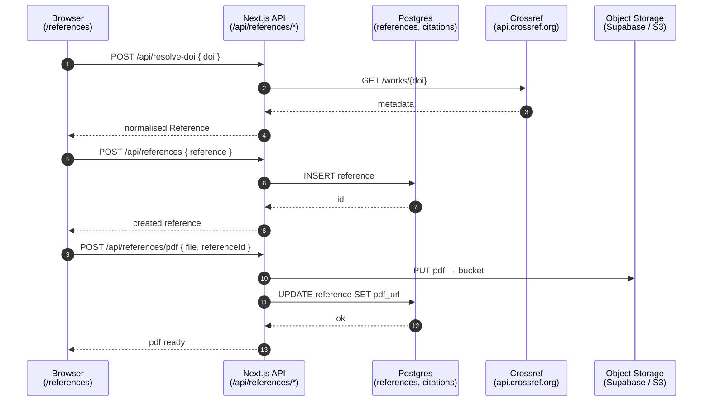

# M · 01 — Reference Manager

!!! tip "Status"
    Stable · shipped in v1.0 · route [`/references`](https://github.com/EUClimateAdvisoryBoard/ESABCCMethodHub/tree/main/src/app/references)

A literature library for the Secretariat. Replaces what used to be a
sprawling EndNote / shared-drive setup with a single searchable store,
plus a Word add-in that inserts citations into a live manuscript.

## User story

> A Secretariat analyst is writing a background note. They paste a DOI
> into the search bar, MethodHub fetches the metadata from Crossref,
> they upload the PDF and annotate three passages. Next, inside Word,
> the Office.js add-in lists the same references and inserts a
> formatted citation at the cursor — no copy-pasting, no EndNote.

## Data flow



## Code surface

| Path                                                           | Role                                                 |
|----------------------------------------------------------------|------------------------------------------------------|
| [`src/app/references/page.tsx`](https://github.com/EUClimateAdvisoryBoard/ESABCCMethodHub/blob/main/src/app/references/page.tsx)         | Route entry — library-picker + master-detail split, library-header buttons (*+ Add Reference*, *Audit a report*). |
| [`src/app/references/audit-report/page.tsx`](https://github.com/EUClimateAdvisoryBoard/ESABCCMethodHub/blob/main/src/app/references/audit-report/page.tsx) | Two-mode report audit surface: *Upload a finished report* and *Live (Word add-in)*. Lazy-loads `react-pdf` so the Vercel build stays under bundle limits. |
| [`src/lib/references/reference-service.ts`](https://github.com/EUClimateAdvisoryBoard/ESABCCMethodHub/blob/main/src/lib/references/reference-service.ts) | Client API for references / libraries / subscriptions. |
| [`src/lib/references/custom-store.ts`](https://github.com/EUClimateAdvisoryBoard/ESABCCMethodHub/blob/main/src/lib/references/custom-store.ts) | Server-side custom-references store; persists `funding` round-tripped from CrossRef. |
| [`src/lib/policy-citations.ts`](https://github.com/EUClimateAdvisoryBoard/ESABCCMethodHub/blob/main/src/lib/policy-citations.ts) | Synthesises one "Policy Citation" reference per tracked policy so `?policy=<id>` deep-links from the Policy Clock resolve. |
| [`src/components/references/*`](https://github.com/EUClimateAdvisoryBoard/ESABCCMethodHub/tree/main/src/components/references) | `LibrarySelector`, `ReferenceList`, `ReferenceForm` — funder textarea + EU-funded badge live here. |
| [`bridge-service/`](https://github.com/EUClimateAdvisoryBoard/ESABCCMethodHub/tree/main/bridge-service) | Local Node bridge on `localhost:8585`. New: `/api/report-plan/:id` and `/api/report-plans` proxies for the Word add-in's plan-scope panel. |
| [`word-addin/`](https://github.com/EUClimateAdvisoryBoard/ESABCCMethodHub/tree/main/word-addin) | Office.js add-in; pairs with `bridge-service`. The task pane now has a *Report* panel at the top that pins the document to a Report Plan — reference search and insertion are then restricted to that plan's bibliography. |

## API surface

| Method | Path                                     | Purpose                                           |
|--------|------------------------------------------|---------------------------------------------------|
| GET    | `/api/references`                        | List references for a library.                    |
| POST   | `/api/references`                        | Create a reference from normalised metadata (incl. `funding`). |
| POST   | `/api/references/doi`                    | Upsert by DOI (idempotent).                       |
| POST   | `/api/references/pdf`                    | Upload a PDF file and attach to a reference.      |
| POST   | `/api/references/fetch-pdf`              | Fetch a PDF from a URL and attach.                |
| GET    | `/api/references/library`                | List the signed-in user's libraries.              |
| POST   | `/api/references/library/backfill`       | Import bulk references from a legacy dump.        |
| POST   | `/api/resolve-doi`                       | Fetch Crossref metadata for a DOI — now lifts CrossRef's `funder[]` into `csl.funder` so any DOI-imported reference picks up funding without re-import. |
| GET    | `/api/similar-papers`                    | Suggest related papers (Crossref / Semantic Scholar). |
| GET    | `/api/citations/used`                    | Roll-up of citation-insertion events grouped by Report Plan / document / funder. Backs the *Live (Word add-in)* tab on `/references/audit-report`. |
| POST   | `/api/citations/used`                    | Append a row to the `citations_used` event log. Posted by the Word add-in on every `insertCitation` / `insertMultiCitation`. |
| GET    | `/api/report-plans`                      | List Report Plans (used by the Word add-in's plan picker via the bridge). |
| GET    | `/api/report-plans/[id]`                 | Fetch a single plan + its reference list — drives the bridge's `/api/report-plan/:id` and the `/report-plan/[id]` page (incl. the funding-analysis panel). |

## Ingestion

Manual only — references are added by users or imported from a legacy
EndNote dump via `/api/references/library/backfill`. There is no
scheduled ingestion for M·01; everything that matters is user-entered or
user-imported.

## Schema

```
references         (id, doi, title, authors[], year, abstract,
                    pdf_url, library_id, added_by, added_at,
                    funding jsonb, …)
reference_tags     (reference_id, tag)
reference_annots   (reference_id, page, rect, note, created_by, …)
libraries          (id, name, owner, visibility)
custom_references  (id, … , funding jsonb)         -- inline-form store
citations_used     (id, reference_id, document_key,
                    plan_id, doi, funding,
                    inserted_by, inserted_at)
```

`funding` mirrors the CrossRef `funder[]` shape — `{ name, doi,
award[] }` — and is GIN-indexed on both reference tables so the
EU-funded share aggregates cheaply across thousands of rows
(migrations [`025_references_funding.sql`](https://github.com/EUClimateAdvisoryBoard/ESABCCMethodHub/blob/main/supabase/migrations/025_references_funding.sql)
and [`028_citations_used.sql`](https://github.com/EUClimateAdvisoryBoard/ESABCCMethodHub/blob/main/supabase/migrations/028_citations_used.sql)).

`citations_used` is a thin event log — one row per citation
insertion. `reference_id` is intentionally `text` (not a foreign key)
because it can point at either `references.id` (uuid) or
`custom_references.id` (text), and the add-in does not always know
which store the citation came from. `funding` and `doi` are
**snapshot fields** — copied at insert time so analytics queries
don't have to join across both reference stores at read time.

All tables have RLS policies keyed to `added_by` / `library_id`. See
[Data & GDPR](../infrastructure/data-gdpr.md) for the retention and
erasure rules.

## Projects — tagging a reference with its report context

The library is **one shared bibliography**, not one per report. To keep
it that way while still answering "which papers did we use for *Policy
Gap 2.0*?", a reference can be filed under one or more **projects** (the
report it was added in the context of).

Projects are modelled as a reserved namespace inside the existing
`tags[]` array using a `project:` prefix — no schema migration, and the
membership rides along through CSL `keyword` / BibTeX / RIS exports like
any other tag:

```
tag  "project:Policy Gap 2.0"   ⇄   project name  "Policy Gap 2.0"
```

The helper module
[`src/lib/references/projects.ts`](https://github.com/EUClimateAdvisoryBoard/ESABCCMethodHub/blob/main/src/lib/references/projects.ts)
owns the convention (`splitTags`, `combineTags`, `aggregateProjects`,
`referenceInProject`). Both reference forms surface a dedicated
**Report / Project** field (separate from free tags, with autocomplete
over existing projects), and adding a reference while a project view is
active pre-fills that report.

Three places consume it:

- **Project view (web).** The reference manager's left rail lists every
  project with a count; a *Project view* dropdown above the list filters
  the shared library down to one report. Project membership is also shown
  as a distinct badge on each row, and the active project round-trips
  through the URL (`?project=…`) so a scoped view is shareable.
- **Word companion app.** The desktop add-in
  ([`word-addin-app/`](https://github.com/EUClimateAdvisoryBoard/ESABCCMethodHub/tree/main/word-addin-app))
  gains a **Project** filter that narrows the pick-list to one report's
  literature — useful when you remember the report but not the exact
  paper title. The control hides itself when the dataset carries no
  project tags.

This is the lightweight, per-reference complement to **Report Plans**
(below), which pin a whole Word document to a pre-agreed bibliography.

## Deep dive

??? abstract "DOI resolution — Crossref request/response shape"
    The route `POST /api/resolve-doi` accepts `{ doi: string }` and:

    1. Normalises the DOI (strips `https://doi.org/`, lower-cases, trims).
    2. Checks the `references` table for an existing row keyed by DOI;
       returns early on hit to avoid the upstream round trip.
    3. On miss, calls Crossref `GET https://api.crossref.org/works/{doi}`
       with a polite `mailto=` parameter (see
       [RFC 7230 User-Agent guidance](https://api.crossref.org/swagger-ui/index.html)).
    4. Maps the Crossref payload to our internal `Reference` type:
       `title`, `authors[]`, `container-title → journal`, `issued →
       year`, `DOI`. Unknown or malformed fields are dropped.
    5. Caches the result for 30 days via a `reference_cache` row with
       `fetched_at`. Cache-bust is a `?refresh=1` query parameter.

    Edge cases worth knowing:

    - **DataCite DOIs** (typical for datasets) round-trip through
      Crossref's `agency` endpoint first; if the agency is `datacite`,
      we switch to `https://api.datacite.org/dois/{doi}`.
    - **Books / book chapters** have `ISBN` where `ISSN` would be;
      the mapper emits both if present so CSL-JSON renders correctly.
    - **Crossref 404** is returned as HTTP 422 to the client with a
      reason code; the UI surfaces it inline on the reference form.

??? abstract "Word add-in bridge — protocol and lifecycle"
    The Word Office.js add-in talks to `bridge-service/` (a local Node
    process) over `http://localhost:8585`. Why a local bridge rather
    than direct browser → webapp calls:

    - Office.js runs in a sandboxed iframe without access to the user's
      Secretariat-wide OIDC session cookie for `methodhub.example`.
    - The bridge holds a long-lived refresh token on the user's
      machine and exchanges it for short-lived access tokens per call.
    - CORS to `methodhub.example` from an Office iframe is an endless
      battle with Microsoft's shifting host origins. A local bridge
      dodges all of it.

    Endpoints exposed by the bridge:

    ```
    GET  /libraries                 list libraries visible to the user
    GET  /references?library=…      list references
    POST /cite                      render CSL-JSON → formatted string
                                    (style = user's current selection)
    POST /insert                    send the formatted citation to
                                    Office.js via window.postMessage
    ```

    The add-in's `manifest.xml` pins the domain to `localhost:8585`;
    EEA IT does not need to open any inbound ports — it's loopback only.

??? abstract "PDF annotation — storage and coordinates"
    PDF annotations are stored in `reference_annots`:

    ```
    reference_id  uuid
    page          smallint
    rect          jsonb   -- { x1, y1, x2, y2 } in PDF user-space units
    note          text
    created_by    uuid
    created_at    timestamptz
    ```

    Coordinates are **PDF user-space** (72 DPI, origin bottom-left),
    not rendered pixels. That keeps annotations stable when the user
    zooms; the viewer (`FullTextViewer.tsx`) converts rect → DOM
    coordinates at render time using `pdfjs-dist` page transforms.

## EU-funded share — the citation-audit pipeline

Two surfaces answer one question: *how much of the literature cited
in our reports is EU-funded?*

### `/references/audit-report` — two modes

The report-audit page lives at
[`/references/audit-report`](https://github.com/EUClimateAdvisoryBoard/ESABCCMethodHub/blob/main/src/app/references/audit-report/page.tsx)
and is reachable via the **Audit a report** button next to *+ Add
Reference* in the library headers (both the fallback and Supabase
variants). It exposes a tab switcher with two modes:

- **Upload a finished report.** Drop a PDF / DOCX in. The page
  extracts the bibliography, resolves each entry against the
  references store + CrossRef, and renders headline tiles plus a
  funder leaderboard. `react-pdf` is **lazy-loaded** here so the
  Vercel build stays under bundle limits.
- **Live (Word add-in).** Reads the `citations_used` event log via
  `GET /api/citations/used`, filterable by Report Plan id and
  Word document key. Same headline tiles and funder leaderboard
  shape so the two modes are directly comparable.

The denominator for the EU-funded share **excludes references with
no funding metadata** in both modes — we can't classify what we
don't know.

### Report Plans — pinning a Word document to a bibliography

The Word add-in's task pane has a **Report panel** at the top that
pins the open document to a specific Report Plan. Once pinned:

- Reference search runs entirely against that plan's bibliography —
  the author **cannot accidentally cite something outside the
  agreed report library**.
- The pin persists across saves via
  `Office.context.document.settings`, so reopening the `.docx`
  restores the scope without re-picking.
- Every `insertCitation` / `insertMultiCitation` writes a row to
  `citations_used` carrying both the document key and the active
  `plan_id` — that's what the *Live (Word add-in)* tab on the audit
  page reads.

Plan listing for the picker is proxied through the bridge service:

```
bridge-service/src/server.ts
  GET /api/report-plans             list available plans
  GET /api/report-plan/:id          plan body + scoped reference ids
                                    + EU-funded share (same calculation
                                    as the in-app /report-plan/[id] panel)
```

The bridge calls MethodHub via `METHODHUB_URL` (defaults to the
public host) and reuses the **same EU funder DOI prefix / name
list** as the references module so the in-app panel and the Word
task pane agree.

## Known limits

- **No automatic citation-style formatting.** The Word add-in inserts a
  reference in CSL-JSON; Zotero-style formatting is done client-side by
  the add-in, not server-side.
- **No duplicate detection across libraries.** Intentional — a library
  is a per-project workspace, not a shared canon.
- **PDF text extraction** is on-demand (served by M·05), not
  pre-computed on upload. Upload costs are kept bounded.
- **Funder coverage is bounded by CrossRef.** Pre-prints and
  non-DOI references carry no funder metadata, so they sit in the
  *unclassified* bucket on the audit surface.
