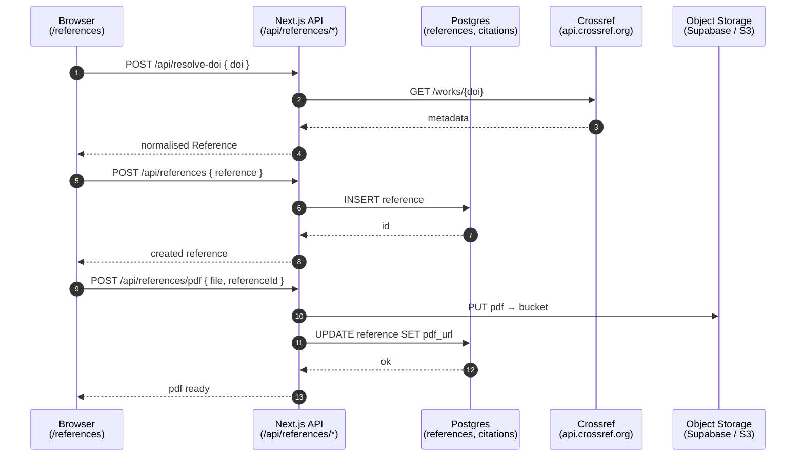

# M · 01 — Reference Manager

!!! tip "Status"
    Stable · shipped in v1.0 · route [`/references`](https://github.com/SebastianFra/MethodHub/tree/main/src/app/references)

A literature library for the Secretariat. Replaces what used to be a
sprawling EndNote / shared-drive setup with a single searchable store,
plus a Word add-in that inserts citations into a live manuscript.

## User story

> A Secretariat analyst is writing a background note. They paste a DOI
> into the search bar, MethodHub fetches the metadata from Crossref,
> they upload the PDF and annotate three passages. Next, inside Word,
> the Office.js add-in lists the same references and inserts a
> formatted citation at the cursor — no copy-pasting, no EndNote.

## Data flow



## Code surface

| Path                                                           | Role                                                 |
|----------------------------------------------------------------|------------------------------------------------------|
| [`src/app/references/page.tsx`](https://github.com/SebastianFra/MethodHub/blob/main/src/app/references/page.tsx)         | Route entry — owns library-picker + master-detail split. |
| [`src/lib/references/reference-service.ts`](https://github.com/SebastianFra/MethodHub/blob/main/src/lib/references/reference-service.ts) | Client API for references / libraries / subscriptions. |
| [`src/lib/references/custom-store.ts`](https://github.com/SebastianFra/MethodHub/blob/main/src/lib/references/custom-store.ts) | Server-side custom-references store, replaces the old GitHub-file path. |
| [`src/components/references/*`](https://github.com/SebastianFra/MethodHub/tree/main/src/components/references) | `LibrarySelector`, `ReferenceList`, `ReferenceForm`. |
| [`bridge-service/`](https://github.com/SebastianFra/MethodHub/tree/main/bridge-service) | Local Node bridge on `localhost:8585` for the Word add-in. |
| [`word-addin/`](https://github.com/SebastianFra/MethodHub/tree/main/word-addin) | Office.js add-in; pairs with `bridge-service`. |

## API surface

| Method | Path                                     | Purpose                                           |
|--------|------------------------------------------|---------------------------------------------------|
| GET    | `/api/references`                        | List references for a library.                    |
| POST   | `/api/references`                        | Create a reference from normalised metadata.      |
| POST   | `/api/references/doi`                    | Upsert by DOI (idempotent).                       |
| POST   | `/api/references/pdf`                    | Upload a PDF file and attach to a reference.      |
| POST   | `/api/references/fetch-pdf`              | Fetch a PDF from a URL and attach.                |
| GET    | `/api/references/library`                | List the signed-in user's libraries.              |
| POST   | `/api/references/library/backfill`       | Import bulk references from a legacy dump.        |
| POST   | `/api/resolve-doi`                       | Fetch Crossref metadata for a DOI.                |
| GET    | `/api/similar-papers`                    | Suggest related papers (Crossref / Semantic Scholar). |

## Ingestion

Manual only — references are added by users or imported from a legacy
EndNote dump via `/api/references/library/backfill`. There is no
scheduled ingestion for M·01; everything that matters is user-entered or
user-imported.

## Schema

```
references        (id, doi, title, authors[], year, abstract,
                   pdf_url, library_id, added_by, added_at, …)
reference_tags    (reference_id, tag)
reference_annots  (reference_id, page, rect, note, created_by, …)
libraries         (id, name, owner, visibility)
```

All tables have RLS policies keyed to `added_by` / `library_id`. See
[Data & GDPR](../infrastructure/data-gdpr.md) for the retention and
erasure rules.

## Deep dive

??? abstract "DOI resolution — Crossref request/response shape"
    The route `POST /api/resolve-doi` accepts `{ doi: string }` and:

    1. Normalises the DOI (strips `https://doi.org/`, lower-cases, trims).
    2. Checks the `references` table for an existing row keyed by DOI;
       returns early on hit to avoid the upstream round trip.
    3. On miss, calls Crossref `GET https://api.crossref.org/works/{doi}`
       with a polite `mailto=` parameter (see
       [RFC 7230 User-Agent guidance](https://api.crossref.org/swagger-ui/index.html)).
    4. Maps the Crossref payload to our internal `Reference` type:
       `title`, `authors[]`, `container-title → journal`, `issued →
       year`, `DOI`. Unknown or malformed fields are dropped.
    5. Caches the result for 30 days via a `reference_cache` row with
       `fetched_at`. Cache-bust is a `?refresh=1` query parameter.

    Edge cases worth knowing:

    - **DataCite DOIs** (typical for datasets) round-trip through
      Crossref's `agency` endpoint first; if the agency is `datacite`,
      we switch to `https://api.datacite.org/dois/{doi}`.
    - **Books / book chapters** have `ISBN` where `ISSN` would be;
      the mapper emits both if present so CSL-JSON renders correctly.
    - **Crossref 404** is returned as HTTP 422 to the client with a
      reason code; the UI surfaces it inline on the reference form.

??? abstract "Word add-in bridge — protocol and lifecycle"
    The Word Office.js add-in talks to `bridge-service/` (a local Node
    process) over `http://localhost:8585`. Why a local bridge rather
    than direct browser → webapp calls:

    - Office.js runs in a sandboxed iframe without access to the user's
      Secretariat-wide OIDC session cookie for `methodhub.eea`.
    - The bridge holds a long-lived refresh token on the user's
      machine and exchanges it for short-lived access tokens per call.
    - CORS to `methodhub.eea` from an Office iframe is an endless
      battle with Microsoft's shifting host origins. A local bridge
      dodges all of it.

    Endpoints exposed by the bridge:

    ```
    GET  /libraries                 list libraries visible to the user
    GET  /references?library=…      list references
    POST /cite                      render CSL-JSON → formatted string
                                    (style = user's current selection)
    POST /insert                    send the formatted citation to
                                    Office.js via window.postMessage
    ```

    The add-in's `manifest.xml` pins the domain to `localhost:8585`;
    EEA IT does not need to open any inbound ports — it's loopback only.

??? abstract "PDF annotation — storage and coordinates"
    PDF annotations are stored in `reference_annots`:

    ```
    reference_id  uuid
    page          smallint
    rect          jsonb   -- { x1, y1, x2, y2 } in PDF user-space units
    note          text
    created_by    uuid
    created_at    timestamptz
    ```

    Coordinates are **PDF user-space** (72 DPI, origin bottom-left),
    not rendered pixels. That keeps annotations stable when the user
    zooms; the viewer (`FullTextViewer.tsx`) converts rect → DOM
    coordinates at render time using `pdfjs-dist` page transforms.

## Known limits

- **No automatic citation-style formatting.** The Word add-in inserts a
  reference in CSL-JSON; Zotero-style formatting is done client-side by
  the add-in, not server-side.
- **No duplicate detection across libraries.** Intentional — a library
  is a per-project workspace, not a shared canon.
- **PDF text extraction** is on-demand (served by M·05), not
  pre-computed on upload. Upload costs are kept bounded.
