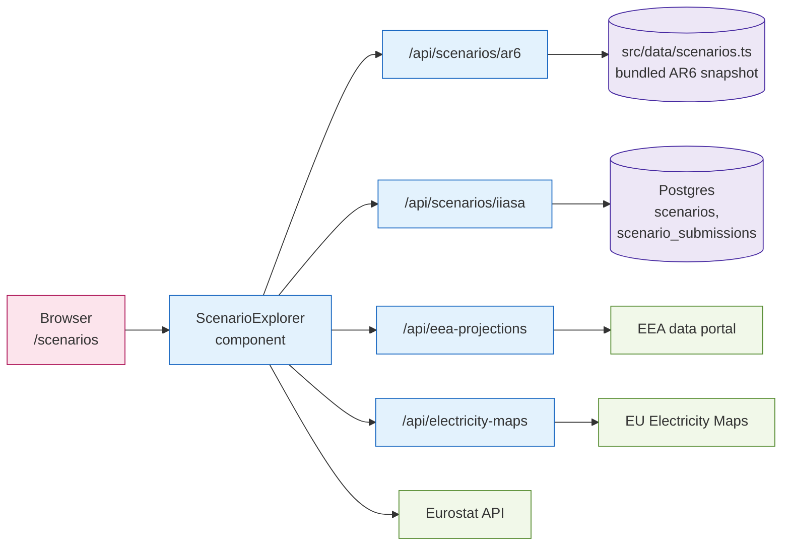

# M · 02 — Data & Scenario Explorer

!!! tip "Status"
    Stable · shipped in v1.0 · route [`/scenarios`](https://github.com/SebastianFra/MethodHub/tree/main/src/app/scenarios)

Eurostat indicators alongside IPCC AR6 and IIASA scenario projections in
one queryable, cross-filtered view — with a path for Secretariat
analysts to upload their own scenario submissions.

## User story

> A scientific officer is comparing EU-27 power-sector CO₂ trajectories
> across the IIASA AR6 WG3 database and EEA's WEM / WAM projections.
> They open MethodHub, filter by "Power", pick two AR6 scenarios and
> the WEM baseline, overlay historical Eurostat values for
> 2015–2023 — all in one chart, no spreadsheet.

## Data flow



## Code surface

| Path                                                                                                            | Role                                                      |
|-----------------------------------------------------------------------------------------------------------------|-----------------------------------------------------------|
| [`src/app/scenarios/page.tsx`](https://github.com/SebastianFra/MethodHub/blob/main/src/app/scenarios/page.tsx)    | Thin route shell.                                         |
| [`src/components/ScenarioExplorer.tsx`](https://github.com/SebastianFra/MethodHub/blob/main/src/components/ScenarioExplorer.tsx)  | The explorer itself — filters, chart, submissions UI.     |
| [`src/components/ScenarioChart.tsx`](https://github.com/SebastianFra/MethodHub/blob/main/src/components/ScenarioChart.tsx)        | Chart.js-based renderer with overlayable series.           |
| [`src/components/EurostatExplorer.tsx`](https://github.com/SebastianFra/MethodHub/blob/main/src/components/EurostatExplorer.tsx)  | Eurostat indicator browser; embedded as a tab.             |
| [`src/data/scenarios.ts`](https://github.com/SebastianFra/MethodHub/blob/main/src/data/scenarios.ts)                              | Bundled AR6 WG3 snapshot.                                  |

## API surface

| Method | Path                             | Purpose                                                 |
|--------|----------------------------------|---------------------------------------------------------|
| GET    | `/api/scenarios`                 | List scenarios, optionally filtered.                    |
| GET    | `/api/scenarios/ar6`             | Returns the bundled AR6 WG3 snapshot.                   |
| GET    | `/api/scenarios/iiasa`           | Proxy to the IIASA scenario database.                   |
| GET    | `/api/eea-projections`           | EEA WEM / WAM projections (member-state submissions).   |
| GET    | `/api/electricity-maps`          | Hourly grid carbon-intensity.                           |
| POST   | `/api/scenario-submissions`      | Submit a scenario for review.                           |
| POST   | `/api/scenario-upload`           | Upload raw scenario files for parsing.                  |

## Ingestion

| Script                                                                                                                               | Cadence | What it does                                    |
|--------------------------------------------------------------------------------------------------------------------------------------|---------|-------------------------------------------------|
| [`scripts/fetch_iiasa_data.py`](https://github.com/SebastianFra/MethodHub/blob/main/scripts/fetch_iiasa_data.py)                       | weekly  | Pulls AR6 WG3 snapshot, writes `src/data/scenarios.ts`. |
| [`scripts/validate-connections.ts`](https://github.com/SebastianFra/MethodHub/blob/main/scripts/validate-connections.ts)               | nightly | Checks external feeds respond and schema matches. |
| Eurostat / EEA projections                                                                                                           | on demand | Fetched live per request; results cached per session. |

## Subroutes

- `/scenarios/upload` — form for uploading a new scenario set (IAMC CSV).
- `/scenarios/submissions` — review queue for user-submitted scenarios.
- `/scenarios/request` — request-a-dataset flow; creates an issue for CCE5.

## Schema

```
scenarios              (id, model, scenario, region, variable, unit,
                        values jsonb, source, submitted_by, status)
scenario_submissions   (id, user_id, title, files[], status, reviewer, …)
eurostat_cache         (indicator, region, dim jsonb, series jsonb, fetched_at)
```

## Deep dive

??? abstract "IAMC CSV — the format we normalise everything to"
    The IIASA AR6 database and many national projection submissions
    ship data in the [IAMC 1.0 wide-format CSV](https://pyam-iamc.readthedocs.io/en/stable/data.html):

    ```
    Model,Scenario,Region,Variable,Unit,2010,2015,2020,2025,2030,…
    MESSAGEix-GLOBIOM,EN_NPi2020_200,EU,Emissions|CO2,Mt CO2/yr,3850,3720,3510,…
    ```

    `scripts/fetch_iiasa_data.py` normalises to a long-format JSONB
    column `values jsonb` (`{"2010": 3850, "2015": 3720, …}`) so the
    chart code can do `Object.entries(values)` without branching.

    Upload acceptance rules (`POST /api/scenario-upload`):

    - First row must be the IAMC header exactly.
    - Year columns must be integers between 1990 and 2100.
    - `Unit` is preserved as-is — the chart layer does unit
      conversion only when two series with different units are
      overlaid.

??? abstract "Chart.js configuration — why certain defaults"
    `ScenarioChart.tsx` wraps Chart.js with a few opinionated defaults:

    - **Animation disabled after the first paint** — the chart is
      re-rendered on every filter change; animation causes jitter.
    - **Y-axis suggested minimum** is 0 for emissions variables and
      dataset-min for capacity variables (avoids visual impression of
      negative generation capacity).
    - **Tooltip pin on click** — scientific reviewers want to read
      exact 2030 values next to 2040 values without chasing the mouse.
    - **Legend is a separate React component**, not Chart.js' built-in,
      because we need filter interactions on the legend items.

??? abstract "Eurostat live calls vs. cache"
    `EurostatExplorer.tsx` calls the Eurostat JSON-stat API directly
    from the server component. We cache in a `eurostat_cache` table
    keyed by `(indicator, region, dim)` with `fetched_at`. Default
    TTL: 24 h. This is enough to absorb repeated user filters and
    stay well below Eurostat's unpublished but real rate limits.

## Known limits

- **ScenarioExplorer is the largest component in the app** (~3 k LoC).
  It is the next candidate for a modest split — but only once the
  product has stabilised; premature refactors here would be expensive.
- **No uncertainty envelopes.** The chart shows central trajectories
  only. Ensembles and quantile bands are on the roadmap.
