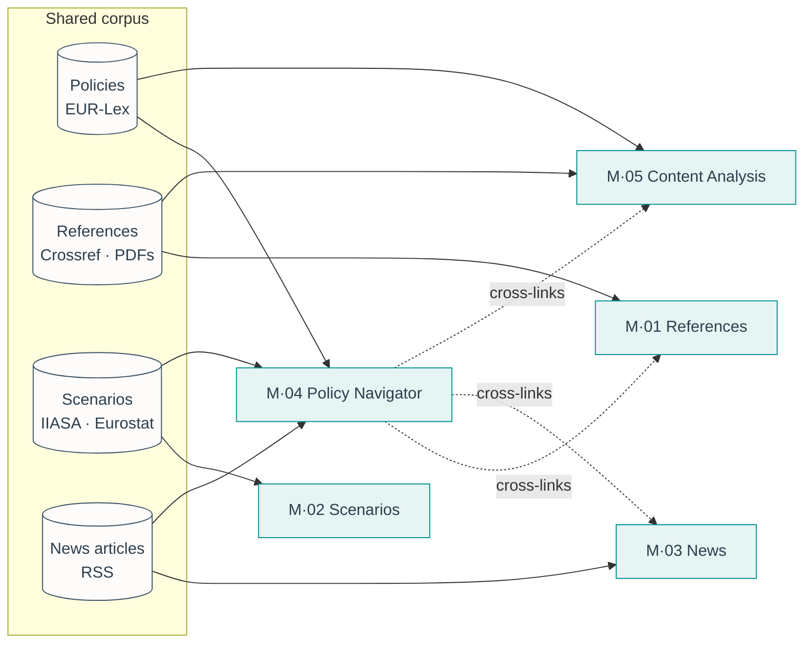

# The five modules

The v1.0 ship surface. Every module listed here is **stable**, covered by
migrations, RLS policies, retention jobs and IT handoff scripts.

| #     | Module               | Route                  | What it does                                                      | Deep-dive                                        |
|-------|----------------------|------------------------|-------------------------------------------------------------------|--------------------------------------------------|
| M·01  | Reference Manager    | `/references`          | Literature library with DOI lookup, PDF annotation, Word add-in.  | [open](../modules/references.md)                 |
| M·02  | Data & Scenarios     | `/scenarios`           | Eurostat, IPCC AR6 and IIASA scenarios in one queryable explorer. | [open](../modules/scenarios.md)                  |
| M·03  | Secretariat News     | `/news-feed`           | Curated climate-policy news and the daily 24 h EU briefing.       | [open](../modules/news-feed.md)                  |
| M·04  | EU Policy Navigator  | `/policy-navigator`    | Network map of EU climate laws with article-level annotation.     | [open](../modules/policy-navigator.md)           |
| M·05  | Content Analysis     | `/content-analysis`    | Hierarchical qualitative coding of policy texts and references.   | [open](../modules/content-analysis.md)           |

<figure class="mh-figure mh-figure--wide" markdown>

<figcaption>Figure 2. The five modules are peers around a single Postgres corpus. Solid edges are reads/writes against the shared schema; dotted edges are explicit peer cross-links (foreign keys, not semantic search).</figcaption>
</figure>

## How they fit together

- Every module reads from the **same corpus** tables, so a reference
  inserted in M·01 shows up in M·05, a policy annotated in M·04 is
  reachable from M·05, etc.
- Cross-linking is explicit (`policy_id`, `reference_id`, `code_id`) —
  not semantic search — to keep the audit trail clean.
- There is **no** "master" module: all five are peers, wired against the
  same Postgres schema.

## Why exactly five?

Earlier prototypes had thirteen modules competing for attention. In
practice the Secretariat used these five daily and the rest weekly at
best. Forcing the scope down makes the value proposition legible and
reduces the IT handoff surface to something that can be reviewed in an
afternoon. The other eight are not deleted — they live under
[`beta/modules/`](beta.md) and can be promoted one at a time as demand
justifies.
