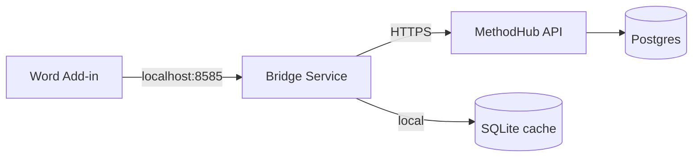

# Companion clients & extensions

MethodHub ships six companion tools that extend the web application into
desktop workflows. Each connects back to the same Postgres corpus and
API surface.

## Bridge Service (`bridge-service/`)

Local Express HTTP server (port 8585) that caches references in SQLite
and bridges Word clients to Supabase. Runs on the analyst's machine.

| Item | Detail |
|------|--------|
| **Runtime** | Node.js + Express |
| **Cache** | better-sqlite3 with WAL mode, 4 indices |
| **Endpoints** | `/search`, `/cite`, `/sync`, `/report-plan` (10 total) |
| **Auth** | Origin-validated CORS + optional token |
| **Fallback** | Falls back to direct Supabase if bridge is unreachable |

### Key files

| Path | Role |
|------|------|
| `bridge-service/src/server.ts` | Express app, routing, CORS, auth |
| `bridge-service/src/cache.ts` | SQLite offline cache with incremental sync |
| `bridge-service/src/citeproc-engine.ts` | CSL-JSON citation formatting via citeproc-js |

---

## Word Add-in — Office.js (`word-addin/`)

TypeScript/Webpack Office.js task-pane add-in for Microsoft Word.
Reference search, citation insertion, bibliography generation directly
in the ribbon.

| Item | Detail |
|------|--------|
| **Runtime** | Office.js + TypeScript + Webpack |
| **Install** | Sideload `manifest.xml` or deploy via admin centre |
| **Connection** | Bridge-first, Supabase fallback |
| **Features** | Search, insert citation, generate bibliography, report plans |

### Key files

| Path | Role |
|------|------|
| `word-addin/src/taskpane/taskpane.ts` | Office.onReady bootstrap, UI state, search |
| `word-addin/src/services/api.ts` | HTTP client with bridge-first fallback |
| `word-addin/src/services/citation.ts` | Word document manipulation (insert, refresh, bibliography) |
| `word-addin/manifest.xml` | Office add-in declaration |

---

## Word Add-in — Desktop App (`word-addin-app/`)

Standalone Electron reference manager. Bundles 2 600+ ESABCC references
offline. Search, annotate, collect, and copy formatted citations to
clipboard for pasting into Word.

| Item | Detail |
|------|--------|
| **Runtime** | Electron |
| **Storage** | Local SQLite for annotations and collections |
| **Features** | Search, PDF annotations, collections, Semantic Scholar integration |
| **Data** | Bundled `references.json` (exported from `src/data/references.ts`) |

### Key files

| Path | Role |
|------|------|
| `word-addin-app/main.js` | Electron main process |
| `word-addin-app/renderer/app.js` | Renderer logic (search, filters, annotations) |
| `word-addin-app/scripts/export-refs.js` | Exports TypeScript references to JSON |

---

## Word VBA Macro (`word-vba/`)

Legacy VBA module for Word. Same citation workflow as the Office.js
add-in but runs in a `.dotm` template for environments where add-ins
are blocked.

| Item | Detail |
|------|--------|
| **Runtime** | VBA inside Word `.dotm` template |
| **Install** | PowerShell installer (`install.ps1`) |
| **Connection** | HTTP to bridge-service or direct API |
| **Config** | `BRIDGE_URL`, `CITE_PREFIX` constants in the module header |

### Key files

| Path | Role |
|------|------|
| `word-vba/ESABCC_RefManager.bas` | VBA module (ribbon, search, HTTP, citation insertion) |
| `word-vba/install.ps1` | Automated installer (detects Word, enables AccessVBOM) |
| `word-vba/uninstall.ps1` | Clean uninstaller |
| `word-vba/embed-in-file.ps1` | Embed macro into a `.docm` file |

---

## Outlook VBA Macro (`outlook-vba/`)

Outlook macro that pushes emails into the MethodHub News Feed. Hourly
auto-scan for matching rules or manual push via QAT button.

| Item | Detail |
|------|--------|
| **Runtime** | VBA inside Outlook |
| **Rules** | Auto-matches POLITICO Pro, Climate Action Press Review |
| **Cadence** | Hourly timer via `Application_Startup` hook |
| **Dedup** | Marks sent emails with a user property to avoid duplicates |

### Key files

| Path | Role |
|------|------|
| `outlook-vba/ESABCC_PushToMethodHub.bas` | VBA module (rules, timer, HTTP POST, dedup) |

---

## Browser Extension (`browser-extension/`)

Manifest V3 Chrome/Edge extension. Right-click a LinkedIn post to
capture it into the media monitoring dashboard.

| Item | Detail |
|------|--------|
| **Manifest** | V3 (Chrome + Edge) |
| **Trigger** | Context menu on LinkedIn posts, or Alt+Shift+C hotkey |
| **Captures** | Post text, author, URL, timestamp |
| **Auth** | Shared secret configured in extension options |

### Key files

| Path | Role |
|------|------|
| `browser-extension/background.js` | Service worker: context menu, payload extraction, API POST |
| `browser-extension/popup.js` | Toolbar popup for manual capture |
| `browser-extension/options.js` | Settings (API URL, shared secret) |
| `browser-extension/manifest.json` | Extension declaration |

---

## PyPSA Service (`pypsa-service/`)

Python/FastAPI backend that wraps PyPSA (the peer-reviewed European
power system model) for energy-system optimisation and maritime/aviation
bunkering analysis.

| Item | Detail |
|------|--------|
| **Runtime** | Python 3.11 + FastAPI + HiGHS solver |
| **Model** | 30-country EU network (EU-27 + NO/CH/UK), capacity expansion LP |
| **Endpoints** | `/optimize`, `/maritime-aviation`, `/electricity-maps` proxy |
| **Deployment** | Docker or Hugging Face Spaces |
| **Data** | 5-layer fallback: PyPSA-Eur costs, ERA5/OPSD profiles, synthetic |

### Key files

| Path | Role |
|------|------|
| `pypsa-service/app/main.py` | FastAPI entry, job queue, CORS |
| `pypsa-service/app/energy_system.py` | 30-country network model, dispatch LP |
| `pypsa-service/app/maritime_aviation.py` | Fuel-mix optimisation for shipping/aviation |
| `pypsa-service/app/data_loader.py` | Multi-layer data loading with fallbacks |
| `pypsa-service/app/electricity_maps.py` | Electricity Maps API proxy |
