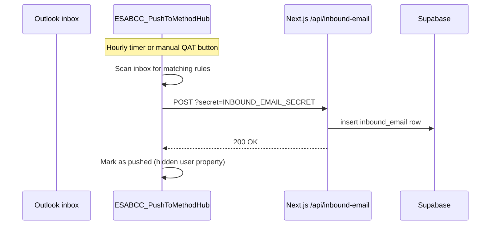

# outlook-vba

Outlook VBA macro that pushes emails into the app's News Feed without having
to forward them. Users either click a Quick Access Toolbar button on the
current message or let an hourly timer auto-push matching emails.



## Contents

- `ESABCC_PushToMethodHub.bas` — the macro.

## What it does

- **Auto-push, hourly**: scans the inbox for emails matching either of two
  rules:
  1. Sender contains "Rasmus" **and** the subject or body mentions "POLITICO"
     (POLITICO Pro newsletter).
  2. Sender is "François" **and** the subject is "Climate Action Press Review".
- **Manual push**: two macros (`ESABCC_PushToMethodHub` and
  `ESABCC_AutoPushNow`) can be added to the Quick Access Toolbar to push the
  selected email on demand.
- **Duplicate protection**: every pushed item is marked with a hidden user
  property so re-scans never send the same email twice.
- **Payload**: `{subject, body, sender, timestamp}` POSTed to `WEBHOOK_URL`
  with `?secret=<INBOUND_EMAIL_SECRET>`.

## Install

1. Open Outlook and press **Alt+F11** to open the VBA editor.
2. File → Import File → select `ESABCC_PushToMethodHub.bas`.
3. In the module, edit:
   - `WEBHOOK_SECRET` — must match `INBOUND_EMAIL_SECRET` on the server.
   - `WEBHOOK_URL` — usually `https://eu-climate-policy.vercel.app/api/inbound-email`.
4. Wire up the hourly timer: in the VBA editor double-click
   **ThisOutlookSession** and paste:

   ```vb
   Private Sub Application_Startup()
       ESABCC_StartHourly
   End Sub
   ```

   `ESABCC_StartHourly` runs an immediate sweep so the feed catches up
   right away, then arms the hourly tick. Without this hook the timer
   never starts and no emails are auto-pushed.
5. Press **Ctrl+S** to save. Close and reopen Outlook.
6. File → Options → Trust Center → enable notifications for macros.
7. **Optional** — add the QAT buttons:
   - Right-click the QAT → Customize Quick Access Toolbar.
   - Choose commands from → **Macros**.
   - Add `ESABCC_PushToMethodHub` (push current email),
     `ESABCC_AutoPushNow` (run the rule scan now and rearm the timer),
     and `ESABCC_DiagnoseHourly` (verify the timer is armed).

## Configuration in the macro

The top of `ESABCC_PushToMethodHub.bas` contains:

- `WEBHOOK_URL`  — the Next.js endpoint.
- `WEBHOOK_SECRET` — shared secret (must equal `INBOUND_EMAIL_SECRET`).

These are the only values you should need to change.

## Troubleshooting

| Symptom                                        | Likely cause                                                  |
|------------------------------------------------|---------------------------------------------------------------|
| Nothing ever pushes                            | Macro was not saved, or Outlook blocks macros                 |
| Hourly auto-push not running                   | `Application_Startup` hook missing in `ThisOutlookSession`. Run `ESABCC_DiagnoseHourly` to confirm. |
| Was working, then stopped                      | Outlook dropped an OnTime tick (busy/modal). Click **Push New Matches Now** — it rearms the timer. |
| Server returns 401                             | `WEBHOOK_SECRET` differs from `INBOUND_EMAIL_SECRET` on the server |
| Same email pushed every hour                   | Hidden user property got stripped; re-import the macro        |
| "Can't connect" errors                         | Corporate firewall blocks outbound HTTPS to Vercel            |
