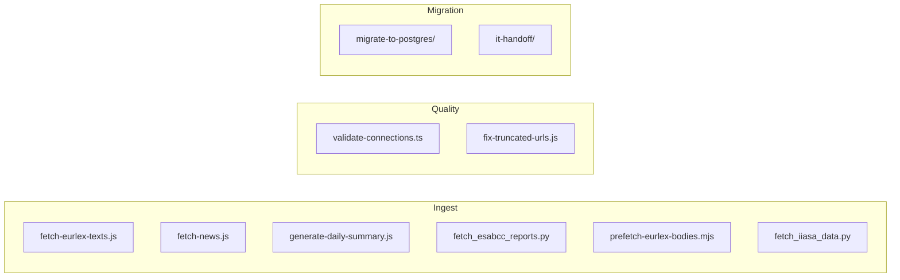

# scripts/

Utility scripts that power the data pipelines and Supabase-to-Postgres
migration for the eight modules. See
[docs/DATA_PIPELINES.md](../docs/DATA_PIPELINES.md) for how these run in CI.



## Data ingestion

| Script                                | Runs via                  | Output                                                 | Module           |
|---------------------------------------|---------------------------|--------------------------------------------------------|------------------|
| `fetch-eurlex-texts.js`               | `daily-updates.yml`, 4×/day | `public/data/policy-texts/{celex}.txt`               | Policy Navigator |
| `fetch-news.js`                       | `daily-updates.yml`, 4×/day | `src/data/newsfeed.ts`                               | News Feed        |
| `generate-daily-summary.js`           | `daily-updates.yml`, 4×/day | `public/data/daily-summary.json` + per-day JSONs     | News Feed        |
| `fetch_esabcc_reports.py`             | `fetch-esabcc-reports.yml`, monthly | `esabcc-reports/*.pdf` + README entries        | References       |
| `prefetch-eurlex-bodies.mjs`          | `prefetch-policy-bodies.yml`, manual | `public/content-analysis/policy-bodies.json`  | Content Analysis |
| `fetch_iiasa_data.py`                 | Manual CLI (uses `pyam`)  | JSON of scenario data for ad-hoc exploration          | Scenarios        |

Run manually:

```bash
node scripts/fetch-eurlex-texts.js
node scripts/fetch-news.js
node scripts/generate-daily-summary.js
python scripts/fetch_esabcc_reports.py
node scripts/prefetch-eurlex-bodies.mjs [--force] [--only=<celex>]
python scripts/fetch_iiasa_data.py --db ar6 --region "EU27" --variable "Emissions|CO2"
```

## Data quality

| Script                                | Purpose                                                   |
|---------------------------------------|-----------------------------------------------------------|
| `validate-connections.ts`             | Validates `src/data/policies.ts` graph: no duplicates, descriptions ≥ 40 chars, valid types. Exits non-zero on error. (Policy Navigator) |
| `fix-truncated-urls.js`               | Repairs truncated `url` columns in `src/data/references.ts` by extracting full URLs from `fullCitation`. One-shot. (References) |

Run manually:

```bash
npx tsx scripts/validate-connections.ts
node scripts/fix-truncated-urls.js
```

## Supabase → Postgres migration

Under [`migrate-to-postgres/`](migrate-to-postgres/):

| File                 | Purpose                                                           |
|----------------------|-------------------------------------------------------------------|
| `dump.sh`            | `pg_dump` of the Supabase public schema, stripped of owners       |
| `restore.sh`         | `psql` restore into a target Postgres                             |
| `verify-parity.mjs`  | Row-counts both databases and reports MATCH/MISMATCH              |
| `smoke-test.mjs`     | Post-restore sanity check                                         |

Run via `npm`:

```bash
SUPABASE_DB_URL=... npm run db:dump-supabase
DATABASE_URL=...    npm run db:restore-postgres dump.sql
SUPABASE_DB_URL=... DATABASE_URL=... npm run db:verify-parity
npm run db:smoke
```

## IT handoff (self-hosted Postgres)

Under [`it-handoff/`](it-handoff/README.md):

| File                       | Purpose                                                          |
|----------------------------|------------------------------------------------------------------|
| `00-prereqs.sql`           | Create DB, enable extensions, create auth shim + roles (superuser) |
| `01-apply-schema.sh`       | Apply `supabase-schema.sql` + all migrations                     |
| `02-service-accounts.sql`  | Create 4 least-privilege service roles                           |
| `03-verify.sh`             | Post-install sanity checks                                       |

Run via `npm`:

```bash
npm run it:apply-schema
npm run it:verify
```

## Conventions

- Node scripts use ES modules (`.mjs`) when they don't need to `require`
  TypeScript-only modules.
- Atomic writes: `fs.writeFileSync` to a temp path and `fs.renameSync` to the
  final path, so a partial run never leaves the repo in an inconsistent state.
- Non-zero exit codes on error — CI uses them to fail the workflow.
- Secrets via env vars, never hardcoded. Document new vars in
  `.env.local.example`.
- When adding a script that runs in CI, wire it up in
  `.github/workflows/daily-updates.yml` or create a sibling workflow file;
  update [docs/DATA_PIPELINES.md](../docs/DATA_PIPELINES.md).
