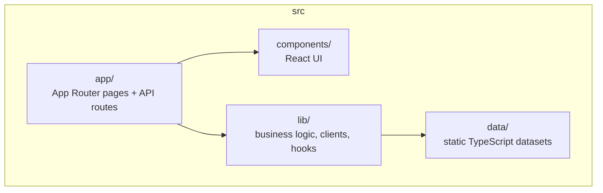

# src/ — Next.js 14 web application

This is the **EU Climate Policy Navigator** web app: the main user-facing
component of the platform. It's a Next.js 14 App Router project deployed on
Vercel.

For how the app fits into the wider platform see
[docs/infrastructure/tech-stack.md](../docs/infrastructure/tech-stack.md).
For local setup see [docs/DEVELOPMENT.md](../docs/DEVELOPMENT.md).

## Layout

| Folder         | Role                                                      |
|----------------|-----------------------------------------------------------|
| `app/`         | Route handlers (`page.tsx`) and API routes (`route.ts`)   |
| `components/`  | Reusable React components (charts, maps, forms)           |
| `lib/`         | Business logic: Supabase clients, data services, hooks    |
| `data/`        | Static datasets bundled with the app                      |

## `app/` — routes

The five modules plus utility pages:

| Route                              | Purpose                                                    |
|------------------------------------|------------------------------------------------------------|
| `/` (`page.tsx`)                   | Homepage with module dashboard                             |
| `/policy-navigator`                | D3 network graph of EU climate laws with article drill-down |
| `/policy-navigator/*`              | Subroutes for `policy`, `policy-text`, `analytics`, `guide`, `search`, `hub` |
| `/references`                      | Literature manager, DOI lookup, PDF annotation             |
| `/references/word-addin-setup`     | Word add-in installer page                                 |
| `/scenarios`                       | IIASA AR6 / Eurostat scenario explorer                     |
| `/news-feed`                       | Curated RSS + daily briefing                               |
| `/content-analysis`                | MAXQDA-style qualitative coding workbench                  |
| `/profile`, `/guide`               | User profile, help guides                                  |
| `/word-addin`                      | Word add-in taskpane (served to Office)                    |

### API routes (`app/api/**`)

The API routes act as a **back-end-for-frontend**: they hide the Supabase
service-role key, proxy external APIs, and normalise responses. Grouped by
module:

| Module            | Routes                                                                                                    |
|-------------------|-----------------------------------------------------------------------------------------------------------|
| Auth              | `/auth/signup`, `/auth/magic-link`, `/auth/forgot-password`                                               |
| Policy Navigator  | `/policy-text`, `/policy-clock`, `/policy-clock/events`, `/eu-calendar`                                   |
| References        | `/references`, `/references/doi`, `/references/pdf`, `/references/fetch-pdf`, `/references/library`, `/references/library/backfill`, `/resolve-doi`, `/doi-lookup`, `/similar-papers` |
| Scenarios         | `/scenarios`, `/scenarios/iiasa`, `/scenarios/ar6`, `/eea-projections`                                    |
| News Feed         | `/policy-news`, `/rss-feeds`, `/live-news`, `/daily-summary`, `/daily-summary/factsheet`, `/link-preview` |
| Content Analysis  | `/content-analysis/ingest`, `/content-analysis/ingest-upload`, `/content-analysis/pdf`, `/content-analysis/classify`, `/content-analysis/resegment` |
| Admin             | `/admin/users`                                                                                             |

## `components/` — React UI

Grouped by theme. Root-level components live under `src/components/`; themed
subfolders live under `src/components/{charts, content-analysis, references, ui}`.

**Navigation & layout**: `SiteHeader`, `SiteFooter`, `Navigation`,
`MobileBottomNav`, `SearchBar`, `NotificationBell`,
`PageHero`, `LinkPreview`.

The site-wide password gate is now enforced server-side in
`src/middleware.ts` against the `SITE_PASSWORD` env var; the login
form lives at `src/app/site-login/`. There is no longer a client-side
gate component.

**Policy Navigator**: `PolicyNetworkGraph` (D3 force layout), `PolicyCard`,
`ConnectionGraph`, `ConnectionDetailPanel`, `ConnectionTypesLegend`,
`EditConnectionModal`, `CreateNetworkModal`, `ConnectionArticleReveal`,
`NetworkManager`, `PolicyGapExplorer`, `PolicyClock`.

**Scenarios**: `ScenarioExplorer`, `ScenarioChart`, `AnalyticsCharts`,
`EurostatExplorer`, `LegislativeCalendar`. Primitives under
`components/charts/`: `BarChart`, `BoxPlot`, `DifferenceChart`, `FanChart`,
`PolicyGapChart`, `WorldMap`.

**News Feed**: `PolicyNewsFeed`, `ActivityFeed`.

**Content Analysis** (`components/content-analysis/`): 14 components —
`NewProjectWizard`, `ProjectLanding`, `DocumentList`, `VersionArchive`,
`AnnotatedDocumentView`, `PdfDocumentView`,
`FloatingCodeToolbar`, `CodeEditorModal`, `CodeSystemTree`, `SegmentsList`,
`AiClassificationsList`, `FullTextSearch`, `HorizontalCoherenceView`,
`AnalysisPlaceholders`.

**References** (`components/references/`): `ReferenceForm`, `ReferenceList`,
`LibrarySelector`, `PdfAnnotator`, `RecentAnnotationsFeed`, `ImportModal`,
`SearchBar`.

**Annotation & comments**: `AnnotationPanel`, `CommentSection`,
`FullTextViewer`.

**UI primitives** (`components/ui/`): Radix-based `Button`, `Dialog`,
`DropdownMenu`, `Tooltip`.

## `lib/` — services and utilities

| File / folder                  | Responsibility                                         |
|--------------------------------|--------------------------------------------------------|
| `supabase.ts`, `supabase-server.ts` | Supabase client init (browser and server)         |
| `auth-context.tsx`             | Auth state + session management                        |
| `store.ts`                     | Annotations + tags (Supabase with localStorage fallback) |
| `types.ts`                     | Core interfaces (`Policy`, `PolicyConnection`, `Annotation`, …) |
| `db/`                          | Dual DB support (Supabase + self-hosted Postgres)      |
| `references/`                  | Reference service, CSL-JSON formatting, PDF storage, annotations |
| `scenarios/`                   | IIASA, Eurostat, EEA clients + policy-gap logic        |
| `content-analysis/`            | MAXQDA-like model, store, seed code trees, live refs   |
| `rss-feeds.ts`                 | RSS parser (regex-based) for EC, EEA, Council, EUR-Lex |
| `article-extractor.ts`         | "Art. 4(2)" → char-span extraction on EUR-Lex text     |
| `notifications.ts`             | Notification CRUD                                      |
| `comments.ts`                  | Threaded comments and activity log                     |
| `ai-summary.ts`                | Multi-provider LLM summariser (Azure → Claude → OpenAI → Gemini) |
| `policy-clock-events-store.ts` | Deadline store                                         |
| `policy-references.ts`         | Cross-reference graph                                  |
| `esabcc-palette.ts`            | Design tokens (colours)                                |
| `eu-countries.ts`              | EU27 metadata (codes, names, flags)                    |
| `useDevice.ts`, `useMediaQuery.ts`, `useConnectionOverrides.ts`, `useNetworks.ts` | React hooks |

## `data/` — static datasets

| File                          | Contents                                              |
|-------------------------------|-------------------------------------------------------|
| `policies.ts`                 | ~70 EU climate directives/regulations with full metadata |
| `scenarios.ts`                | Thousands of AR6/IIASA scenario datapoints            |
| `references.ts`               | Seeded reference library                              |
| `newsfeed.ts`                 | Curated static news items (refreshed by cron)         |
| `sectoral-policies.ts`        | Domain-specific policies (transport, industry, etc.)  |
| `esabcc-reports.ts`           | Published ESABCC advisory reports                     |
| `policy-bodies.generated.ts`  | Auto-generated EU institutional body registry         |

## External integrations at a glance

- **Supabase** — auth, comments, annotations, notifications, references.
- **EUR-Lex** — CELEX search, consolidated text.
- **Eurostat** — historical emissions, energy, population (JSON-Stat 2.0).
- **IIASA AR6** — scenario database.
- **Crossref** — DOI → CSL-JSON.
- **RSS** — EC, EEA, Council, EUR-Lex, Carbon Brief.
- **LLMs** — Azure OpenAI, Anthropic Claude, OpenAI, Gemini.

## Build/config notes

- `next.config.js` at the repo root — trailing slash, CORS + CSP headers for
  Word add-in, redirects from legacy `/policy` / `/analytics` to
  `/policy-navigator/*`.
- `tailwind.config.ts` — ESABCC palette (primary `#004B7F`, secondary
  `#007B6C`), responsive max-widths.
- `tsconfig.json` — path alias `@/*` → `./src/*`.

## Conventions

- **Server-only secrets** (Supabase service role, LLM keys) only live in
  `/api/*` route handlers; never exported from `lib/` into a client component.
- **localStorage fallback** is used in a few places (annotations, content
  analysis) so the app remains usable without auth. When adding features,
  keep this pattern unless they are inherently multi-user.
- **Static-first data**: if data changes less often than once per deploy,
  commit it under `src/data/` or `public/data/`. If it changes per user,
  store it in Supabase.
