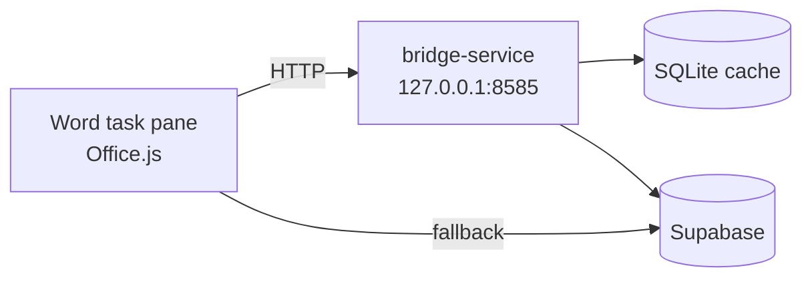

# word-addin

Office.js task-pane add-in for Microsoft Word that provides **ESABCC reference
manager** functionality directly inside the document:

- search references by title, author, DOI,
- see each paper's project-workspace context while searching — the whole-document
  summary, chapter (report-chapter / sector) classification and notes — and
  filter results by chapter,
- see how many times each paper is already cited in the document (a "cited N×"
  badge on search results and a per-paper tally in the Bibliography tab),
- insert formatted citations at the cursor,
- generate and refresh a bibliography,
- sync the local reference library from Supabase.



All traffic goes through [`bridge-service`](../bridge-service/README.md) so the
add-in never needs Supabase credentials. If the bridge is down, read-only
operations fall back to Supabase directly; citation formatting requires the
bridge.

## Manifest and hosting

- [`manifest.xml`](manifest.xml) declares the add-in to Office.
- Task pane URL in production:
  `https://methodhub.vercel.app/word-addin-dist/taskpane.html`.
- Three ribbon buttons are exposed: **Insert Citation**, **Bibliography**,
  **Refresh All**.

## Source layout

| Path                       | Purpose                                                  |
|----------------------------|----------------------------------------------------------|
| `src/taskpane/taskpane.ts` | Office.onReady bootstrap, UI state, basket management    |
| `src/services/api.ts`      | Tries `http://127.0.0.1:8585/api/status`; falls back to Supabase |
| `src/services/citation.ts` | Word document manipulation — `insertCitation`, `generateBibliography`, `refreshAllCitations` |
| `webpack.config.js`        | Build (HTTPS + office-addin-dev-certs)                   |

## Develop

```bash
npm install
npm run install-certs    # one-time: trust the dev HTTPS cert
npm run dev              # webpack-dev-server on https://localhost:3000
npm run sideload         # opens Word with the add-in registered
npm run validate         # validate manifest.xml
```

You must start [`bridge-service`](../bridge-service/README.md) first.

## Build

```bash
npm run build            # outputs to dist/
```

The production build is deployed alongside the Next.js app under
`/word-addin-dist/`.

## Install for end users

1. Ensure `bridge-service` is running on the workstation.
2. In Word: Insert → My Add-ins → Upload My Add-in → choose `manifest.xml`.
3. Task pane appears under the Home ribbon.

(For enterprise-wide deployment, publish the manifest via the Microsoft 365
admin centre.)

## Troubleshooting

| Symptom                                 | Likely cause                                          |
|-----------------------------------------|-------------------------------------------------------|
| "Bridge unreachable" banner             | `bridge-service` not running                          |
| Dev server HTTPS cert warning in Word   | Run `npm run install-certs` and restart Word          |
| Sideload fails on macOS                 | Install `office-addin-dev-settings` globally and retry |
| Inserted citations show placeholder text | `csl_styles` missing in Supabase; run a bridge sync  |
