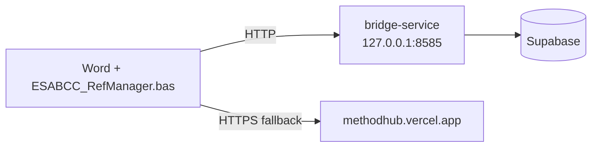

# word-vba

Legacy VBA reference-manager macro for Microsoft Word. Provides the same
citation / bibliography workflow as the Office.js add-in but runs inside an
auto-loaded `.dotm` template. Use this on Word versions that cannot load the
modern add-in (or when IT policy restricts the Office Store).



## Contents

| File                          | Purpose                                             |
|-------------------------------|-----------------------------------------------------|
| `ESABCC_RefManager.bas`       | The macro (ribbon, search forms, DOI lookup, citation insertion) |
| `install.ps1` / `install.cmd` | One-click installer (no admin rights needed)        |
| `uninstall.ps1` / `uninstall.cmd` | Removes the template and resets registry keys   |
| `embed-in-file.ps1` / `.cmd`  | Alternative: embed the module directly into a `.docm` |

## What the macro does

- Adds a **custom ribbon tab** with Search, Insert Citation, Build Bibliography.
- Talks to the local [`bridge-service`](../bridge-service/README.md) at
  `http://127.0.0.1:8585` for references, search, and formatting.
- Falls back to the public web app (`https://methodhub.vercel.app`)
  for DOI lookups.
- Marks every inserted citation with a `CITE:` tag so the "Refresh" action can
  find and update them.
- Keeps a session-local basket of selected references.
- Offers a **Project** filter in the search dialog: pick a report (e.g.
  *Policy Gap 2.0*) to scope the list to just that report's literature —
  handy when you remember the report but not the exact paper title. The
  project list is pulled live from `/api/references?facet=projects`.

> **Note:** the search dialog is generated at install time. After updating
> `ESABCC_RefManager.bas`, re-run `install.cmd` (or re-embed) so the new
> Project filter appears in Word.

Relevant constants at the top of `ESABCC_RefManager.bas`:

- `BRIDGE_URL  = "http://127.0.0.1:8585"`
- `WEBAPP_URL  = "https://methodhub.vercel.app"`
- `CITE_PREFIX = "CITE:"`

## Install

Windows PowerShell (no admin rights):

```powershell
cd word-vba
./install.ps1
```

or double-click `install.cmd` (calls PowerShell with
`-ExecutionPolicy Bypass`). The installer:

1. Detects the installed Word version from `HKCU`.
2. Enables `AccessVBOM` temporarily so macros can be imported.
3. Launches a hidden Word instance, imports `ESABCC_RefManager.bas`, bakes the
   UserForms, and injects a `customUI14.xml` ribbon definition into a `.dotm`.
4. Copies the template to `%APPDATA%\Microsoft\Word\STARTUP\` so Word loads it
   on next launch.
5. Restores the original `AccessVBOM` value.

## Uninstall

```powershell
./uninstall.ps1
```

Removes the template and resets registry state.

## Embed in a specific document

```powershell
./embed-in-file.ps1 -Path path\to\report.docm
```

Bakes the macro directly into a single `.docm` instead of using the STARTUP
folder — handy for templates you share with reviewers.

## Troubleshooting

| Symptom                                 | Likely cause                                          |
|-----------------------------------------|-------------------------------------------------------|
| Ribbon tab does not appear              | Template not copied to `%APPDATA%\Microsoft\Word\STARTUP` (re-run `install.ps1`) |
| "The template cannot be opened" warning | Unblock the `.dotm`: Right-click → Properties → Unblock |
| All lookups fail with timeout           | `bridge-service` not running                          |
| DOI lookup returns empty                | Check internet access to `methodhub.vercel.app` |
